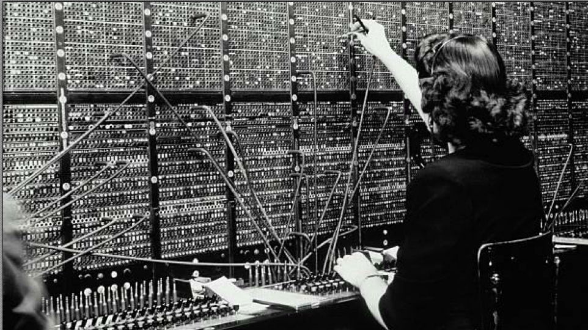

# Lecture 1

### What is Information Security? 

"A well-informed sense of assurance that the information risks and controls are in balance.” 
Jim Anderson, Inovant* (2002)

What does this mean?
- well-informed sense of assurance = we have an opinion that‘s based on evidence;
- information risks = risk is normally associated with the prospect or the possibility of loss;
- controls = anything that reduces risk: business policy, training/education or technology;
- in balance = are both the same (\$ gain/loss).

Security professionals must review the origins of this field to understand its impact on our 
understanding of information security today - let's do this now

> - if the information is not important, then the controls will be weak
>   - both have to be in balance
> - risks and controls are in balance

### The 1960s, 70s and 80s – what was the communication model?

Communications – based on ‘circuit switched’ telephony:
- Very old technology – lots of problems – not at all versatile or ‘fault tolerant’
- Many countries wanted improvement – the US commissioned a research project (effectively ARPANET).

> communication performed by operators
> - A to B, had to go through switches
> 

### History of information security - 1960s, 70s and 80s

- Advanced Research Project Agency (ARPA) began to examine feasibility of redundant networked communications (to improve the existing ‘circuit switched’ model).
- ARPANET initially connected four independent network nodes situated at UCLA, SRI, UCSB, 
- ARPANET – international in 1973 with connections to London and Norway. 
- Further expansion across the US in 1982 – the foundations of the Internet had been set up!

- ARPANET moved ‘circuit switched’ telephony into ‘packet switched’ data communications.
- Some of the main benefits:
  - No single defined physical path between sender – receiver
  - Packets travel independently – no interdependence
  - Supports ‘store and forward transmission’ – much greater versatility

> - circuit switched network (plugs) to packet switched
>   - divide long string of data into packets, order them and travel independently to the destination
>   - all back together, will receive the file at destination

### Analogue to Digital
How long is the voltage kept high to signal a “1” in digital 
communication?
- Depends on the data rate, at 1Mbps 1µs.
  - 1,000,000 bits per seconds
  - 1 microsecond per bit

> - 5v on and off with digital

### Package switching router

package-switching router | network gear in riser |
| --- | --- |
|  | 

> each riser, a patch panel
> - each cable goes to a particular port in the router

### Network fibre optics cable
- Information sent via fiber optic cables is much more difficult to intercept because light can’t be read in the same way signals sent via copper cabling can be.

### Network devices

- **Router** –  A hub is a basically multi-port repeater. A hub connects multiple wires coming from different branches, for example, the connector in star topology which connects different stations. Hubs cannot filter data, so data packets are sent to all connected devices. Also, they do not have the intelligence to find out the best path for data packets which leads to inefficiencies and wastage.
- **Bridge** – A bridge operates at the data link layer. A bridge is a repeater, with the add-on functionality of filtering content by reading the MAC addresses of the source and destination. It has a single input and single output port, thus making it a 2-port device.
- **Switch** – A switch is a data link layer device. The switch can perform error checking before forwarding data, which makes it very efficient as it does not forward packets that have errors and forward good packets selectively to the correct port only.
- **Router** – A router is a device like a switch that routes data packets based on their IP addresses. The router is mainly a Network Layer device. Routers normally connect LANs and WANs.

### 1990's to present time

- Networks of computers became more common; so too did the need to interconnect networks (Internet). Initially based on de facto standards.
- In early Internet deployments, **security was treated as a low priority.**
- The Internet brings millions of unsecured computer networks into continuous communication with each other.
- Ability to secure a computer’s data influenced by the security of every computer to which it is connected.
- Growing threat of cyber attacks has increased the need for improved securityExample: the advent of the “Web” and “executable content”
- From late 1990s, we started to ‘add on’ security to our existing software architecture. 

> need a lock on network equipment
> - security was patched on later as an afterthought
> - transmit executables; and could run the file program

Why did we look at computer network cables & devices?

- Network security encompasses all the steps 
taken to protect the integrity of a computer 
network and the data within it. Network security 
is important because it keeps sensitive data 
safe from cyber attacks and ensures the 
network is usable and trustworthy. 
- Many of the devices in a computer network are 
susceptible to potential attacks. 
- Network security involves the use of a variety of 
software and hardware tools such as **Firewalls**, 
**Intrusion detection systems (IDS)** and 
**Intrusion prevention systems (IPS)** to protect 
the integrity of a computer network and the data 
within it.

> need firewalls and intrusion detection system

### Defining security
***“The quality or state of being secure - to be free from danger”***

A successful organization should have multiple layers of security in place:
1) Physical: This involves securing the physical infrastructure and assets of an organization, such as buildings, servers, and other 
equipment, from theft, damage, and unauthorized access.
2) Personnel: This includes implementing policies and procedures to ensure that employees and contractors are aware of their 
security responsibilities and are trained to respond to security incidents.
3) Operations: This involves the day-to-day procedures and controls that are put in place to protect the organization’s data and IT 
infrastructure, such as regular system backups, patch management, and incident response.
4) Communications: This layer focuses on securing all forms of communication (emails, phone calls, video conferences, etc.) to 
prevent eavesdropping, interception, or disruption.
5) Network: This involves protecting the organization’s network infrastructure from threats such as malware, hacking, and denial-of-
service attacks, often through the use of firewalls, intrusion detection systems, and secure network architectures.
6) Information: This layer focuses on protecting the confidentiality, integrity, and availability of the organization’s data, both in transit 
and at rest, through measures such as encryption, access controls, and data loss prevention strategies.

> - Personnel need to be trained
>   - aware of security procedures
> - Operations, controls put into place, backup, etc. Software needs to be patched
> - Communications - needs to fix software across all forms of communication
> - Network - DOS attacks
> - Information - in transit - going over the network - at rest, in a database 

- “The protection of information and its critical elements, including systems and hardware that use, store, and transmit that information” (CNSS*)

How do we achieve information security?
- Policy, awareness, training, education, technology C.I.A. triangle (Basis for CNSS model of Information Security)
- Was a standard based on Confidentiality, Integrity, and Availability
- Now expanded into a more comprehensive list of critical characteristics of information

### Key information security concepts

