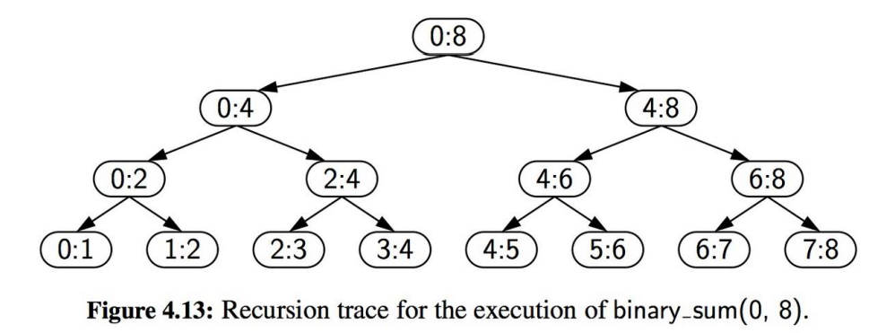
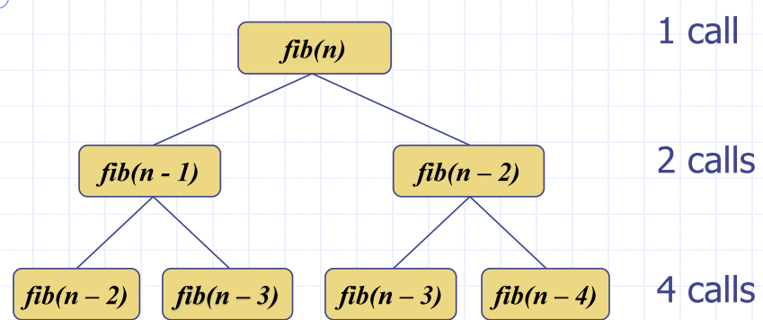
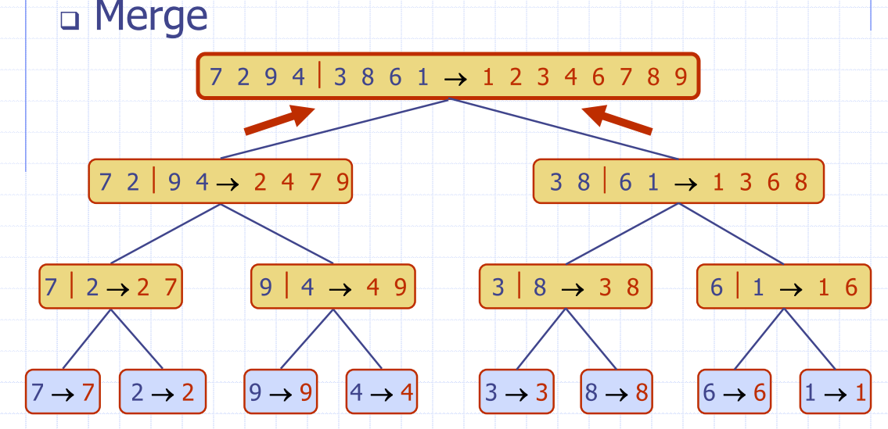

# Lecture 1 Recap:
- Big-O notation
  - quantify the rate of growth of the function as we increase the size of the input in terms of their upper bound
  - $f(n)$ is a function of the number of operations an algorithm takes with input size n
  - operating under word-RAM -> assignment of operations to size
- Develop algorithms that are scalable

- Given functions $f(n)$ and $g(n)$ which map positive integers to positive real numbers, we say that:
$$f(n) \; is \; O(g(n))$$
If there exists constants $c$ and $n_{0}$ such that 
$$ f(n) \le c\cdot g(n) \; for \;all \; n > n_{0}$$

1. Drop lower order terms and constants
2. Make your bounds as tight as possible
   - Can we say "$2n$ is $O(n^{2})$"?
   - Yes, - remember big-O is **just an upper bound**
   - but this doesn't give us much information about the function's growth rate

Make the smallest possible class of the functions (the "tightest" possible bound)
  - say $2n$ is $O(n)$ even if $2n$ is in $O(n^{2})$
  
3. Simplify as much as possible
   - Use the smallest expression of the class

### Operations:
|Type | name| 
|---|---|
|$O(1)$| Constant
|$O(\log n)$| Logarithmic
|$O(n)$| Linear
|$O(n^{2})$ | Quadratic
|$O(2^{n})$ | Exponential
|$O(n!)$ | Factorial

# Lecture 2 - Analysis of Recursion Algorithms
- When a method calls itself
- Classic example: factorial function
  - $n! = 1 \cdot 2 \cdot 3 \cdot ... \cdot n$

#### Recursion has two steps:
- Test for base cases
  - Else there will be a stack overflow - if more than 1000 calls in python
  - Every recursive chain of calls must eventually reach a base case.

### Types of recursion:
- **Linear recursion**
- **Binary Recursion**
- **Multiple recursion**

### Linear recursion:
- Performs a single recursive call

```python
def linear_sum(S, n)
""" Compute the sum of a sequence of the first n numbers of Sequence S"""
    if n == 0:
        return 0 # This is the base case
    else:
        return linear_sum(S, n-1) + S[n-1]
```
### Example 2: reverse a list:
```python
def reverse_list(my_list, i, j):
    if i < j:
        tmp = my_list[i]
        my_list[i] = my_list[j]
        my_list[j] = tmp
        return reverse_list(my_list, i+1, j-1)
    else:
        return my_list
```
### Tail recusion
- recursive call is the **last step**
  - Result of the call must be used immediately and directly, or it is not a tail recursion
- Factorial is **not** a tail recursion, because it is multiplied by $n$ before it is returned
- Can easily be converted to iterative forms

## Binary recursion
- Two calls for each non-base case


```python
def binary_sum(S, start, stop):
  if start >= stop:
    return 0
  elif start == stop-1:
    return S[start]
  else:
    mid = (start + stop) // 2
    return binary_sum(S, start, mid) + binary_sum(S, mid, stop)
```

## Multiple recursion

- Makes potentially many recursive calls:
```python
import os
import sys

def directory_tree(path):
    if os.path.isdir(path): # is this a directory?
        for thing in os.listdir(path):
            childpath = os.path.join(path, thing)
            directory_tree(path) # note – this could be called many times
    else: # nope, we’ve bottomed out – let’s just print this file/path
        print (path)
```

### Recursion activity
- Use recursion to sort an array of n integers
- Call this ``selectionSort``

**Base Case**
- $n=1$, nothing to sort

**Recursive case**
- Find the largest element of the array - find the largest $e_{max}$
- Swap $e_{max}$ with the largest element in the array
- repeat this process for the next $n-1$ elements
```
Algorithm selectionSort(A, n)
    if n > 1 then
        maxIndex <- 0
        for i <- 1 to n - 1 do
          if A[i] > A[maxIndex] then
              maxIndex <- i

          swap(A[maxIndex], A[n – 1])
          selectionSort(A, n - 1)
```
- Each time I recurse, I reduce the list by 1
$$ 
T(n) = 
\begin{cases}
        O(1) & \text{if } n = 0\\
        O(n) + T(n-1)  & \text{if } x \ge 1
\end{cases}
$$

### Running time of selectionSort

- $n$ decreases by one in each call, so there will be $n$ recursive calls in total

$$
\begin{align}
T(n) &= O(n) + T(n – 1)\\
&= O(n) + O(n - 1) + T(n – 2) \\
&= O(n) + O(n - 1) + O(n - 2) + T(n – 3)\\
T(n) &= 1+2+3+4+...+n-1 + n \\
T(n) &= n(n-1)/2 \\
T(n) \; \; &\text{is} \; \; O(n^{2}) \\
\end{align}
$$

## Fibonacci Algorithm
```
Algorithm fib(n)
for i
    if n < 2 then
        return 1
    return fib(n - 1) + fib(n - 2)
```

- The number of calls doubles at each level in the recursion tree
- Therefore the total number of calls will be less than or equal to $2^{n}$
We can say this algorithm is $O(2^{n})$

# Divide and conquer algorithm paradigm
## Search Algorithm
Binary search, list the element in a sorted list in $log_{2} n$ time
- Compare the middle element, `m`, with `k`
  - If k < m, search the left half
  - If k > m, search the right half
  - If k = m, return true

```python
""" Return true us target is found in indicated portion of a Python list
The search only considers the portion from data[low] to data[high] inclusive
"""
def binary_search(data, target, low, high):
    if low > high:
        return False
    else:
        mid = (low+ high) // 2
        if target == data[mid]:
            #recur on the portion left of the middle
            return binary_search(data, target, low, mid-1)
        else:
            #recur on the portion right of the middle
            return binary search(data, target, mid + 1, high)
```
#### Binary Search Recurrence
We can express the running time of binary search as:
$$ 
T(n) = 
\begin{cases}
        O(1) & \text{if } n = 0\\
        O(1) + T(n/2)  & \text{if } x > 0
\end{cases}
$$

$$ T(n) = T(n/2) + 1$$
$$ T(n/2) = T((n/2)/2) + 1 = T(n/4) + 1$$
$$ T(n/4) = T(n/8) + 1 $$
At the $k$th step:
Let $k = \log n$
$$ T(n/2^{k}) + 1 = T(n / 2^{\log_{2}n}) + \log_{2}n $$
$$ T(n/2^{k}) + 1 = T(n /n) + \log_{2}n $$
$$ T(n/2^{k}) + 1 = 1 + \log_{2}n $$

# Sorting
- Sorting is a fundamental operation
- Given a list, how would you do it?
- Bubble sort, insertion sort, or selection sort
  

### Bubblesort
- Bubble the greatest number to the top
- $n^{2}$ time complexity
- UPDATE

### Merge-Sort
- Sorting based on the divide-and-conquer paradigm
- Guaranteed $O(n \log n)$ running time
- Sort input sequence $A$ with $n$ elements
  - Divide: partition $A$ into two halves
  - Recur: Recursively sort each half
  - Conquer: merge the two halves

**DIVIDE STEP**
```
Algorithm mergeSort(A, l, r)
  Input an array A 
  Output A sorted between indices l and r
  
  if l < r
    m <- floor((l + r) ÷ 2 ) 
    mergeSort(S, l, m)
    mergeSort(S, m + 1, r)
    merge(S, l, m, r)
```

**CONQUER STEP**
- Conquer step Merging two sorted sequences, each with n÷2 elements, takes $O(n)$ time



#### Analysis of Merge Sort:
We can express the running time of mergesort as:
$$ 
T(n) = 
\begin{cases}
        O(1) & \text{if } n < 2 \\
        O(n) + 2\cdot T(n/2)  & \text{if } n \ge 2
\end{cases}
$$
- Depth h of the merge-sort tree is $O(\log n)$
- Overall amount of work done at nodes of depth `i` is $O(n)$
- Thus, the total running time of merge-sort is $O(n \log n)$

### Quicksort
- Randomised Divide and conquer sorting algorithm
- Similar to Merge sort
  - Picking a pivot, splitting on the left and the right

- **Divide**: pick a random 
element x (called pivot) 
and partition S into 
  - `L` elements less than x
  - `E` elements equal to x
  - `G` elements greater than x
- **Recur**: sort `L` and `G`
- **Conquer**: join `L`, `E` and `G`

#### Divide step
- Partition input sequence
  - remove, in turn, each element y from S, and 
  - insert y into L, E or G, depending on the result of the comparison with the pivot x
- Each insertion and removal is at the beginning or end of a sequence
  - hence takes O(1) time
- Thus, the partition step of quick-sort takes O(n) time


### Performance Analysis
- Worst case for quick-sort occurs when the pivot is the 
minimum or maximum element
- Running time is proportional to the sum: n + (n−1) + … + 2 + 1
- Thus, the worst-case running time of quick-sort is $O(n^{2})$

### Expected running time
- Consider a recursive call of quick-sort on a sequence of size s
  - Good call: the sizes of L and G are each less than 3s÷4
  - Bad call: one of L and G has size greater than 3s÷4


- Good calls have a probability 1/2
  - ½ of the possible pivots cause good calls

- Probabilistic Fact: Expected number of coin tosses required in 
order to get k heads is 2k
  - expected height of the quick-sort tree is O(log n)
  - Amount of work done at nodes of the same depth is O(n)
Thus, the expected running time of quick-sort is O(n log n)

### In-place Quick-Sort
- In partition step, use replace operations to rearrange the elements of the input sequence
  - elements less than the pivot have index less than h
  - elements equal to the pivot have index between h and k
  - elements greater than the pivot have index greater than k
- Recursive calls consider
  - elements with index less than h
  - elements with index greater than k

- Perform partition using two indices to split S into L and E 
& G (a similar method can split E & G into E and G).


- Repeat until j and k cross:
  - Scan j to the right until finding an element > x.
  - Scan k to the left until finding an element < x.
  - Swap elements at indices j and k

 
