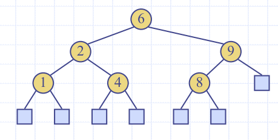

# Lecture 3

## Recapt Lecture 2
### quick-sort
- Randomised divide and conquer sorting algorithm
  - Divide: pick a random element $x$ (called a pivot)

### Quick sort recursion tree
- execution of quick sort is depicted by a recursion tree
  - Each node represents a recursive call of quick sort and stores
  - Use the first element as a pivot, and divide the cards according to whether they are 'larger than' or 'smaller than'
 Good execution example:

 

#### The worst case running time
- The worst case occurs when picking the minimum or maximum element

#### Expected running time
- Good call: The size of $L$ and $G$ are each less than $3s/4$
- Bad call: one of $L$ or $G$ is greater than $s3/4$

Probabilistic fact: Expected number of coin tosses required in order to get $k$ heads is $2k$

In practise, quick sort is chosen over merge sort:
- Is in-place: only needs the array of data, no extra memory needed
  - Keep track of pointers, and use them until they cross over
  - In place partitioning - update textbook notes:

## Sorting:
```python
def bogo_sort(my_list):
    while is_sorted(my_list) == False:
        random_shuffle(my_list)
```
worst case: unbounded

Average case: $n \cdot n!$

Best case: $n$

# Lecture 3

### Counting Comparisons
- Each possible run of the algorithm corresponds to a root-to-leaf path in a decision tree
- If you traverse the tree, you can determine every element in relation to every other element's relation in the list

#### E.g. permutations
$$ <a, b, c> = |c| = 3$$
|permutation |
|---|
a, b, c,
a, c, b
b, a, c
b, c, a
c, a, b, 
c, b, a

- UPDATE PROOF

Every comparison based sort takes at best $n \log n$ time

### Bucket sort
- $S$ be a list of $n$ key, element items with keys in the range of [0, N-1]
- Create a bucket for each element
- Because the buckets are already sorted in the array, iterate through the buckets and link them together



#### Analysis
- Initialising the bucket array has to take $n$ time
- Phase 1 takes $O(n)$ time
- Phase 2 takes $O(n + N)$ time (has to iterate through each chain, in the whole bucket)
  - Which ever of $n$ or $N$ will dominate depening on the size.

#### Properties and Extensions
- Stable sort property
- Relative order of any two items with the  same key is preserved after the execution of the algorithm
### Lexicographic order:
- d-tuple is a sequence of d keys $(k1, k2, k3, ..., kd)$ where 
is said to be the i-th dimension of the tuple

### Lexicographic-sort (Tuple sort)
- Comparator that compares two tuples by their ith dimension
- *LexicographicSort* sorts a sequence of d-tuples in 
lexicographic order by executing stableSort, d times
  - Once per dimension
- Runs in $O(d\cdot T(n))$ time