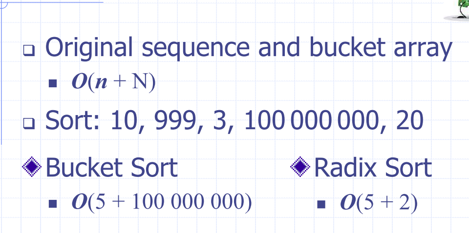

# Lecture 3

## Recap Lecture 2
### Quick-sort
- Randomised divide and conquer sorting algorithm
  - Divide: pick a random element $x$ (called a pivot)

### Quick sort recursion tree
- Execution of quick sort is depicted by a recursion tree
  - Each node represents a recursive call of quick sort and stores
  - Use the first element as a pivot, and divide the cards according to whether they are 'larger than' or 'smaller than'
 Good execution example:

 

#### The worst case running time
- The worst case occurs when picking the minimum or maximum element

#### Expected running time
- Good call: The size of $L$ and $G$ are each less than $3s/4$
- Bad call: one of $L$ or $G$ is greater than $s3/4$

Probabilistic fact: Expected number of coin tosses required in order to get $k$ heads is $2k$

In practise, quick sort is chosen over merge sort:
- Is in-place: only needs the array of data, no extra memory needed
  - Keep track of pointers, and use them until they cross over
  - In place partitioning - update textbook notes:

## Sorting:
```python
def bogo_sort(my_list):
    while is_sorted(my_list) == False:
        random_shuffle(my_list)
```
worst case: unbounded

Average case: $n \cdot n!$

Best case: $n$

# Lecture 3

### Counting Comparisons
- Each possible run of the algorithm corresponds to a root-to-leaf path in a decision tree
- If you traverse the tree, you can determine every element in relation to every other element's relation in the list

#### E.g. permutations
$$ <a, b, c> = |c| = 3$$
|permutation |
|---|
a, b, c,
a, c, b
b, a, c
b, c, a
c, a, b, 
c, b, a

Every comparison based sort takes at best $n \log n$ time
- Add a ss of the proof here

### Bucket sort
- $S$ be a list of $n$ key, element items with keys in the range of [0, N-1]
- Create a bucket for each element
- Because the buckets are already sorted in the array, iterate through the buckets and link them together


#### Analysis
- Initialising the bucket array has to take $n$ time
- Phase 1 takes $O(n)$ time
- Phase 2 takes $O(n + N)$ time (has to iterate through each chain, in the whole bucket)
  - Which ever of $n$ or $N$ will dominate depening on the size.

#### Properties and Extensions
- Stable sort property
- Relative order of any two items with the  same key is preserved after the execution of the algorithm
### Lexicographic order:
- d-tuple is a sequence of d keys $(k1, k2, k3, ..., kd)$ where 
is said to be the i-th dimension of the tuple

### Lexicographic-sort (Tuple sort)
- Comparator that compares two tuples by their ith dimension
- *LexicographicSort* sorts a sequence of d-tuples in 
lexicographic order by executing stableSort, d times
  - Once per dimension
- Runs in $O(d\cdot T(n))$ time

### Radix sort
- Specialiation of lexicographic-sort
  - Uses bucket sort as the stable sorting algorithm in each dimension
  - Applicable to tuples where the keys in each dimension $i$ are integers in the range $[0, N-1]$.
  - Take the sequences of $d$-tuples

### Radix-sort for binary numbers
- COnsider a sequence of $n$, $b$-bit integers
- Represent each elements as a $b$-tuple of integers in the range $[0, 1]$ and apply radix-sort with $N=2$
- Runs in $b\cdot (n+2)$ or $O(n\cdot n)$ time

#### Memory Sort


## Arrays
A linear structure is one whose elements can be seen as being in a sequence. That is, one element follows the next.

ADT for a sequence: given a list of items $X$ in some order:
- ``build(x)``: make new data stucture for items in $X$
- ``len(x)``
- ``get(x)``
- ``add(x)`` add $x$ to $X$
Arrays must be consecutive memory cells
- size must be verified at creation (is static)
  - constant random time access
  - But what if we want to insert something?
  - What if we need more space?

### Array implementation efficiency:
- Accessing an element
  - $O(1)$
- Iterating over elements:
  - $O(n)$
- Insert/Delete element:
  - $O(n)$
- Memory Usage:
  - $O(n)$

### Singly linked list
- Concrete data structure
  - sequence of nodes
  - head pointer
- Nodes store
  - element
  - Link to next node


Simple process to insert between two elements

### Singly linked list


### Doubly linked list


### Circularly Linked list


## Extensible lists 
- push(o)/add(o)/append(o)
adds element o at the end 
of the list

### Linked list implementation efficiency
- Accessing an element
  - $O(1)$
- Iterating over elements:
  - $O(n)$
- Memory Usage:
  - $O(n)$
- Insert/Delete element:
  - $O(n)$
- Accessing tail
  - $O(n)$
  - Can do better by adding a reference to the tail

## Extensible lists and Amortisation
- Array-based implementation of a dynamic list
  - space used by the data structure is $O(n)$
  - Accessing the element at $i$ takes $O(1)$ time
  - *Add* and *remove* tun in $O(n)$ time
## Extensible lists 
- push(o)/add(o)/append(o) adds element o at the end 
of the list 
- How large should the new array be if we run out of 
capacity?
- Incremental strategy
  - increase size by a constant c
  - double the size?

#### Comparison of Strategies
Incremental strategy analysis
- a sequence of n pushes will take $O(n)$ time per push

Doubling strategy analysis
- Array is replaced $k = \log _{2} n$ times
- Total time of $T(n)$ of a series of $n$ push operations is proportional to $3n-1$
- Amortised time of push is $T(n) / 2 = O(1)$
- 
