# Lecture 4

### Stacks
- Stores arbitary objects
  - linkedlist, list
- Insertion and deletions are LIFO
- Like a spring loaded plate dispenser
  - Insertions at the top of the stack
  - Removals from the top of the stack

### Stack ADT (operations)
- ``push(T)``
- ``pop()``
- ``T top()``
- ``integer size()``
- ``boolean isEmpty()``

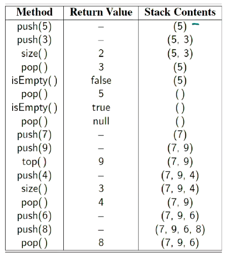

### Array-base stack
- Simple stack implementation
- Add elements from left to right
- Variable keeps track of index of top element
  - index is the top of the stack

```
Algorithm size()
    return t + 1

Algorithm pop()
    if isEmpty() then
        throw NoSuchElementException
    else
        t <- t - 1
        return S[t+1]
```
- If I am using an array, use ``t`` to denote the index I'm up to
  - if I pop from the array, I set the last index to ``None`` and reduce the index  ``t``
- Stack should not be allowed to change anything that isn't the top element
- Fixed-array can become full
  - Push operations throws ``IllegalStateException``
    - Limitation of array implementation
    - not intrinsic to the Stack ADT - only because we used an array as part of our ADT

### Performance
- If we use a dynamic array, do we use a constant time for push
- Space is $O(n)$
- Each operations runs in $O(1)$
  - push to the back is $O(1)$ - we know where the back is, look it up and put the element there
  - Pop is also $O(1)$
- Typically the size (the number of elements on the stack) is maintained inside the structure

### Other implementations
- We could use an extensible list
  - Amortised $O(1)$ push
  - $O(1)$ pop

- Could also use some sort of linked list
  - $O(1)$ push and pop
    - insert to the front in constant time

## Queues
- Stores arbitary objects
- Insertions and deletions are FILO
- Think of a waiting line (queue)
  - insertions at the rear of the queue
  - Removals at the beginning of the queue

### Queue operations
- ``enqueue(T)``
- ``T dequeue()``
- ``T first()``
- ``integer size()``
- ``boolean isEmpty()``

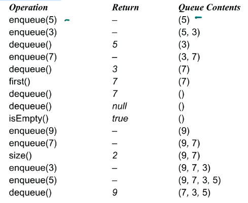

### Array-Base queue
- Use an array of size $N$ in a circular fashion
- Two variables keep track of the front and size
  - $f$ index of the front element
  - $sz$ number of stored elements (size)
  - $r = (f + sz) \mod N$
  - $N=10, f=1, sz=8$


### Operations
- Enqueue throws an exception if an array is full
  - implementation dependent (of having a full sized list)
- Uses modulo operator $mod$

The following are `enqueue` and `dequeue` operations
```
Algorithm enqueue(item)
    if size() = N then
        throw IllegalStateException
    else
    r <- (f + sz) mod N
    Q[r] <- item
    sz <- (sz + 1)

Algorithm deqeue()
    if isEmpty() then
        return null
    else
        item <- Q[r]
        f <- (f + 1) mod N
        sz <- (sz - 1)
        return item
```

### Programming: Call stacks
Programming languages use stacks to keep track of the current execution
- As methods are called, they are pushed to the call stack including information about the memory address of the instruction being  executed (or the method being called) and the local variables required.

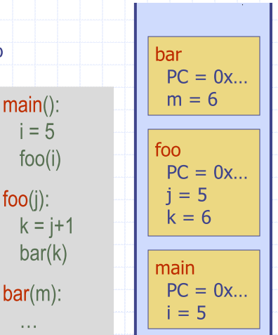

```python
def reverse(inlist):
    stack = []
    for item in inlist:
        stack.append(item)
    i = 0
    while len(stack) > 0:
        inlist[i] = stack.pop()
        i += 1
    return inlist

reverse([1,2,3,4,5,6])
[6, 5, 4, 3, 2, 1]
```

- Also parentheses matching
- HTML Tag Matching


### Application of Queues: Round Robin Scheduler
- Can be implemented using a queue Q repeately performing the following steps:
  1. e = Q.dequeue()
  2. Sevice element e
  3. Q.enqueue(e)

## Iterators
- Structure, and ADT
- Facilitate scanning through a sequence of elements

### Iterable interface
- Iterable has the following method
  - ``iterator()``
- A python list is iterable
  - produces an iterator for its collection as the return value of the ``iterator()`` method

```python
mylist = [“a”, “b”, “c”, “d”, “e”]
for element in mylist:
print(element)

a
b
…

x = iter(mylist) # <list_iterator object at 0x000…>
print(x)
<list_iterator object at 0x000…>
m = next(x)
print (m)
a
m = next(x)
print(m)
b
```

### Implementing iterators
- Implement two methods in your class
- ``__iter__ ``returns the iterator object
- ``__next__`` returns the next value and is 
called implicitly after each increment (in a 
“for element in thing” loop for example)

```python
Class Counter:
    def __init__(self, low, high):
        self.current = low - 1
        self.high = high
    def __iter__(self):
        return self
    def __next__(self):
        self.current += 1
        if self.current < self.high:
            return self.current
        raise StopIteration

for c in Counter(3, 9):
    print(c)
```

# Trees
## Tree basics
- Abstract model of hierarchical structure
- Consists of nodes with a parent-child relation
  - parent is a node above other nodes of a tree
  - Graphs have no heirarchy or structure

### Arthemtic Expression tree
- Leaf nodes are operands (numbers)
- parents are operators

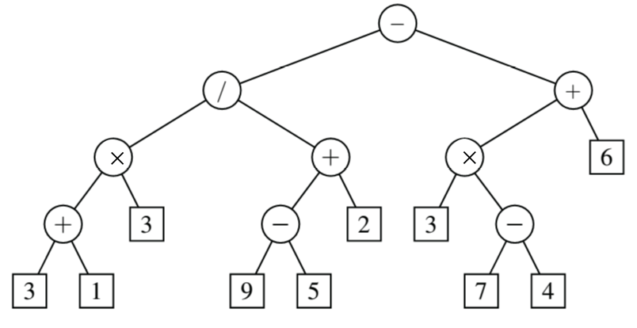

### Tree terminology
|***Terminoplogy*** | ***Meaning***
|---|---
| Root | (root node) has no parents
| Internal Node | has at least one child, cannot be an external node
| External node | a.k.a. leaf
| Edge | line between nodes
| Path | set of edges that have to be connected
| Ancestors of a node | anything connected the node and is 'above' or parent to it
| Descendants of a node | anything connected and 'below'
| Siblings | share the same parent
| Degree | number of outlinks, i.e. links going downwards
| level | defined as the root being at level 0, and every child node being an additional level down
| Depth of a node/tree | Count the number of edges from node to the root, Depth of $k=3$
| Height of a node/tree | Number of edges on the *longest* path to a leaf 
| Subtree | A tree that you root at some arbitrary node (e.g. c below)
| $k$-ary tree | At most $k$ children for a given node
| 2-ary Tree | at most 3 children for a given node

|**binary Tree** | **k-ary tree**
|--- | --- |
 |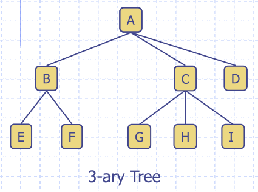

### Tree properties
- If every internal node has at least 2 child nodes
  - If $l$ is a number of leaf nodes
  - Number of internal nodes is at **most** $l-1$
  - $1+2+4+...+2^{h-1}=2^{h}-1=l-1$

### General Tree Structure

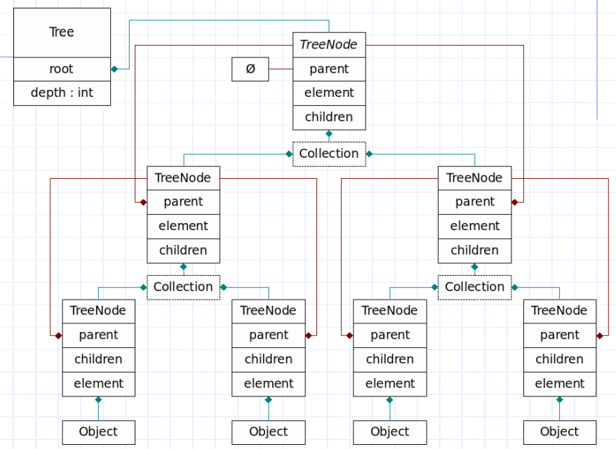

- Stores a pointer to it's parent
- Has a collection (container of 'stuff', list)

### Tree ADT
- ``size()``
- ``isEmpty()``
- ``iterator()``
- ``positions()``

Accessor methods:
- ``root()``
- ``parent(p)``
- ``children(p)``
- ``numChildren(p)``

Query methods
- ``isInternal(p)``
- ``isExternal(p)``
- ``isRoot(p)``

### Tree CDT
C is 'concrete'. Common update methods
- ``replace(p,o)``
- ``addRoot(o)``
- ``remove(p)``

### Preorder Traversal
- A node is visited before its descendants
  - Visit performs some task at the node
- Application: print a strcutured document

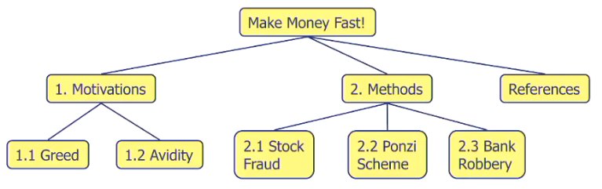

```
Algorithm preOrder(p)
    visit(p)
    for each child c of p
        preorder(c)
```
You would get the following:
- Make Money Fast!
- 1. Motivations
- 1.1 Greed
- 1.2 Avidity
- 2. Methods
- 2.1 Stock Fraud
- 2.1 Ponzi Scheme
- 2.3 Bank Robbery
- References


### Postorder traversal
- A node is visited after its descendants

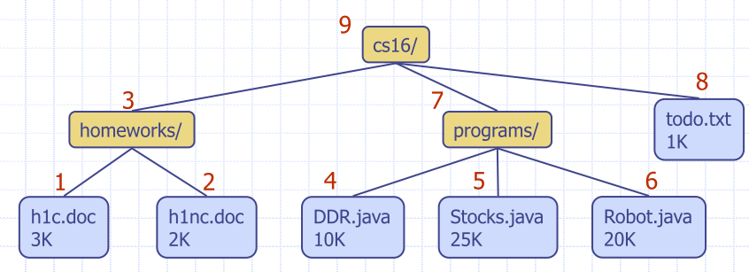

```
Algorithm postOrder(p)    
    for each child c of p
        postOrder(c)
    visit(p)
```


## Binary Trees
- Each internal node has at most two children
  - Exactly two for a properr binary tree
- Internal node has a left child and right child
- **Full level**
  - level $l$ is full if it contains $2^{l}$ nodes
- **Complete binary tree**
  - for height $h$
  - Level $0, ...,h-1$ are full
  - In level $h$, all leaf nodes are as far left as possible
- **Proper** Binary tree
  - every node, except for leaves, has two children
  - also called a full binary tree

### Binary tree ADT 
Additional methods:
|name| description
|---|---
``left(p)``|
``right(p)``|
``sibling(p)`` | Do I have a sibling, if so, give me a reference to it

#### Traversal
- A node is visited after its left subtree and before its right subtree
- There is no generic *inOrder* traversal methods for a k-ary tree

### Print arithmetic expressions
- Print operand or operator when visiting node
- Print '(' before traversing left subtree
- print ')' after traversing right subtree

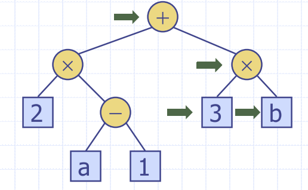

### Euler Tour Traversal
- Handle preorder, postorder and inorder traversals
- Each node (in a binary tree) is visited three times
  - blend different trvaersals to achieve more complex functionality

### Linked Structure for Binary Trees
- Node stores
  - element
  - parent node
  - left child node
  - right child node


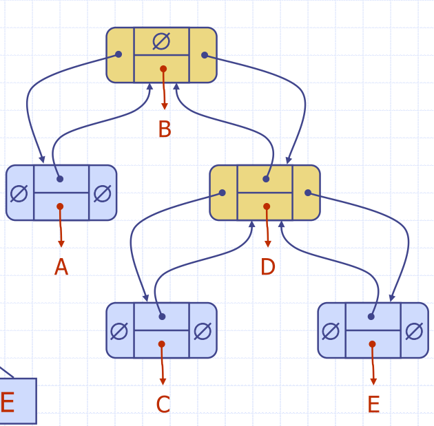

### Breadth-first travsersal
- Visit all the nodes at depth $d$ before visiting nodes at depth $d+1$
- Visiting level by level

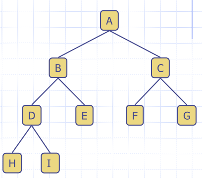

### Examples

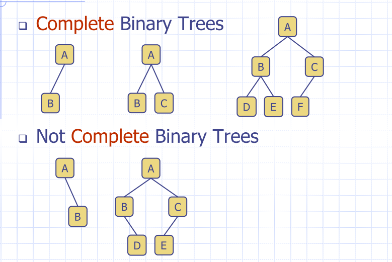

Proper binary tree
- Every node, *except for the leaves* has two children
- Also called a full binary tree

### Examples

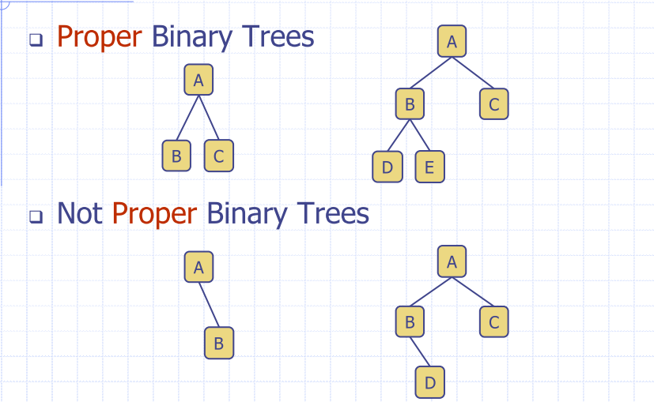
