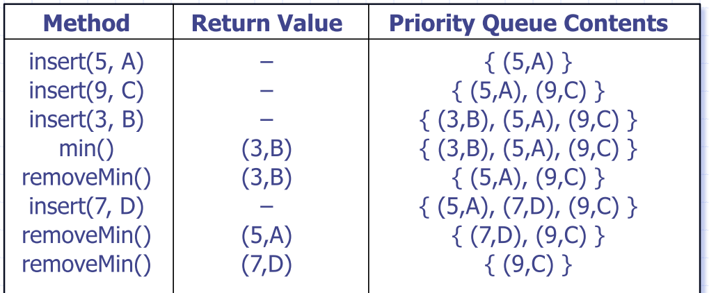
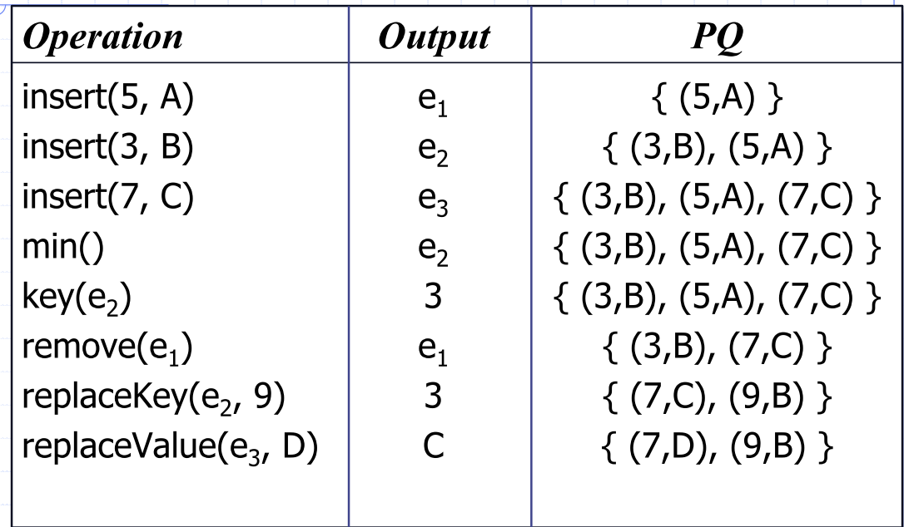
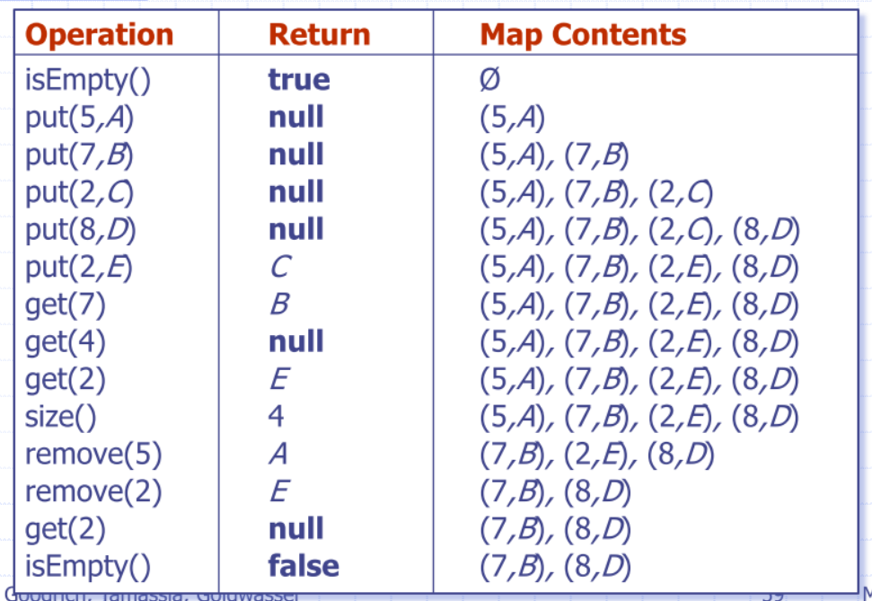
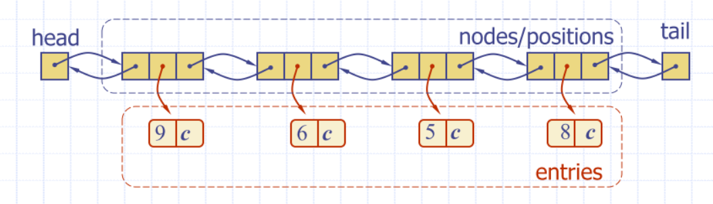

# Lecture 5

## Priority queues
### ADT
- Each entry is a pair (key, value)
- Main methods
  - ``insert(k,v)``
  - ``removeMin()``
- Additional methods
  - ``min()``
  - ``size()``, ``isEmpty()``

- Queue
  - FIFO
- Priority Queue
  - Elements are stored as Entries
  - Entry with the highest priority is stored first



- An entry in a key is a key-value pair
- Can override the less than $\lt$ operator to compare entries

```python
class entry:
def __init__(self, k, v):
    self._key = k
    self._value = v

def __lt__(self, other):
    return self._key < other._key

def get_key(self):
    return self._key
```

- Imposing a total order on your keys means that trees are representing a kind of *ordered map*
  - however, true maps require *key-uniqueness*


### Comparator ADT
```python
# 2D coordinate class stub
class point:
    def __init__(self, x, y):
        self._x = x
        self._y = y

    def get_x(self):
        return self._x

    def get_y(self):
        return self._y

    # Less than ‘<‘ operator
    def __lt__(self, other): 
        xa = self.get_x()
        ya = self.get_y()
        xb = other.get_x()
        yb = other.get_y()
    if xa == xb:
        return ya < yb
    return xa < xb

```

### Sequence-based priority queue
- Implementation with an ***unsorted*** list
  - Insertion takes $O(1)$ time
  - ``removemin()`` and ``min()`` take $O(n)$ time

- Implementation with a ***sorted*** list
    - ``Insert(p)`` take $O(n)$ time
    - ``RemoveMin()`` and ``min()`` take $O(1)$ time

## Heaps
- Binary tree storing keys at its nodes and satisfying the following properties:
- **Heap order**: the key of the node is $\ge$ the key of its parent
  - $key(v) \ge key(parent(v))$
- Has to be a **complete binary tree**
  - at height $h$, the internal nodes are to the left of the external nodes
- **Last node** of a heap is the rightmost nodes of maximum depth

### Heap properties
- A heap can implement a priority queue
- Store a (key, element) entry at each node
- Keep track of the position of the last node

### Insertion into a heap
- **Insert** in the PQ ADT corresponds to inserting key $k$ into the heap
- Insertion algorithm:
  1. Find the insertion node $z$

### Upheap
- After inserting a new key $k$, the heap-order property (child nodes must have keys >= their parents) may be violated
- Upheap swaps k along an upward path from the insertion node, until k reaches the root or a node whose parent has a key less than or equal to k
- Since a heap has height $O(\log n)$ upheap runs in $O(\log n)$ time
  - worst case you swap all the way up the tree, which is length $\log n$

|addition of key 3 | addition of key 4 | final result 
|--- | --- | --- |
 |  | 

### removal from a heap
removeMin in the PQ ADT corresponds to removing the root key from the heap
- Removal algorithm
1. Replace the root key with the key of the last node w
2. Remove w
3. Restore the heap-order property (downheap)

### Downheap
- Downheap replaces root key with key `k` of the last node and swaps key `k` along a downward path from the root
  - **swaps with the smaller of the two keys**
- Because height of tree is $\log n$, downheap runs in $O(\log n)$
- ``removeMin()`` corresponds to removing the root (smallest key) from the heap
- Algorithm:
  - Swap the last position with the root, and retrieve the node

| ``removeMin`` | **intemediate step** | **result** 
| --- | --- | --- |
|  |  | 


### Updating/Inserting another node
- Insertion node can be found by traversing a path of O(log n) nodes, BUT
- Depends on how the binary tree is implemented. With a linkedlist, $O( 2 \log n)$ (traversing up the tree and back down again)

### Array-Based Heap Implementation
- For a node at index $i$:
  - left child is at the index $2i+1$
  - right child is at the index $2i + 2$
  - ``removeMin()`` corresponds to removing/swapping at index $n-1$, plus more swapping
  - Upheap and downheap operating correspond to swapping

### Heap-sort
- Take $n$ items, insert and ``removeMin()`` in $\log n$ time
- Heap-based priority queue can sort a sequence of $n$ elements in $n \log n$ time

### Heap construction
- Construct a heap containing $n$ items
- Using *Insert*
  - n calls give $O(n \log n)$ time
- Special case construction by merging
  - Bottom-up heap construction
  - Better than O(n log n) or I wouldn’t be telling you about it!

### Merging two heaps
- Given two heaps *and a key k*
- Create a new heap with the root node storing k and with the two heaps as subtrees
- Perform downheap to restore the heap-order property

| ``initial`` | **add key: intemediate step** | **result** 
| --- | --- | --- |
|  |  | 

- Can construct a heap storing n given keys using bottom-up construction with log n phases
- In phase i, pairs of heaps with $2^{i} - 1$ keys are merged into heaps with $2^{i + 1} - 1$ keys
- $2^{i} - 1 + 2^{i} - 1 = 2^{i + 1} - 1$


### Analysis
- Worst-case time of a downheap with a proxy path
  - Worst case scenario is that a downheap opeation has to be performed for each merge
- The total number of nodes of the proxy paths is $O(n)$
- Bottom-up heap construction runs in $O(n)$ time

### Summary:

|Performance | artefact
|--- | ---
|$O(n)$ | space
|$O(n)$ | build
|$O(\log n)$ | ``getMin()``
<!-- | $O(\log n)$ |  -->

## Adaptable priority queues
- Sometimes want to be able to remove any arbitrary element
### ADT Adaptable Priority Queue
|**Method**|**Description**
|---|---
|``remove(e)`` | remove an arbitrary element (not necessarily the minimum or maximum)
|``replaceKey(e, k)`` | Essentially a priority update
| ``replaceValue(e, v)`` | changing the value of the item




### Locating entries
- ``remove(), replaceKey(e, v)`` and ``replaceValue(e, v)`` need fast ways of locating an entry $e$ in a priority queue
- For instance, how would you locate the entry with key 11?
  

- Can search the entire queue
  - Are faster methods
- Position in the data structure 

### Location-Aware Entries
- Locators can be used to keep track of 
elements as they are moved around 
inside a container
-  That is, keep “pointers” to keys inside 
the tree that follow each (key, value) 
node as they move around

### List implementation
- Location-aware list entry is an object storing
  - key
  - value
  - position (or rank) of the item in the list
- In turn, the position (or array cell) stores the entry
-  Back pointers (or ranks) are updated during swaps


### List APQ Run time
- ``remove(e)`` and `replaceValue(e, x)` take constant time
  - Assuming you already have a reference to `e`
- ``replaceKey(e, k)`` runs in `O(n)` time
  - We get to the value in constant time, but we may need to traverse the container to find the correct new location
- Achieve this using a **hashmap** implementation for example

### Heap APQ Run Time
**Operation** | performance 
| --- | ---
| ``replaceValue(e, x)`` | $O(1)$
| ``remove(e) `` | $O(\log n)$
| ``replaceKey(e, k)`` | $O(\log n)$

## Performance
- Improved times thanks to location-aware entries are highlighted in red


| **Method** | **Unsorted List** | **Sorted List** | **Heap**
| --- | --- | --- | ---
| ``size, isEmpty``| $O(1)$| $O(1)$ | $O(1)$ 
| ``insert`` |$O(1)$ | $O(n)$| $O(\log n)$
| ``min`` | $O(n)$ | $O(1)$|$O(1)$
| ``removeMin``| $O(n)$ |$O(1)$ | $O(\log n)$
| ``remove`` |$O(1)$ | $O(1)$| $O(\log n)$
| ``replaceKey`` | $O(1)$|$O(n)$ | $O(\log n)$
| ``replaceValue`` | $O(1)$| $O(1)$|$O(1)$

### Min-heap vs maxheap
**Min-heap**
- ``key(i) >= Key(parent(i))``
- can ``getMin()`` in constant time $O(1)$
- ``removeMin()`` in $O(\log n)$ time

Can we do ``removeMin()`` in $O(1)$?
- A: Yes, but mostly out of scope for this course.
Generally (and a very interesting point)
- You can *never* have *both* $O(1)$ insert and $O(1)$ removeMin in the same DS.
  - Could sort in $O(n)$. We have proven this is not possible

## Maps
- Searchable collection of key-value entries
- Main operations
  - searching, inserting and deleting items
- Keys must be unique
  - cannot have multiple entries with same key
- Applications
    - address book
    - student-record database

### Map-ADT

**Function** | **Description**
|---|---|
| ``get(k)`` |
| ``put(k, v)`` |
| ``remove(k)``  |
| ``size()``|
| ``isEmpty()`` |
| ``entrySet()`` | yield a collection of key/value pairs - python ``items()``
| ``keySet()`` | yield an collection of keys
| ``values()`` | yield a collection of values

### Use of Null as Sentinel
- something we store when we don't have something there
  - get, put and remove return null 
(None) if a requested entry is not  present
- None is a sentinel value
  -  **Thus, we cannot store None as a key!**
- Alternative: throw an exception for a key that is not in the map



``put(2, e)``: this particular implementation returns the old value

### Comparison with Earlier Data Structures
- Priority queues and maps both store key-value pairs
  - We call these key-value pairs entries-
-  Keys
   - Map keys must be *unique*
   - Priority queue allows multiple entries to have same key
     - Two or more elements may share the same priority of course!
- Total order relation on keys
  - Required for priority queues
  - Optional for maps (may or may not be ordered)-
- Accessing elements
  - Maps allow access to any entry by key
  - Priority queues allow access to highest priority element

### Simple List-Based Map
Implemented using an *unsorted* list 
- Store the items of the map in a list $S$ (based on a 
doubly-linked list), in arbitrary order



- How are you going to find the key?

``get(k)`` Algorithm. Complexity: $O(n)$
```
Algorithm get(k):
  B = S.positions() {B is an iterator of the positions in S}
  while  B.hasNext()  do
    p = B.next() { the next position in B }
    if  p.element().getKey() = k  then
      return  p.element().getValue()
  return  null {there is no entry with key equal to k}
```

``put(k)`` Algorithm. Complexity: $O(n)$
```
Algorithm put(k, v):
  B = S.positions()
  while  B.hasNext()  do
    p = B.next()
    if  p.element().getKey() = k  then
      t = p.element().getValue()
      S.set(p,(k,v))
      return  t {return the old value}
  S.addLast((k,v))
  n = n + 1  {increment variable storing number of entries}
  return  null {there was no entry with key equal to k}
```
## Multimaps
- Can store multiple entries with the same key
- 'Remove all the elements with a given key'

## Sets
- Set – unordered collection of elements, without 
duplicates
  -  elements of a set are like keys of a map, but without 
any auxiliary values
- Multiset (alias *Bag*) – set-like container that 
allows duplicates
  - Likely never need to use that, but could come in handy for prime factorisation. E.g. ``{2, 2, 2, 3, 5} = 120``

### Set ADT:

|**Function name** | **Description**
|---|---
|``add(e)`` | Adds the element *e* to S (if not already present)
|``remove(e)`` | Removes the element *e* from $S$ if present
|``contains(e)`` | Returns whether *e* is an element of *S*
|``iterator()`` | Returns an iterators of the elements of *S*
|``addAll(T)`` | Updates $S$ to include all elements of set $T$, essentially $S \cup T$
|``retainAll(T)`` | Updates $S$ so that is only keeps elements that are also elements of set $t$, Effectively replacing $S$ by $S \cap T$ 
|``removeAll(T)`` | Updates by removing any of its elements that also occur in set $T$, essentially $S - T$

## Intuition: Union on sorted lists
Generalised merge of  two sorted lists A and B
 - Auxiliary methods
  - ``remove_first``
-  Runs in $O(n_{A} + n_{B})$ time assuming the auxiliary methods run in $O(1)$ time
