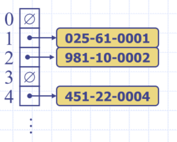
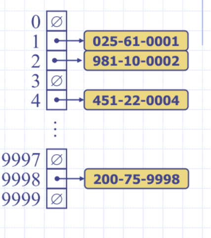
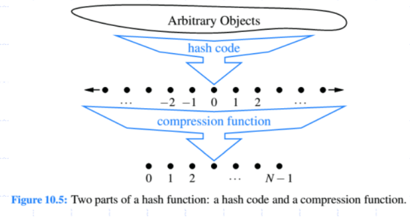
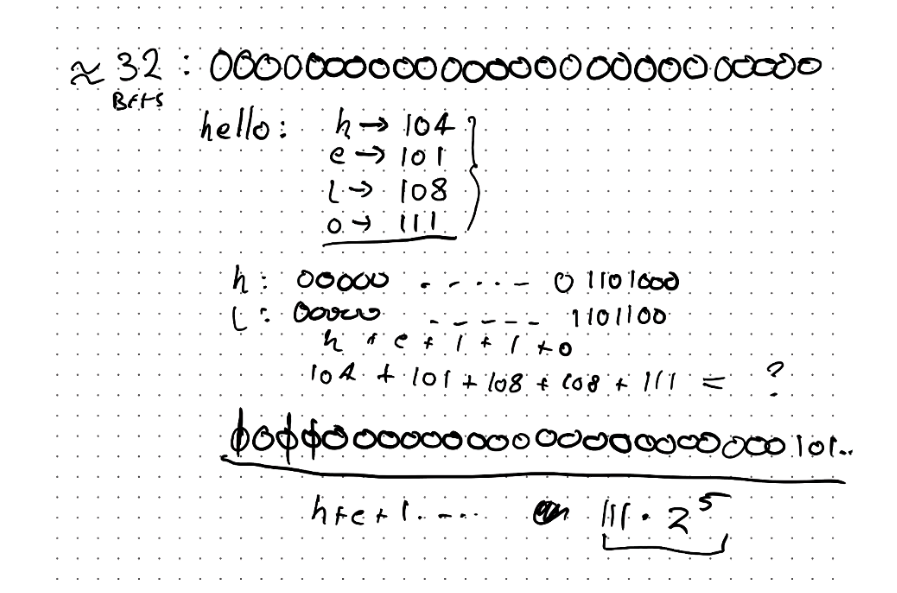
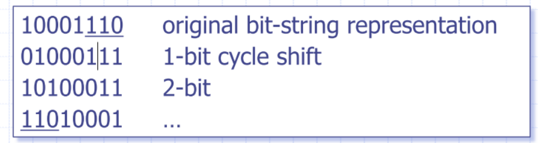
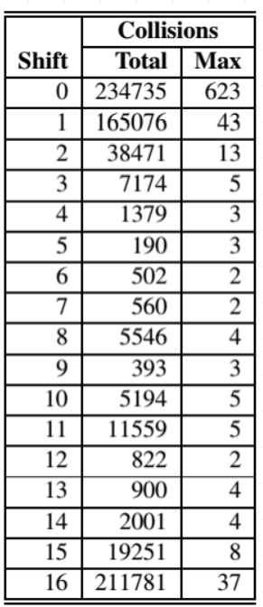
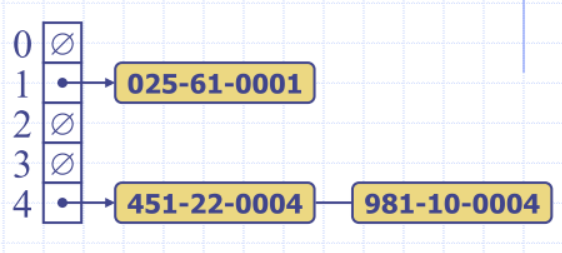
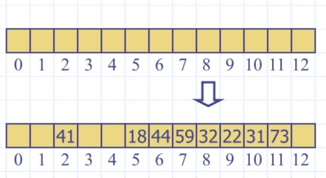
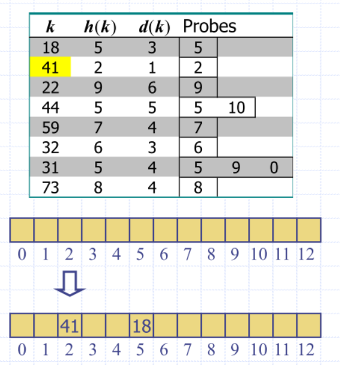
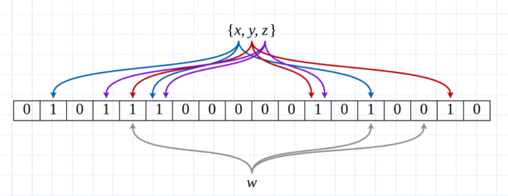

# Lecture 6

## Hash Table
- we care about Seach, inserting and deleting items

We want:
- $O(1)$ worst case insert, find and delete
  
We can have:
- efficient insertion and find operations
- do not require the items to be ordered
- do not require efficient removal of items
- Settle for $O(1)$ in the *average* case

### Direct Access array
Consider a setting in which a map with n items 
uses keys that are known to be integers in a 
range from 0 to N − 1
-  for some N ≥ n
- Very good if key space is small (constant time  insert/delete/lookup) – data is at position k
  -  But if $N >> n$ we will pay extreme space overhead
     - The array will be very sparse and wasteful
     - e.g. if we have three items, and one of the keys was '6221' means at least 6221 items

### More general types of keys
What should we do if our keys are not integers 
in the range from 0 to N – 1?
 - Use a *hash function* to map general keys to corresponding indices in a table
- *Hash function* is a mapping: 
  - I have some huge span of index and I'm going to map to some smaller domain
- If u >> N, no *hash function* is injective
  -  That is, we must have collisions
  - $\exists \: \; a, b : h(a) = h(b)$
  - ``h('Barry') = h('John')`` could occur
  - use a hash function to map general keys to 
corresponding indices in a table
  -  e.g. last four digits of a Tax File Number



- You can define a hash function on whatever kind of data you want

#### Compression functions
- In textbook, we call it a compression function
Hash function h maps keys of a given type to 
integers in a fixed interval [0, N - 1]
  -  $h(x) = x \mod N$ – hash function for integer keys
  -  Take the integer and modulo it by the hash table size. Is this a good idea?
  -  Potential for lots of collisions
- Integer h(x) is called the *hash value* of key $x$
- Hash table for a given key type consists of
    - hash function $h$
    - bucket array (called table) of size $N$
- Map implemented with a hash table
    - goal is to store item ``(k, o)`` at index $i = h(k)$

- Hash table for a map storing entries as (TFN, Name)
  - where TFN is a nine-digit positive integer
-  Hash table uses an array of size N = 10,000 and the hash 
function
   - h(x) = last four digits of x



### Hash functions
Usually specified as the composition of two functions
- Hash code
  - Keys -> integers
- Compression function
  - keys -> integers → [0, N - 1]
  - in compression function to keey array in check



### Hash codes
**Component Sum**:
Partition the bits of the key into components of 
fixed length
-  e.g. 16 or 32 bits
- Sum the components
Example:
- “the” =  h = (int) t + (int) h + (int) e
  -  Collisions may be common
  - the = teh = eht = het = eth

**Polynomial Accumulation**:
- Partition the bits of the key into a sequence of 
components of fixed length (e.g. 8, 16 or 32 bits)
- Evaluate the polynomial at a fixed value $z$, ignoring overflows
Empirically, $z = {33, 37, 39, 41}$ are reasonable.
- This is a type of “rolling” hash function – each step depends on the value of the previous step

### What is the intuition?
- We are trying to spread out the influence of each
“piece” of the key on the final hash code
- This means the hash code wont depend too much
on any individual “piece”
- By increasing powers on each successive piece, we
ensure significant bits are set/utilized
    - spread influence over the domain of bits
Note: Here the “pieces” are those 8/16/32-bit
quantities from the original key,  $a_{0}, a_{1}, a_{2}, ..., a_{n-1}$



Intutition on paper
- the more randomness I can scatter throughout the bits, the better (I want to avoid collisions as best I can)

**Cyclic Shift**
- Variant of polynomial accumulation that replaces 
the multiplication with a bit shift
- Shift n bits from one side of bit pattern to the other 
side during the partial accumulation



```python
def cyclic_hash(my_string):
    mask = (1 << 32) – 1  # Max 32-bit int
    h = 0                            # the running sum of the hash value
    for character in my_string:
        h = (h << 5 & mask) | (h >> 27) # 5 bit shift
        h += ord(character) # the integer representation of the char
    return h
```
- idea is that we are shifting bits across

### Shift collisions Example
- Each row shows the result of 
shifting a different number of bits
- Shows collisions for 230,000+ 
English words
- Total – total number of collisions
- Max – largest number of collisions 
that occurred for a hash code
- Which code is best?
  -  (For this data) - 5?



### Division
- $h_{2}(y) = y \mod N$
- size N of the hash table should be prime
    - reason has to do with number theory and is beyond the scope of this course
    - Basic idea: Reduce the number of common factors between hash values and $N$
    - Results in more “spread” across available buckets

### Multiply, Add and Divide (MAD)
- $h_{2}(y) = ((ay + b) \mod p) \mod N$
- $p$ is a prime number $> N$
- a and b are random integers in the range 
[0, p-1]

### Recall that
- Hash table for a given key type consists of
  - hash function h that maps keys of a given type 
to integers in a fixed interval [0, N-1]
  - array (called table) of size N
- Goal is to store item (k, o) at index i = h(k)
  - might get collisions
- Collisions occur when different elements are 
mapped to the same cell

### Collision Handling
- Collisions occur when different elements are mapped to the same
cell
- Separate Chaining
  -  each cell in the table points to a linked list of entries that map there
    - or extensible list, etc.
  -  simple, but requires additional memory outside the table



### Map with Separate Chaining
- Delegate operations to a list-based map at each cell

```python
Algorithm get(k): # get is find
    return A[h(k)].get(k) 

Algorithm put(k, v): # put is insert
    t = A[h(k)].put(k, v) 
    if  t = null  then {k is a new key}
        n = n + 1
    return t

Algorithm remove(k):
    t = A[h(k)].remove(k)
    if  t != null  then {k was found}
        n = n - 1
    return t
```
- Hashtable as pointer to other data structures storing stuff
- the ``get`` is a get implementation of a linkedlist
- use a hash table to find the 'bucket' of a key-value store
  - iterate through the linkedList at this index, find the element and return (key,value, or both, etc.)

### Linear probing
- Open addressing: colliding item is placed in a different cell of the table
- Linear probing: handles collisions by placing the colliding item in the next 
(circularly) available table cell
- Each table cell inspected is referred to as a “probe”
- Colliding items lump together
  -  causing future collisions to cause a longer sequence of probes


Insert keys 18, 41, 22, 44, 59, 32, 31, 73, in this order


- When you delete an item, cannot make it empty
  - empty implies there are hash is free, but elements could have been appending further on in the list
- append a placeholder value that will never show up in the list

### Quadratic Probing
- Probe index calculated by quadratic function
    -  $(h(k)) + f(i))$ where $f(i)=i^{2}$ for $i= 0, 1, 2, …$
- Guaranteed to find an empty slot if
    -  table size is prime 
    -  table is less than half full
    -  This is because the quadratic probing sequence must visit at least half of the table indexes before repeating if the size of the table is prime
       -  How densely filled is the table?


### Double hashing
Secondary hash function $d(k)$ handles collisions by 
placing an item in the first available cell of the series 
$(h(k) + jd(k)) \mod N$ for $j = 1, 2, … , N - 1$

Consider a hash table storing integer keys that handles collision with double 
hashing



### Hashing performance
- O(1) – expected running time of all Map 
operations
-  O(n) – worst case for searches, insertions and 
removals
   - occurs when all keys inserted into the map collide

Load factor $a = n÷N$ affects performance of a hash table
-  Expected number of probes for an insertion 
with open addressing is
 - $1 ÷ (1 - \alpha)$
- So what might be a reasonable load factor?

### Load Factors
- **Chaining**: $\alpha$ = 0.8 to 1.0 acceptable
  - If $\alpha$ = 1, one element per list
  - Low space overhead; a good hash function will give us on average $\alpha$ elements per linked list
  - Note that load can be arbitrarily large (chains approach infinite length as $\alpha$ approaches infinity)
- Probing: Depends on the type, but typically $\alpha$ < 2/3 is desired
  -  Python’s own open addressing uses 2/3
 -  State-of-art mechanisms can do well even with $\alpha$ > 0.9
- Can $\alpha$ > 1.0 ?

### Fun with Hashing
- We can use hashing to implement structures 
other than maps
  - Bloom Filters – fast member testing
- Want collision free hashes?
  - Perfect hash functions
- Want less probing (and, worst-case constant time lookups)?
  - Cuckoo hashing


### Bloom Filters
- Sometimes we might want to answer questions like “is the key k in my set S
 or not” (think duplication detection for example)
- Idea: We will build a structure that can efficiently answer this question with a caveat
  - If the answer is “no” then k **is not** in S
  - If the answer is “yes” then k *might be* in S
  -  That is, false positives are possible, but false negatives are not

- Define an empty m element bitvector
  -  Proportional to the number of keys to add, $n$
- Define z unique hash functions
  - z is usually a small constant
- To add a key, pass it to each of the z hash functions
  - Each switches on a bit
- To query a key, do the same as “add” and see if all bits are on



- w is a 'yes' as some of the bits are on

Idea: Given our set of keys S, we do some “offline work” to find a hash function that gives no collisions
- Then, we know that we can always get constant-time access to those entries!
- Example: h(k) = k mod 10 is perfect for $S = {10, 21, 32, 43, 54, 65, 76, 87, 98}$
- Knowing about keys ahead of time is very useful for many applications
  -  What if they are integers from 0 to n?

### Cuckoo Hashing
Idea: Store two hash tables with a unique hash function for each
- Put(k): Try the first table; if occupied, throw the entry with key k’ out and enter k here; Now try to put k’ into the second table… Continue repeatedly until a pre-set number of these repeats occur (or a cycle is found) – if so, rehash both tables with a new set of hash functions!!
- Get(k): It’s either at h1(k) or h2(k)…
  -  Guaranteed constant-time access

- Insertions (even though you might end up with a 
big song and dance with rehashing keys) have 
been proven to be expected constant time
-  So long as the load factor is below 50%
   - Finds/Deletes are constant time