# Lecture 6 continued

- Note: our key focus in COMP306 will be on Binary search tree, AVL trees and Splay trees

### Search Tables
An ordered map implemented by means of a sorted list. Stores key-value pairs
- Sometimes still some sense of ordering
- store the items in an array-based sequence
  - sorted by key
- use an external comparator for the keys
- use binary search to lookup keys

### Search tables performance:
- Searches take $O(\log n)$ time
  - using binary search
- Inserting a new item takes $O(n)$ time
- Removing an item takes $O(n)$ time

### Binary search trees
- Binary tree storing keys (or key-value entries) at its **internal nodes** and satisfying the following property:
- Let `u`, `v`, and `w` be three nodes such that `u` is in the left subtree of v and w is in the right subtree of v.
  - $key(u) \le key(v) \le key(w)$
  - v is in the middle, u on left and w is on the right
- **External nodes do not store items**
- In-order traversal of a binary search tree visits the keys in increasing order

- Be careful: key can be tuples or pairs
- For instance in the one below, compare number first, then letter

search tree image 1 | search tree image 2
|--- | ---
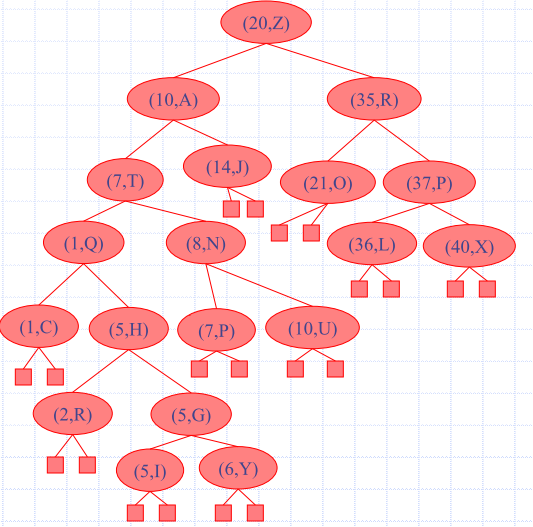 | 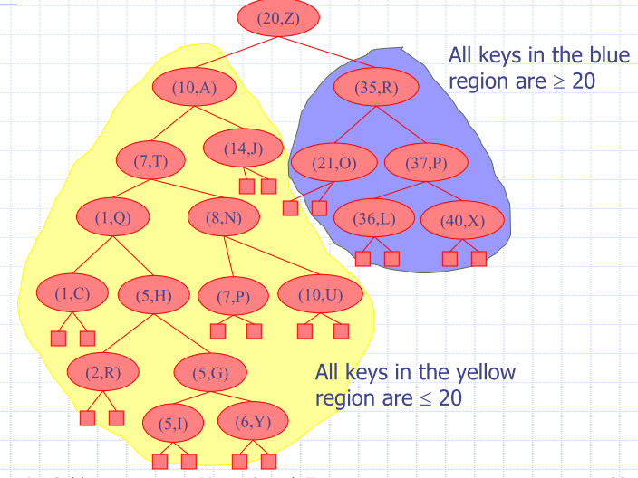

### Search for key $k$
- Trace a downward path starting at the root
- Next node visited depends on the comparison of k with the key of the current node
  - if a leaf is reached, the key is not found
Example: ``get(4)``
  - call ``TreeSearch(4, root)``
- Algorithms for nearest neighbour queries are similar

- Search proceeds down the tree to found item or an external node
- Example: Search for item with key 11

**Intermediate step** | **result, no node**
|--- | ---
 | 

### Insertion

- ``put(k, o)``
- search for key k
  - using TreeSearch
- Assume k is not already in the tree
- w is the leaf reached by the search
- Insert k at node w and expand w into an internal node

Example: insert 5

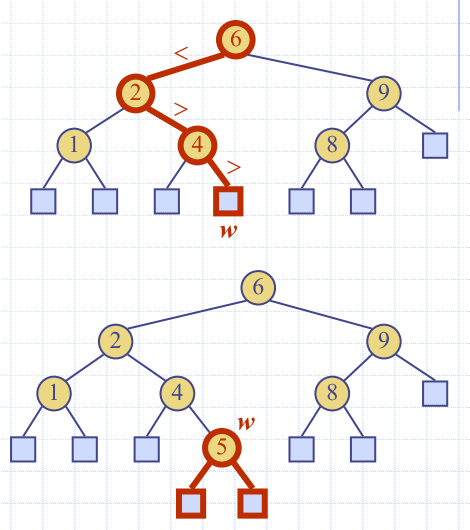

### Deletion

``remove(k)``
- search for key k
- Assume key k is in the tree
- $v$ is the node storing $k$
  - If node $v$ has a leaf child $w$
    - remove $v$ and $w$ with ``removeExternal(w)``
    - removes $w$  and its parent

Example: remove 4

- Consider the case where the key k to be removed is stored at a node v whose children are both internal
    - **HAVE TO PERFROM IN-ORDER TRAVERSAL**
    - find internal node w that follows v in an in-order traversal
    - 'I need to find the next key bigger than `k`'
    - copy key(w) into node v
    - remove node w and its  left child z
- must be a leaf 

Example: remove 3

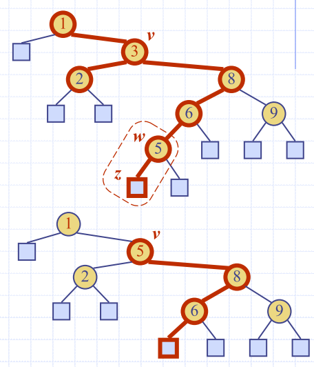

Example: What steps would be involved in deleting the node with key=58?
|before|after
|---|---
|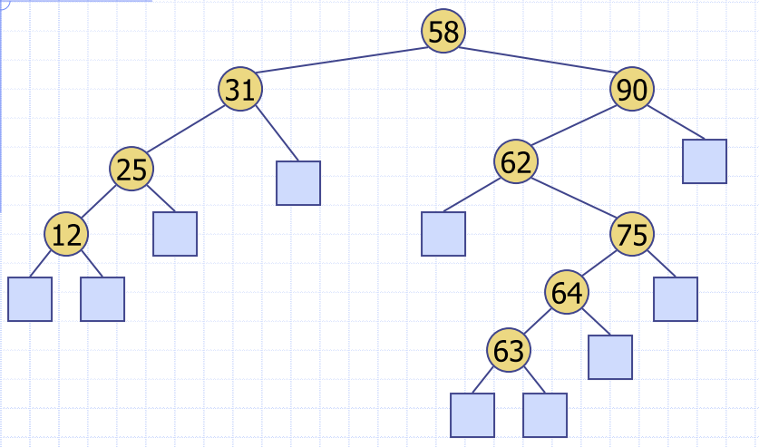|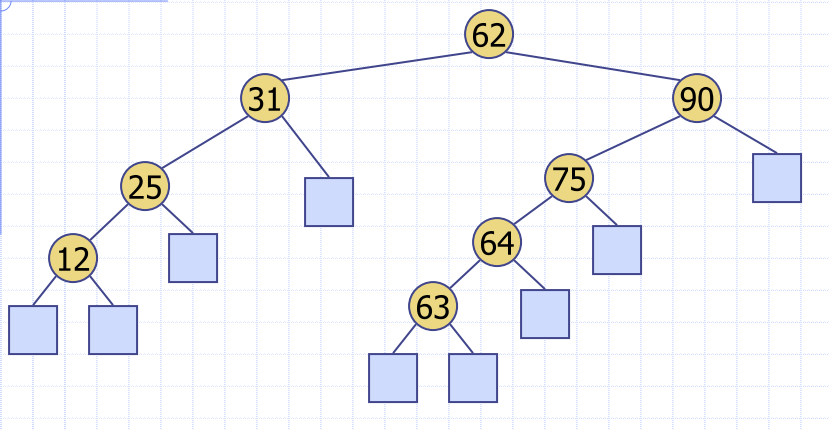 

### Performance

- Consider an ordered map with `n` items implemented by means of a binary search tree of height h
  - space used is O(n) (we have n things)
  - get, put and remove take $O(h)$ time ($h$ is the height of the tree)
    - when the tree is a stick, $h = n$
- Height h is
  - $O(n)$ in the worst case
  - $O(\log n)$ in the best case

### What is I want to store duplicate keys?
- Create a multimap (lookup multimap ADT)
  - return the list, and return that for a given key
- One node with a key

### BST vs Binary Search in Arrays
- searching the tree just simulates looking up an array (in certain circumstances)

## AVL Trees
Balanced binary search tree
- For every internal node v, the heights of the children of v can differ by at most 1

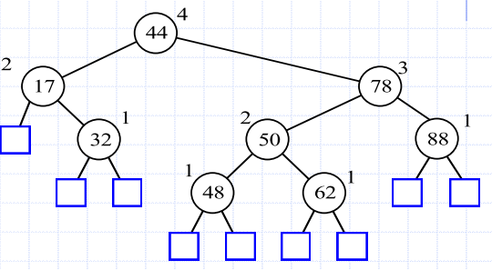

**Height-Balance property**: for every internal node v, the heights of the children of v differ by at most 1
- Height of right subtree - height of left subtree OR count the level of each subtree

### AVL tree search
- is $O(h)$
  - ``TreeSearch(48, root)``
  - What is the maximum height of an AVL tree with $n$ nodes
- Height of an AVL tree storing $n$ keys in $O(\log n)$

### Insertion (AVL)
- Insertion is as in a binary search tree
  - by expanding an external node
- Example
  - insert 54
    - Is it still an AVL tree?

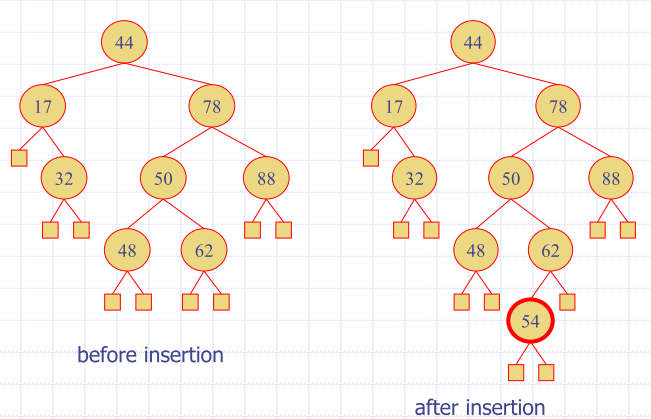

- At worst, one or more ancestors will change from
  - having children with height difference 1 to
  - having children with height difference 2
- Rebalancing the first unbalanced ancestor will rebalance the tree
- Need to preserve in-order relation
  - using tri-node restructuring

- Insertion is as in a binary search tree, plus rebalance
- $z$ is the first unbalanced node encountered while traveling up the tree from w
- $y$ is the child of $z$ with the larger height
- $x$ is the child of $y$ with the larger height
- ``restructure(x)`` to restore balance at $z$

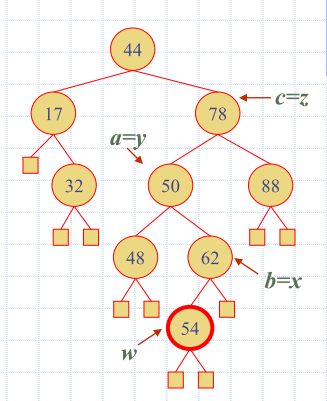

### Tri-node restructuring
- Let ``(a,b,c)`` be the in-order listing of $x, y, z$
- Perform the rotations needed to make b the  topmost node of the three
  - move $b$ up to make it the root node of $a$ and $c$
  - $c$ becomes the right subtree of $b$
  - $a$ becomes the left subtree of $b$

|Before | after
|---|---
| 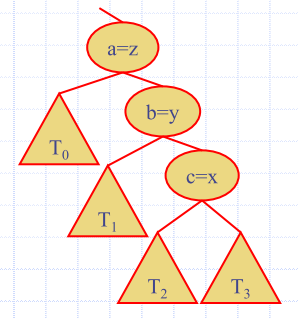 | 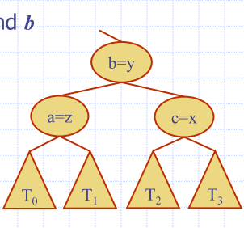

### Tri-node Restructuring (Case 2)
- Let ``(a,b,c)`` be the in-order listing of $x, y, z$
- Perform the rotations needed to make b the topmost node of the three

|Step 1 | Step 2 | Step 3
|---|---|---
| 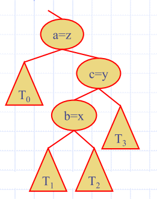 |  | 

There are all mirror symmetric cases:

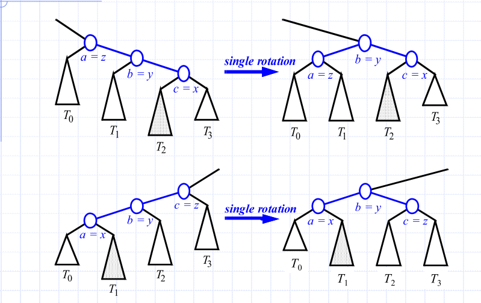

### Removal

- Begins as in a binary search tree
- Removed node will become an empty external node
  - its parent, w, may cause an imbalance
- Example: remove(32)

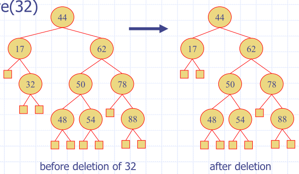

### Balancing after a removal
- z is the first unbalanced node encountered while travelling up the tree 
from w. Let y be the child of z with the larger height, and let x be the 
child of y with the larger height
- Perform tri-node restructuring to restore balance at z
- As this restructuring may upset the balance of another node higher in the 
tree, must continue checking for balance until the root of T is reached

### tri-node restructuring
- Order preserving
  - changes preserve the in-order traversal of all nodes
- Local changes
  - changes are made locally when the grandparent is unbalanced
  - only a constant number of nodes are altered
  - single restructure restores the height-balance property globally

### AVL Tree Performance
| Operation | performance
|---|---
|Space | $O(n)$
| Restructuring | $O(1)$ - using a linked-structure
| Searching | $O(\log n)$
| Height | $O(\log n)$ - no restructures needed
| Insertion | $O(\log n)$
| Removal | $O(\log n)$ - restructuring up the tree, maintaining heights is $O(\log n)$

## Splay Tree
- Splay tree is a binary search tree
  - nodes are splayed after being accessed
    - deepest internal node accessed
- Do not enforce a logarithmic upper bound on height of the tree
  - worst-case time complexity of search, delete and insert is $O(n)$

- Moves a node to the root using rotations
- Performed after all operations
  - searches
  - insertions
  - Removals

### Rotations
right rotation
- makes the left child x of a node y into y’s parent; y becomes the right child of x

Right rotation | left rotation 
|--- | ---
|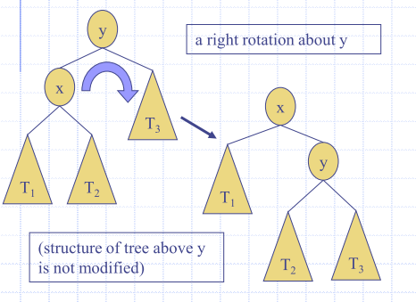 | 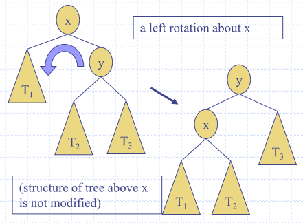

### Splaying

|Method | Splay Node
|---|---
|Search for k | If key found, use that node, If key not found, use parent of ending external node
|``Insert(k,v)`` | Use new node containing the entry inserted
|Remove item  with key k | Use parent of the internal node that was actually removed, from the tree (the parent of the node that the removed, item was swapped with)

### How do we splay?
- Is the node a child of the root?
  - zig (left rotation)
  - zag (right rotation)

### Example combinations
|Zag | Zig | zig-zig | zag-zag | NOTE: Zig-zag
|--- | --- | --- |--- |--- 
| 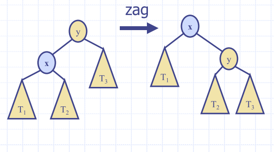|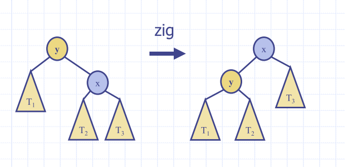 | 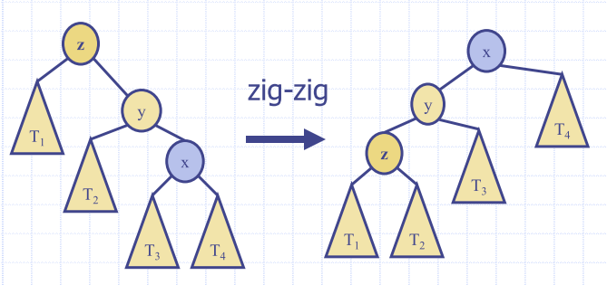 | 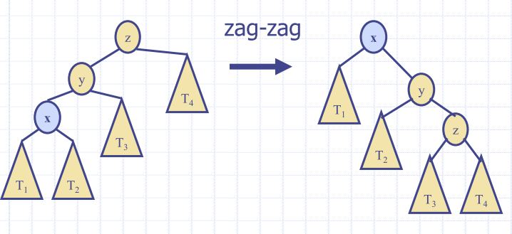 | 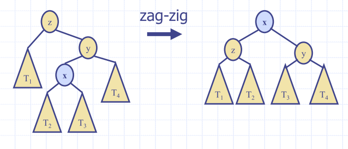

### Ultimate table:

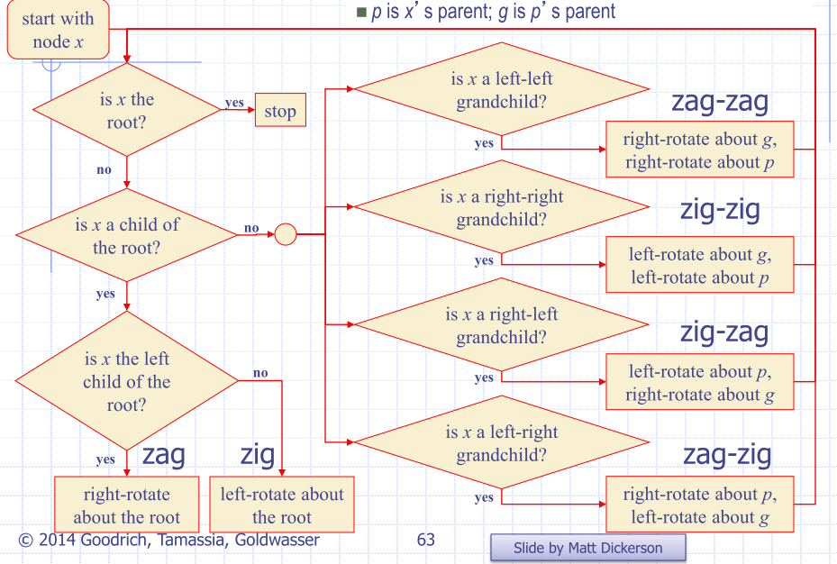

- Becuase splay operations are constantly occuring
- amortised running time is much better than linear
- Should have really good expected behaviour

### Insertions with Splaying
Insert 2:

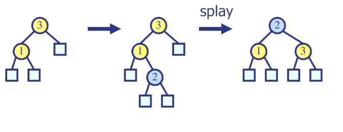

Insert 4:

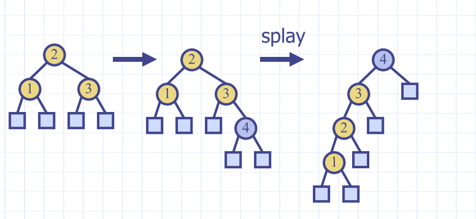

### Splaying costs
- Splaying costs $O(h)$
  - where h is height of the tree
    - O(n) worst-case
- O(h) rotations, each of which is O(1)
- Amortised cost of splaying any node is O(log n)
  - amortised cost of a splay operation is the time  T(n) needed to perform a series of n splay 
operations, divided by n
    - i.e. 𝑇(𝑛) ÷  𝑛

- Splay trees can adapt to perform searches on frequently-requested items much faster than O(log n) in some cases

### Key Ideas
- probably ~10-20 balanced tree types in the literature
  - most commonly seen: AVL, Splay, Red-black, B+ trees

### Red-Black Trees
- A very specific type of balanced tree
  - A specialisation of (2, 4)-trees
- Very similar in spirit to the AVL tree, but  less stringent balance requirements
  - Implication: Faster inserts and deletions, but slower finds.

### B-Trees (B+ and other variants)
- Typically used in database applications
- Very high number of children
  - Allows for shallow trees
  - In databases, this means fewer disk seeks
