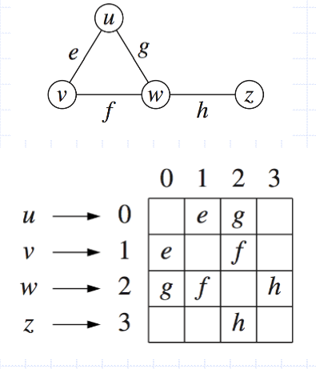

# Lecture 8 - Graphs

1. Graph fundamentals 
2. Graph implementation
3. Depth-first search
4. Breadth-first search
5. Directed graphs

# Graphs
- A graph is a pair (V, E), where
  - V is a set of nodes, called vertices
  - E is a collection of pairs of vertices, called edges
  - Both vertices and edges can be thought of as positions and may store elements
    - Similar to a binary tree, is an object that might have pointers to other objects
    - might have an identifier 'g' for example, with other data underneath etc

### Example
- Vertex represents an airport and stores the airport code
- Edge represents a flight route between two airports and stores distance of the route


### Edge types
- Undirected edge
  - unordered pair of vertices (u,v)
  - e.g. a flight route
- Undirected graph
  - all the edges are undirected
  - e.g. flight route network
- Directed edge
  - ordered pair of vertices (u,v)
  - first vertex u is the origin
  - second vertex v is the destination
  - e.g. a flight
- Directed graph
  - all the edges are directed
  - e.g. flight network


Might want to have a directed edge (can go in one direction, but can't go back)
- sometime edges have direction
- If it consists entirely with no directions, then undirected graph


### Terminology
- End vertices (or endpoints) of an edge
  - U and V are endpoints of ``a``
- Edges incident on a vertex
  - a, d, and b are incident on V
- Adjacent vertices
  - U and V are adjacent
     - connected by a vertix

- Degree of a vertex
  - X has degree 5 (number of edges connected to a vertex)
  - Could have indegree and outdegree if directed
  - indegree, how many edges are coming into the node
  - outdegree, how many edges outbound from the node
- Parallel edges
  - h and i are parallel edges
- Self-loop
  - j is a self-loop


### More terminology
- Path
  - sequence of alternating 
vertices and edges 
  - begins with a vertex
  - ends with a vertex
  - each edge is preceded and 
followed by its endpoints
- Simple path
  - all vertices and edges are distinct
- Examples
  - $P_{1} =(V,b,X,h,Z)$ is a simple path
  - $P_{2} =(U,c,W,e,X,g,Y,f,W,d,V)$ is not a simple path 


### More terminology
- Cycle
  - path that starts and ends on the same vertex
- Simple cycle
  - all vertices are distinct, except the first and last
  - all edges are distinct
- Examples
  - $C_{1} =(V,b,X,g,Y,f,W,c,U,a,V)$
    - a simple cycle
  - $C_{2} =(U,c,W,e,X,g,Y,f,W,d,V,a,U)$
    - not a simple cycle


### Subgraphs
- Subgraph S of a graph G is a graph such that 
  - vertices of S are a *subset* of the vertices of G
  - edges of S are a subset of the edges of G
- Spanning subgraph of G is a subgraph that contains *all* the vertices of G


### Connectivity

- Graph is connected if there is a *simple path* between every pair of vertices
- Connected component of a graph G is a connected subgraph of G


### Trees and Forests
- Undirected graph T is an unrooted tree if 
  - T is connected
  - T has no simple cycles
- An undirected graph is a ***forest** if it contains no simple cycles*
- If you have graphs are disconnected and you want to check a component, you need to check every disconnected graph you haven't checked


### Spanning Trees and Forests
- **Spanning tree** of a connected graph is a spanning subgraph that is a tree
- Spanning forest of a graph is a spanning subgraph that is a forest
    - dropped edges, no longer have cycles anymore


### Notation
- in an undirected graph with no self-loops and no multiple edges
  $$ m \le n(n-1) / 2 $$
- $n = |v|$ number of vertices
- $m = |e|$ number of edges
- deg($v$) degree of vertex $v$
- We count each edge twice, i.e.
$$ \sum_{v} deg(v) = 2m $$

### Graph Density
- Undirected simple graph
$$𝐷 = \dfrac{2𝑚}{𝑛(𝑛−1)}$$
  - Directed simple graph
$$𝐷 = \dfrac{m}{𝑛(𝑛−1)}$$
- Maximum density is 1
- Minimum density is 0
- Sparse
  - $m  ≅ O(n)$  
- Dense
  - $m  ≅ O(n^{2})$

### Graph implementation - vertex and edge ADTs
- Graph is a collection of vertices and edges
- Model the abstraction as a combination of three data types: Vertex, Edge and Graph
- Vertex is a lightweight object that stores an arbitrary element provided by the user (e.g. an airport code)
  - ``element()`` method retrieves stored element
- Edge stores an associated object (e.g. a flight number, travel distance, cost)
  - retrieved with ``element()``

### Graph ADT

| function | Description
|---|---
``numvertices`` | Returns the number of vertices in the graph
``vertices()`` | Returns an iteration of all the vertices of the graph
``numEdges()`` | Returns the number of edges in the path
``edges()`` | returns an iteration of all the edges of the graph
``getEdge(u,v)`` | Returns the edge from vertex $u$ to verte $v$ if one exists, otherwise return null.
``endVertices(e)`` | Returns an array containing the two endpoint vertices of edge $e$. IOf the graph is directed, the first vertex is the origin and the second is the destination
``opposite(v, e)`` | For edge $e$ incident to vertex $v$, returns the other vertex of the edge. An error occurs if $e$ is not incident to $v$.
``outDegree(v)`` | Returns the number of outgoing endes from vertex $v$.
``inDegree(v)`` | Returns the number of incvoming edges to vertex $v$
``outgoingEdges(v)`` | Returns an iteration of all outgoing edges from vertex v
``incomingEdges(v)`` |  Returns an iterations of all incoming edges to vertex $v$
``insertEdge(u, v, x)`` | Creates and returns a new Vertex storing element $x$.
``removeVertex(v)`` | Removes vertex $v$ and all its incident edges from the graph.
``removeEdge(e)`` | Removes edge $e$ from the graph

### Edge list
- **Sequence of edges**
  - represented by vertex pairs
Edge List (image below)
(1,2)
(1,3)
(3,0)
(0,2)


### Edge list Structure
- Vertex object
  - element
  - reference to position in vertex sequence
    - have to add this into a map, etc.
- Edge object
  - element
  - origin vertex object
  - destination vertex object
  - reference to position in edge sequence
    - Going to *store weight in object*
    - going to *hold pointers to the vertices* it is referring to
- Vertex sequence
  - sequence of vertex objects
- Edge sequence
  - sequence of edge objects


### Adjacency List Structure
- Extends edge list
- Incidence sequence for each vertex
  - *sequence of references to edge objects* of incident edges
- Augmented edge objects
  - references to associated positions in incidence sequences of end vertices


### Adjacency Map Structure
- Adapts adjacency list
- Incidence list becomes a map


### Adjacency Matrix structure
- Edge list structure
- Augmented vertex objects
  - integer key (index) 
associated with vertex
- 2D-array adjacency matrix
  - reference to edge object 
for adjacent vertices
  - null for nonadjacent 
vertices
- “Old fashioned” version
  - 0 for no edge
  - 1 for edge



### Performance table

| |Edge list | Adjacency List | Adjacency Matrix
|---|---|---|---
Space| $n+m$| $n+m$ | $n^{2}$
``outgoingEdges(v)`` | m | deg($v$) | $n$
``incomingEdge(v)`` | m | deg($v$)|$n$ 
``getEdge(v, w)``| m | min(``deg(v)``, ``deg(w)``) | 1
``insertVertex(o)``| 1 |1 |$n^{2}$
``insertEdge(v, w, o)``|1 | 1 | 1
``removeVertex(v)`` | m | ``deg(v)`` |$n^{2}$
``removeEdge(e)``| 1 | 1 | 1

- $n = |v|$ number of vertices
- $m = |e|$ number of edges


## Graph traversal
- Systematic process for exploring a graph
  - visit all vertices and edges
- Efficient if done in linear time
- Allows determination of reachability
  - how to travel from one vertex to another

### Depth-First Seach (DFS)
- General technique for traversing a graph
- DFS traversal of a graph G : $O(n + m)$
  - visits all the vertices and edges of G
  - determines whether G is connected
  - computes the connected components of G
  - computes *a* spanning forest of G

```
Algorithm DFS(G, v):
    Input Graph G and a vertex v of G
    Output Collection of vertices reachable from v and their discovery edges and back edges

    Mark vertex v as visited
    for all e in G.outgoingEdges(v) do
        if e is not explored then
            w <- G.opposite(v, e)
            if w has not been visited then
                Record edge e as a discovery edge for vertex w
                DFS(G, w)
            else
                Mark e as a back edge for vertex w
```
- dont want to go back to the original node, but I want to mark that I have visited and discovered this edge


### properties of DFS
- Property 1
  - DFS(G, v) visits all the vertices and edges in the connected component of v
- Property 2
  - Discovery edges labelled by DFS(G, v) *form a spanning tree* of the connected component of v

### Analysis of DFS
- Setting/getting a vertex/edge label takes O(1) time
- Each vertex is labelled twice 
  - once as UNEXPLORED
  - once as VISITED
- Each edge is labelled twice
  - once as UNEXPLORED
  - once as DISCOVERY or BACK
- Method outgoingEdges is called once for each vertex
- DFS runs in O(n + m) time
  - provided graph is implemented as an adjacency list
    - recall that $\sum_{v} deg(v) = 2m$

### Path Finding And Cycle Finding
- DFS can be modified to identify a path from one vertex to another
- can be used to identify cycles through backedges

### DFS for entire graph
- Have to run DFS for all nodes on each subsequent run

```
Algorithm DFS(G):
    Input Graph G
    Output Labelling of edges of G as discovery and back edges
    
    for all u is an element of G.vertices() do
        Set u to be unvisited
    for all e is an element of G.edges() do
        Set e to be unexplored
    for all v is an element of G.vertices() do
        if v has not been visited then
            DFS(G, v)
```

## BFS Algorithm from a vertex
```
Algorithm BFS(G, u)
    Input Graph G and a vertex u of G
    Output Collection of vertices reachable from u and their discovery and cross edges
    
    Q = new empty queue
    Q.enqueue(u)
    Mark vertex u as visited
    while Q.isEmpty() do
        v = Q.dequeue()
        for all e in G.incidentEdges(v) do
            if e is not explored then
                w <- G.opposite(v, e)
                if w has not been visited then
                    Record edge e as a discovery edge for vertex w
                    Q.enqueue(w)
                    Mark vertex w as visited
                else
                    Mark e as a cross edge
```

### Example


### DFS vs. BFS
Back edge (v, w)
- w is an ancestor of v in the tree of discovery edges Cross edge (v, w)
- w is in the same level as v, or in the next level

## BSF Properties
- Notation
  - $G_{s}$ connected component of s
- Property 1
  - $BFS(G, s)$ visits all the vertices and edges of $G_{s}$
    - WILL ONLY VISIT ONE CONNECTED COMPONENT
- Property 2
  - Discovery edges labeled by $BFS(G, s)$ form a spanning tree $T_{s}$ of $G_{s}$
- Property 3
  - For each vertex v in $L_{i}$
    - path of $T_{s}$ from s to v has i edges 
    - every path from s to v in $G_{s}$ has at least i edges

### Analysis of BFS
- Setting/getting a vertex/edge label takes O(1) time
- Each vertex is labelled twice 
  - once as UNEXPLORED
  - once as VISITED
- Each edge is labelled twice
  - once as UNEXPLORED
  - once as DISCOVERY or CROSS
- Each vertex is inserted once into a sequence $L_{i}$
- Method ``outgoingEdges`` is called once for each vertex
- BFS runs in O(n + m) time
  - provided graph is implemented as an adjacency list
    - recall that $\sum_{v} deg(v) = 2m$

## Directed Graphs
- Graph whose edges are all directed
  - “directed graph”
- Applications
  - one-way streets
  - flights
  - task scheduling


- Graph whose edges 
are all directed
- “directed graph”
  - Applications
- one-way streets
- flights
- task scheduling

### Digraph Properties
- Graph G=(V,E) such that
  - each edge goes in one direction
  - edge (a,b) goes from a to b, but not b to a
- If G is simple
  - $m < n\cdot (n - 1)$
- If in-edges and out-edges are kept in separate adjacency lists
- can perform listing of incoming edges and outgoing edges in time proportional to their size

### Digraph Application
Scheduling: edge (a,b) means task a must be completed before b can be started


### Directed Graph Traversal
- Specialise (DFS & BFS) traversal 
algorithms for digraphs by 
traversing edges only along
their direction
- Directed DFS algorithm has
four types of edges
  - discovery edges
  - back edges
  - forward edges
  - cross edges
- Directed DFS starting at vertex s determines the vertices reachable from s

### Reachability
DFS tree rooted at vertex `v`
- vertices reachable from `v` via directed paths
  - e.g. if we take c, we can only go to e, to d, to a, to c as well
  - given some vertex, which other ones can we get to?


### Strong connectivity
- Reach a vertex from any given vertex
- If we can run of every node and we can get to every other node, then we are done

### Strong Connectivity Algorithm
- Pick a vertex ``v`` in ``G``
- Perform a DFS from ``v`` in ``G``
  - if there’s a w not visited, false
- Let ``G’`` be ``G`` with edges reversed
- Perform a DFS from ``v`` in ``G’``
  - if there’s a ``w`` not visited, false
  - else, true
- Running time: $O(n+m)$


### DAGs and Topological Ordering
- Directed acyclic graph (DAG)
  - digraph with no directed cycles
- Topological ordering of a digraph is a numbering $v_{1}, ..., v_{n}$ of the vertices such that for every edge $(v_{i}, v_{j})$, we have $i < j$
- Example: in a task scheduling digraph, a topological ordering of a task sequence that satisfies the precedence constraints
- Not one topological ordering for a graph

**Theorem**

A digraph has a topological ordering if and only if it is a DAG


### Algorithim for Topological sorting
- Essentially, find the vertex with no outgoing edges, and label it the highest number. remove it from the graph and edges associated with it
  
```
Algorithm TopologicalSort(G):
  H <- G // Temporary copy of G
  n <- G.numVertices()
  while H is not empty do
    Let v be a vertex with no outgoing edges
    Label v <- n
    n <- n - 1
    Remove v from H
```

### Topological sorting with DFS
```
Algorithm topologicalDFS(G)
  Input dag G
  Output topological ordering of G
  
  n <- G.numVertices()
  for all  u in G.vertices() do
    Set u to be unvisited
  for all  v in G.vertices() do
    if v has not been visited then
      topologicalDFS(G, v)

Algorithm topologicalDFS(G, v)
  Input graph G and a start vertex v of G
  Output labeling of the vertices of G in the connected component of v
  
  #Mark vertex v as visited
  for all  e in G.outgoingEdges(v) do
    w <- G.opposite(v, e)
      if w has not been visited then
        { e is a discovery edge }
        topologicalDFS(G, w)
      else
        { e is a forward or cross edge }
  #Label v with topological number n
  n <- n - 1
```


