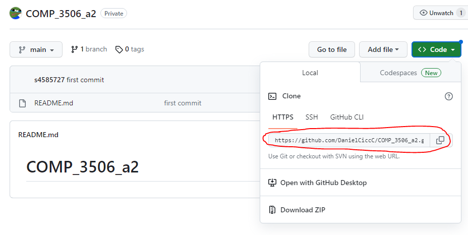
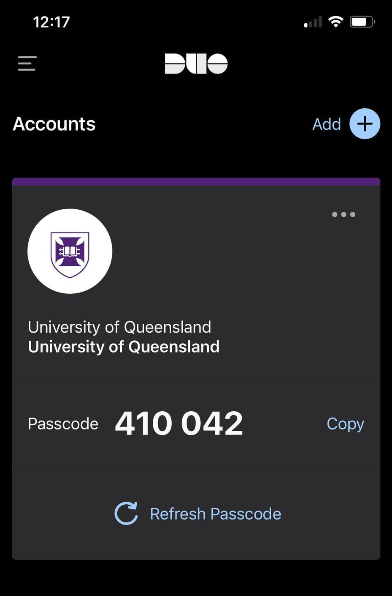

# Moss Setup

I have been testing a few methods to try and use moss effectively on local. While I have had success in the past using [microsoft's remote SSH extension on vscode](https://marketplace.visualstudio.com/items?itemName=ms-vscode-remote.remote-ssh) but UQ's recent addition of 2FA has made the process a little less intuitive, plus now I'm getting flakey connectivity issues.

The best method I'm finding now is to creating a git repository and create clones into both local and moss. Using a windows machine, you can ssh into local through DOS (or PuTTY) and clone the repository in terminal, as follows:

### On GitHub (or related)
1. Create a new repository (make sure to make this private so your peers cannot see it)
2. In the upper-right corner of any page, click your profile photo, then click [developer settings](https://github.com/settings/apps).
3. You will need to create a new personal access token to clone onto moss. Git reccomend their fine-grained tokens, but for our purposes classic tokens will be fine. Generate a new token and make sure the expiration easily exceeds the due date of the assignment.
4. I select all scopes for safety, but ``repo``, ``write:packages``, ``delete:packages`` and ``admin:org`` are necessities.
5. Copy the key to the side for safekeeping
6. Navigate to your repo and copy the HTTPS URL (circled)




### On DOS
1. Open a DOS prompt (where ``sxxxxxxx`` is you student username)

```DOS
ssh -l sxxxxxxx remote.labs.eait.uq.edu.au
```
2. Type in your Password
3. Next, go into your Duo app and type the six-digit passcode into the prompt for 2FA. Make sure to refresh.



4. You should be in. Make a new directory to clone your repo.
5. ``cd`` to your new directory and clone your new repository
```dos
git clone https://github.com/{$YOUR_REPO}
```
6. Your password will be the access token you created earlier. Copy this into your DOS prompt.
7. Your repo should be setup

I created a clone to work on locally, and I will just pull any changes to work on over moss. Having a repo likes this also makes it quite simple for submitting over gradescope - now it just becomes a matter of linking up your GitHub account for access and choosing this new repository and related branch.

Happy coding :)