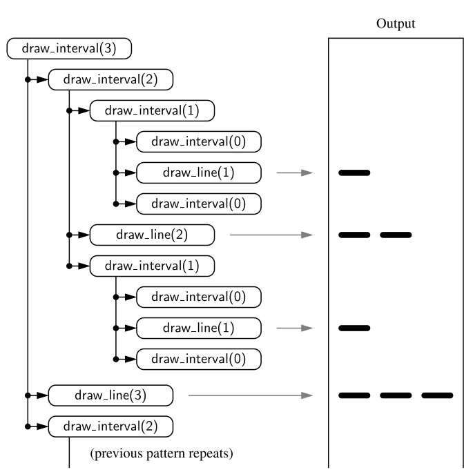

# Chapt 3.1. Experimental studies

We are interested in the desgin of "good" data structures and algorithms

**Data Structure**: a systematic way of organising and accessing data

**Algorithm**: A step-by-step procedure for performing some task in a finite amount of time.


## Experimental studies
- We can study the running time of an algorithm by recording the time spent between each execution

```python
for time import time
start_time = time()
# run the algorithm
end_time = time()
elaqpsed = end time - start_time
```
- We can use this approach to gather experimental data on the efficiency of Python's list class
- Not the best measure of algorithm efficiency; other background process may yield and unfair test. A fairer metric is the number of CPU cycles that are used by the algorithm

We are interested in the general dependence of running time on the size and structure of the input.
- Perform independent experiments on many different test inputs of various sizes, i.e.


### Challenges of experimental analysis:
- Experimental running times of two differing algorithms are difficult to compare unless experiements are performed on the same hardware and software requirements
- Experiments can only be completed on a limited set of inputs
- An algorithm must be fully implemented in order to execute it, to study its running time experimentally.

## Goal of experimental analysis:
- Evaluate relative efficiency of algorithms in a way that is independent of the hardware and software envrionment
- Is performed at a high-level description of the algorithm without need for implementation
- Takes into account all possible inputs.

### Counting prime operations:
Perform an analysis directly on a high-level description of the algorithm. Define a set of *primitive operations* such as the following:
- Assigning an identifier to an object
- Determining the object associated with an identifier
- Performing an arithmetic operation (e.g. adding two numbers)
A primitive operation corresponds to a low-level instruction with an execution time that is constant. 

Henceforth, to capture the growth of an algorithms's running time, we will associate a function $f(n)$ that characterises the number of primitive operations performed, relative to the input size $n$.

## Focus on worst-case input
- characterise the running times in terms of the wrost case, as a function of the input size, $n$, of the algorithm.
  - easier than avergae case analysis


# Recursion
Begin with the following four example of the use of recursion, providing an python implementation for each:
1. The factorial function
2. An English rules
3. Binary search
4. File system for a computer, in which directories can be nested arbitrarily deep within other directories

## The factorial function
$$ 
n! = 
\begin{cases}
        1 & \text{if } x \in n = 0\\
        n \cdot (n-1)\cdot (n-1) \cdot \cdot \cdot 2 \cdot 1 & \text{if } x \ge 1
\end{cases}
$$
There is a natural recursive definition for the factorial function. Observe that $5!=5\cdot 4 \cdot 3 \cdot 2 \cdot 1 = 5\cdot 4!$. Thus, the recrusive defintion can be formalised as
$$ 
n! = 
\begin{cases}
        1 & \text{if } x \in n = 0\\
        n \cdot (n-1)! & \text{if } x \ge 1
\end{cases}
$$

### Recursive implementation of the Factorial function
```python
def factorial(n):
    if n == 1:
        return 1
    else:
        return n * factorial(n-1)
```
- repetition is provided by the repeated invocations of the function
---
  
## Drawing the English Rulers
- For each inch, we place a tick with a numeric label. We denote the length of the tick designating a whole inch as the *major tick length*
- Between marks for whole inches, the rules contains a series of minor ticks, placed at intervals of 1/2 inch, 1/4 inch, etc.


Although it is possible to draw such a ruler with iteration, the task is considerably easier with iteration

### Python Implementation
```python
def draw_line(tick_length, tick_label=''):
"""Draw one line with given tick length (followed by optional label)"""
line = '-' * tick_length
if tick_label:
    line += ' ' + tick_label

def draw_interval(center_length):
    """ Draw tick length based upon a central tick length."""
    if center_length > 0:       # stop when length drops to 0
        draw_interval(center_length - 1)    # recursively draw top ticks
        draw_line(center_length)            # draw center tick
        draw_interval(center_length - 1)    # recursively draw bottom ticks

def draw_ruler(num_inches, major length):
    """Draw English ruler with given numbr of inches, major tick length"""
    draw_line(major_length, '0')        # draw 0 inch line
    for j in range(1, 1+num_inches):
        draw_interval(major_length - 1)     # draw interior tick for inch
        draw_line(major_length, str(j))     # draw in j line and label
```
The execution of the recursive *draw_interval* function can be visualised using a recursion trace.




---
## Binary search
This algorithm is used to efficiently locate a target value within a sorted sequence of $n$ elements.
- When the standard sequence is unsorted, the standard approach is to use a loop to examine every element, until either finding a target or exhausting a dataset
- When sorted and indexable, we know that the values stored at indices $0,...,j-1$ are less than or equal to the value at index $j$ -> same for values greater than $j$.
    - The algorithm maintains two parameters, low and high, such that all the candidate entries have index at least low and at most high.
      - Initially, low = 0 and high = $n-1$
      - compare the target value with the median candidate $mid=\lfloor(low+high)/2\rfloor$
  
-  Consider three cases:
  1. If the target equals data[mid], return the result
  2. If target < data[mid], recur the first half of the sequence
  3. If target > data[mid], then recur the second half of the sequence

Whereas a sequential search runs in $O(n)$ time, binary search runs in $O(\log n)$ time
```python
""" Return true us target is found in indicated portion of a Python list
The search only considers the portion from data[low] to data[high] inclusive
"""
def binary_search(data, target, low, high):
    if low > high:
        return False
    else:
        mid = (low+ high) // 2
        if target == data[mid]:
            #recur on the portion left of the middle
            return binary_search(data, target, low, mid-1)
        else:
            #recur on the portion right of the middle
            return binary search(data, target, mid + 1, high)
```
---
## File Systems
A file system consists of a top-level directory, and the contents of this directory consists of files and other directories, which in turn contain files and other directories, and so on. The operating system allow directories to be nested arbitrarily deep
- Many common behaviours of an operating system, such as copying a directory or deleting a directory are implemented as recursive algorithms
- The cumulative disk space for an entry can be computed with a simple recursive algorithm

```
Algorithm DiskUsage(path):
    Input: A string designating a path to a file-system entry
    Output: The cumulative disk space used by that entry and any nested entries
    total = size(path)
    if path represents a directory then
        for each child stored within directory path do
            total = total + DiskUsage(child)
    return total
```
---

## Analysing Recursive Algorithms
For each recursive algorithm, we will account for each operation that is performed based upon the particular ***Activation*** of the function that manages the flow of control at the time it is executed
- i.e. only account for the number of operations that are performed within the body of that activation
- Can then account for the overall number of operations that are executed as part of the recursive algorithm
    - This can achieved by understanding the recursion trace of each algorithm

### Factorial algorithm
- To compute ```factorial(n)```, we see there are a total of $n+1$ activations, as the parameter decreases from n in the first call, to $n-1$, etc.
- Therefore, the overall number of operations computing ```factorial(n)``` is $O(n)$
### Drawing an English ruler
- Consider how many lines of input are generated by an initial call to ``draw_interval(c)`` 
- We know that a call to ``draw_interval(c)``  for $c>0$ spawns two calls to ``draw_interval(c-1)`` and a single call to ``draw_line``.
- For all $c \ge 0$, a call to ``draw_interval(c)`` results in precisely $2^{c} - 1$ lines of output
  - More generally, the number of lines priented by ``draw_interval(c)`` is one more than twice the number generated to call ``draw_interval(c-1)``

### Performing a Binary Search
- The running time of a binary search algorithm is proportional to the number of recursive calls performed
- The binary search algorithm runs in $O(\log n)$ times for a sorted sequence with $n$ elements
    - Initially, the number of candidates is $n$, after the first call in a binary search, it is at most $n/2$; after the second call $n/4$; and so on. In general, after the $j$th call in a binary search, the number of candidate entries remaining is at most $n/2^{j}$.
  
## Recursion run Amok
### An inefficent recursion for Computing Fibonacci Numbers
Fibonacci:
$$F_{0} = 0$$
$$F_{1} = 1$$
$$F_{n} = F_{n-2} + F_{n-1},        n>1 $$ 
A direct implementation based on the algorithm would be as follows:

```python
def bad_fibonacci(n):
    """Return the nth Fibonacci number"""
    if n <= 1:
        return n
    else:
        return bad_fibonacci(n-1) + bad_fibonacci(n-2)
```
- Computing the fibonacci sequence depends on the two previous values $F_{n-1}$ and $F_{n-2}$, but the call to compute $F_{n-1}$ requires it's own recursive call to compute $F_{n-2}$ -> does not have the knowledge of that value
  
Computing the nth Fibonacci number in this way requires an exponential number of calls to the function. The number of calls $c_{n}$ for input size $n$ is $c_{n}>2^{n/2}$, which mean that ``bad_fibonacci(n)`` makes a number of calls that is exponential in $n$.

We can compute $F_{n}$ much more efficiently in which invocation only makes one recursive call. Rather than having the function return a single value, we define a recursive function that returns a pair of consecutive fibonacci numbers.

```python
def good_fibonacci(n):
    """ Return pair of Fibonacci numbers, F(n) and F(n-1)"""
    if n <= 1:
        return (n, 0)
    else:
        (a, b) = good_fibonacci(n-1)
        return (a+b, a)
```
The execution of ``good_fibonacci(n)`` table $O(n)$ time.

## 4.4 Further examples of Recursion
- If a recursive call starts at most one other, we call this **linear recursion**
- If a recursive call starts two others, we call this **binary recursion**
- If a recursive call starts more than two others, we call this **Multiple recursion**

### Linear recursion
- Implementation of factorial function and ``good_fibonacci`` function are examples of linear recursion
- Note that linear recursion reflects the structure of the recursion trace, not the asymptotic analysis of the running time

#### Example: Summing the elements of a sequence recursively
The following computes the sum of a sequence
```python
def linear_sum(S, n)
""" Compute the sum of a sequence of the first n numbers of Sequence S"""
    if n == 0:
        return 0
    else:
        return linear_sum(S, n-1) + S[n-1]
```

### Binary recursion
Revisit the problem of summing $n$ elements of s sequence $S$, of numbers. With two or more elements, we can recursively compute the sum of the first half, and the sum of the second half, and ad these together as shown in the following:
```python
def binary_sum(S, start, stop):
    """ Return the sum of the numbers in implicit slice S[start:stop]. """
    if start >= stop:
        return 0
    elif start == stop - 1:
        return S[start]
        else: 
            mid = (start + stop) // 2
            return binary_sum(S, start, mid) + binary_sum(S, mid, stop)
```
The size of the range is divided in half for each recursive call, and uses $\log n$ amount of additional space, compared to $n$ space used in the ``linear_sum`` function. However, the running time of ``binary_sum`` is $O(n)$, as there are $2n-1$ function calls, each requiring constant time.

### Multiple recursion
The recursion of analysing the disk space usage of a file system is an example of multiple recursion, because the number of recursive calls made during one invocation was equal to the number of entries within a given directory of a file system.

## Designing Recursive algorithms
An algorithm that uses recursion typically has the following form:
- Test for **base cases**. Begin by testing for a set of base cases (there should be at least one)
- **Recur**. If not a base case, we perform one or more recursive calls. This may involve a step that decides which of several possible recursive calls to make.

## Eliminating tail recursion
Some forms of recursion can be eliminated without any use of auxillary memory. A notable form is known as **tail recursion**.
- A recursion is a tail recursion if any recursive call that is made from one context is the very last operation in that context, with the return value of that recursion immediately returned by the enclosing recursion.
- Of the recursive functions demonstrated in this chapter, the ``binary_search`` and ``reverse`` function are examples of recursion.
- Any tail recursion can be reimplemented nonrecursively by enclosing the body in a loop for repition, and replacing a recursive call with new parameters by a reassignment of the existing parameters to those values.
```python
def binary_search(data, target):
    """return True if target is found in the given python list"""
    low = 0
    high = len(data) - 1
    while low <= high:
        mid = low+high // 2
        if target == data[mid]:
            return True
        elif target < data[mid]:
            high = mid - 1
        else:
            low = mid + 1
    return False
```
Where we made a recursive call ``binary_search(data, target, low, mid-1)`` in the original version, we replace ``high = mid - 1`` in our new version and continue our iteration.
