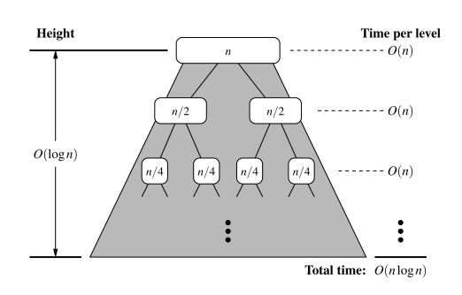
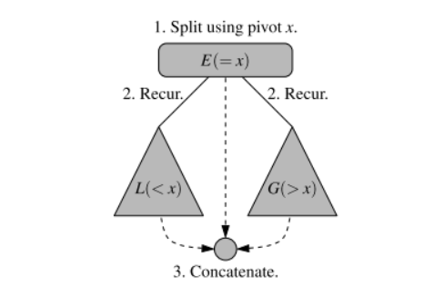

# Chapter 12.1 Why study Sorting algorithms?
Given a collection, the goal is to rearrange the elements so that they are ordered from smallest to largest
- In python, the natural order of object is typically defined with the $<$ operator, having the following properties
$$k \nless k$$ (Irreflexive)
$$ \text{if} \; k_{1} < k_{2}, \; \text{and} \; k_{2} < k_{3}, \; \text{then} \; k_{1} < k_{3} $$ (Transitive)
- Sorting is amongst the most important of computing problems
  - merge sort, quick-sort, bucket-srt, and radix sort
  
# 12.2 Merge-Sort
### Divide and Conquer
The first two algorithms in this chapter use recursion in an algorithmic design patterns called ***divide and conquer***. This pattern consists of the following three steps:
1. **Divide**: If the input size is smaller than a certain threshold, solve the problem directly using a straightforward method and return the solution so obtained. Otherwise, divide the input data into two or more disjoint subsets
2. **Conquer**: Recursively solve the subproblems associated with the subsets
3. **Combine**: Take the solutions to the subproblems and merge them into a solution to the original problem.

Implementing into an algorithm:
1. **Divide**: If $S$ has zero or one elements, return $S$ (as it is already sorted). Otherwise, remove all the elements from $S$ and put them into two sequences, $S_{1}$ and $S_{2}$, each containing about half of the elements of S.
2. **Conquer**: Recursively sort sequences of $S_{1}$ and $S_{2}$.
3. **Combine**: Put back the elements into $S$ by merging the sorted sequences $S_{1}$ and $S_{2}$ into a sorted sequence, i.e. $\lfloor n/2 \rfloor$ elements of $S_{1}$ and $\lceil n/2 \rceil$ elements of $S_{2}$.

Each node of $T$ represents a recursive invocation of the merge-sort algorithm. We associate with each node $v$ of $T$ the sequence $S$ that is processed by the invocation associated with $v$.

The algorithm visualisation in terms of the merge-sort tree helps us analyse the running time of the merge-sort algorithm. Each node of the tree represents a recursive call of merge-sort.


### Implementation of Merge-Sort
- The ``merge`` function is responsible for the subtask of merging two previously sorted sequences, $S_{1}$ and $S_{2}$, with the output copied into $S$. 
  - We copy one element during each pass of the while loop, conditionally determining whether the next elements should be taken from $S_{1}$ or $S_{2}$.

```python
def merge(S1, S2, S):
    """Merge two sorted Python lists S1 and S2 into properly sized list S"""
    i = j = 0
    while i + j < len(S):
        if j == len(S2) or (i < len(S1) and S1[i] < S2[j]):
            S[i + j] = S1[i]
            i += 1
        else:
            S[i + j] = S2[j]
            j += 1

def merge_sort(S):
    """Sort the elements of Python list S using the merge-sort algorithm."""
    n = len(S)
    if n < 2:
        return # list is already sorted
    # divide
    mid = n // 2
    S1 = S[0:mid] # copy of first half
    S2 = S[mid:n] # copy of second half
    # conquer (with recursion)
    merge_sort(S1) # sort copy of first half
    merge_sort(S2) # sort copy of second half
    # merge results
    merge(S1, S2, S) # merge sorted halves back into S
```
A step of the merge process is illustrated in the following figure:


### Running time of Merge-Sort
Let $n_{1}$ and $n_{2}$ be the number of elements of $S_{1}$ and $S_{2}$, respectively. It is clear that the operations performed inside each pass of the while loop (of function ``merge``) take $O(1)$ time.
- During each iteration of the loop, one element is copied from either $s_{1}$ or $S_{2}$ into $S$ (and the element is considered no further). Therefore, the number of iterations of the loop is $n_{1} + n_{2}$ (and the time complexity would be $O(n_{1} + n_{2})$).

To determine the the complexity of the merge-sort algorithm, we account for the time to divide the sequence into two subsequences, and the call to merge to combine the two sorted sequences, but we exclude the two recursive calls to merge-sort.

Observations:
- The divide step at node $v$ runs in time proportional to the size of the sequence for $v$
- The merging step also takes time that is linear in the size of the merged sequence.
  - If we let $i$ denote the depth of node $v$, the time spent at node $v$ is $O(n/2^{i})$ since the size of the sequence handled by the recursive called associated with $v$ is equal to $n/2^{i}$

Given our definition of 'time spent at a node', the running time of merge-sort is equal to the sum of the times spent at the nodes of $T$. Observe $T$ has exactly $2^{i}$ nodes at depth $i$.
- The overall time spent at all the nodes of $T$ is $O(2^{i} \cdot n/2^{i})$, which is $O(n)$.
- The height of $T$ is $\lceil \log n \rceil$
Thus, the algorithm merge-sort sorts a sequence $S$ of size $n$ in $O(n \log n)$ times, assuming two elements can be compared in $O(1)$ time.



### Using recurrence equations to determine the time complexity of merge-sort
Let the function $t(n)$ denote the worst-case running time of merge-sort on an input sequence of size n. We can characterise function $t(n)$ by means of an equation where the function $t(n)$ is recursively expressed in terms of itself.

In order to simplify the characterisation of $t(n)$, let us restrict our attention to the case when $n$ is a power of 2. Thus:
$$ 
t(n) = 
\begin{cases}
        b & \text{if } n \le 1 \\
        2t(n/2) + cn)  & \text{otherwise, for some constants } b, c \in \mathbb{Z^{+}}
\end{cases}
$$
Observe that the function $t(n)$ appears on the left and right hand sides of the equal sign, due to the design of the recurrence relation. However, we truly desire a Big-O characterisation of $t(n)$, i.e. a closed form characterisation of $t(n)$.

This can be obtained by applying the definition of a recurrence relation, assuming $n$ is relatively large.
$$\begin{align} 
t(n) &= 2(2t(n/2^{2})+cn/2) + cn \\
&= 2^{2}t(n/2^{2})+2cn/2 + cn = 2^{2}t(n/2^{2}) + 2cn \\
\end{align}
$$
If we apply the equation again, we get:
$$\begin{align} 
t(n) &= 2^{3}t(n/2^{3}) + 3cn \\
\end{align}
$$
And applying the equation three times, obtain:
$$\begin{align} 
t(n) &= 2^{i}t(n/2^{i}) + icn \\
\end{align}
$$
The issue remains, then, to determine when to stop this process. To see when to stop, recall that we switch to the closed for $t(n) = b$ when $n<1$, which will occur when $i= \log n$. Thus,
$$\begin{align} 
t(n) &= 2^{\log n}t(n/2^{\log n }) + (\log n) cn \\
&= nt(1) + (\log n) cn \\
&= nb +  cn (\log n) \\
\end{align}
$$
Thus, we get an alternative justification of the fact that $t(n)$ is $O(n \log n)$.

## Quick Sort

### High level description of Quick-Sort:
The main idea is to apply a divide-and-conquer technique, and then combine the sorted subsequences by a simple concatenation.
1. ***Divide***: If S has at least two elements, select a specific elements $x$ from $S$, which is called the **pivot**. As is common practise, choose the pivot $x$ to be the last element in $S$. Remove all elements from $S$ and put them into three sequences
    - $L$, storing the elements in $S$ less than $x$
    - $E$, storing the elements in $S$ equal to $x$
    - $G$, storing the elements in $S$ greater than $x$
  If the elements of $S$ are distinct, then $E$ only holds one element - the pivot itself.
2. ***Conquer***: Recursively sort sequences $L$ and $G$
3. ***Combine***: Put back the elements into $S$ in order by first inserting the elements of $L$, then those of $E$, and finally those of $G$.


