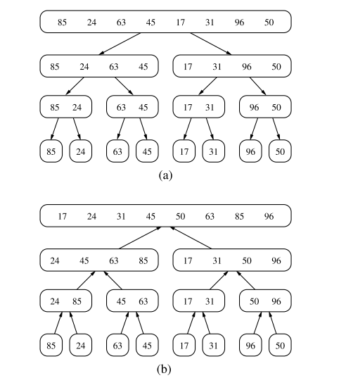
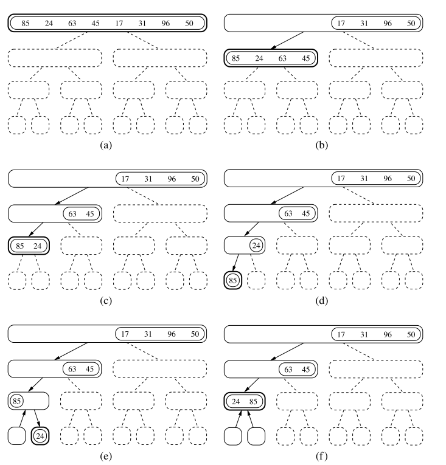
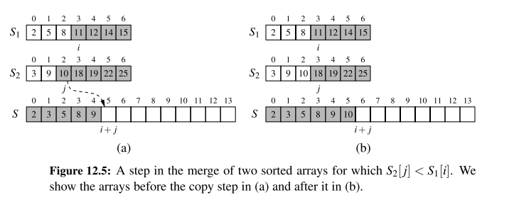

# Chapter 12.1 Why study Sorting algorithms?
Given a collection, the goal is to rearrange the elements so that they are ordered from smallest to largest
- In python, the natural order of object is typically defined with the $<$ operator, having the following properties
$$k \nless k$$ (Irreflexive)
$$ \text{if} \; k_{1} < k_{2}, \; \text{and} \; k_{2} < k_{3}, \; \text{then} \; k_{1} < k_{3} $$ (Transitive)
- Sorting is amongst the most important of computing problems
  - merge sort, quick-sort, bucket-srt, and radix sort
  
# 12.2 Merge-Sort
### Divide and Conquer
The first two algorithms in this chapter use recursion in an algorithmic design patterns called ***divide and conquer***. This pattern consists of the following three steps:
1. **Divide**: If the input size is smaller than a certain threshold, solve the problem directly using a straightforward method and return the solution so obtained. Otherwise, divide the input data into two or more disjoint subsets
2. **Conquer**: Recursively solve the subproblems associated with the subsets
3. **Combine**: Take the solutions to the subproblems and merge them into a solution to the original problem.

Implementing into an algorithm:
1. **Divide**: If $S$ has zero or one elements, return $S$ (as it is already sorted). Otherwise, remove all the elements from $S$ and put them into two sequences, $S_{1}$ and $S_{2}$, each containing about half of the elements of S.
2. **Conquer**: Recursively sort sequences of $S_{1}$ and $S_{2}$.
3. **Combine**: Put back the elements into $S$ by merging the sorted sequences $S_{1}$ and $S_{2}$ into a sorted sequence, i.e. $\lfloor n/2 \rfloor$ elements of $S_{1}$ and $\lceil n/2 \rceil$ elements of $S_{2}$.

Each node of $T$ represents a recursive invocation of the merge-sort algorithm. We associate with each node $v$ of $T$ the sequence $S$ that is processed by the invocation associated with $v$.

The algorithm visualisation in terms of the merge-sort tree helps us analyse the running time of the merge-sort algorithm. Each node of the tree represents a recursive call of merge-sort.





### Implementation of Merge-Sort
- The ``merge`` function is responsible for the subtask of merging two previously sorted sequences, $S_{1}$ and $S_{2}$, with the output copied into $S$. 
  - We copy one element during each pass of the while loop, conditionally determining whether the next elements should be taken from $S_{1}$ or $S_{2}$.

```python
def merge(S1, S2, S):
    """Merge two sorted Python lists S1 and S2 into properly sized list S"""
    i = j = 0
    while i + j < len(S):
        if j == len(S2) or (i < len(S1) and S1[i] < S2[j]):
            S[i + j] = S1[i]
            i += 1
        else:
            S[i + j] = S2[j]
            j += 1

def merge_sort(S):
    """Sort the elements of Python list S using the merge-sort algorithm."""
    n = len(S)
    if n < 2:
        return # list is already sorted
    # divide
    mid = n // 2
    S1 = S[0:mid] # copy of first half
    S2 = S[mid:n] # copy of second half
    # conquer (with recursion)
    merge_sort(S1) # sort copy of first half
    merge_sort(S2) # sort copy of second half
    # merge results
    merge(S1, S2, S) # merge sorted halves back into S
```
A step of the merge process is illustrated in the following figure:


