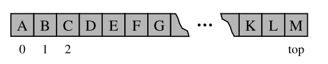

# Chapter 6.1 - Stacks
A stack is a collection of objects that are inserted and removed according to the last-in, first-out (LIFO) principle.
- May only access or remove the most recently inseted object that remains (at the so-called 'top' of the stack)

### Stack Data Type
 Formally, a stack is an abstract data type (ADT) such that an instance S supports the following two methods:

-  ``S.push(e)`` Add an element ``e`` to the top of stack $s$
-  ``S.pop()``: Remove and return the top element from the stack ``S``; an error occurs if the stack is empty
  
Accessor methods for convenience:
- ``S.top()``: Return a reference to the top element of stack S, without removing it; an error occurs if the stack is empty.
- ``S.is_empty()``: Return True if stack S does not contain any elements.
- ``len(S)``: Return the number of elements in stack S; in Python, we implement this with the special method ``__len__``.

### Simple Array-based Stack implementation
Implement a stack quite easily, aligning the top of the stack at the end of the list.



### Adapter Pattern
The **Adapter** design pattern applied tto any context where we effectively want to modify an existing class so that its methods match those of a related, but different, class or interface.
- Apply an adapter pattern by defining a class in such a way that it contains an instance of the existing class as a hidden field, and iimplement each method of the new class using methods of this hidden instance variable

|***Stack Method***| ***Realisation with Python list***
|---|---
|``S.push(e)`` |``L.append(e)``
|``S.pop()``|``L.pop()``
|``S.top()``|``L[-1]``
|``S.is_empty()``| ``len(L)==0``
|``len(S)``| ``len(L)``

We use the adapter desing pattern to define an ``ArrayStack`` that uses an underlying Python list for storage
- Use word ``ArrayStack`` to emphasize that the underlying storage is inherently Array based
- when ``pop`` is called on an empty Python list, it formally raises and ``Indexerror``, but this does not seem appropriate for a stack - define a new exception class that is more appropriate

### Usage example
```python
S = ArrayStack( )       # contents: [ ]
S.push(5)               # contents: [5]
S.push(3)               # contents: [5, 3]
print(len(S))           # contents: [5, 3]; outputs 2
print(S.pop())          # contents: [5]; outputs 3
print(S.is empty())     # contents: [5]; outputs False
print(S.pop())          # contents: [ ]; outputs 5
print(S.is empty())     # contents: [ ]; outputs True
S.push(7)               # contents: [7]
S.push(9)               # contents: [7, 9]
print(S.top())          # contents: [7, 9]; outputs 9
S.push(4)               # contents: [7, 9, 4]
print(len(S))           # contents: [7, 9, 4]; outputs 3
print(S.pop())          # contents: [7, 9]; outputs 4
S.push(6)               # contents: [7, 9, 6]
```

## Class implementation

```python

class ArrayStack:
    """LIFO Stack implementation using a Python list as underlying storage."""
   
    def init (self):
    """Create an empty stack."""
        self. data = [ ] # nonpublic list instance
   
    def len (self):
    """Return the number of elements in the stack."""
        return len(self. data)
   
    def is empty(self):
    """Return True if the stack is empty."""
        return len(self. data) == 0
   
    def push(self, e):
    """Add element e to the top of the stack."""
        self. data.append(e) # new item stored at end of list
   
    def top(self):
    """Return (but do not remove) the element at the top of the stack.
   
    Raise Empty exception if the stack is empty.
    """
        if self.is empty():
           raise Empty( Stack is empty )
        return self. data[−1] # the last item in the list
   
    def pop(self):
    """Remove and return the element from the top of the stack (i.e., LIFO).
   
    Raise Empty exception if the stack is empty.
    """
        if self.is empty():
            raise Empty( Stack is empty )

        return self. data.pop( ) # remove last item from list
```

### Efficiency for stack-based implementation

|***Operation***|***Running Time***
|---|---
|``S.push(e)`` |$O(1)^{*}$
|``S.pop()``|$O(1)^{*}$
|``S.top()``|$O(1)$
|``S.is_empty()``| $O(1)$
|``len(S)``| $O(1)$

### Reversing data using a stack
As a consequence of the LIFO protocol, a stack can be used as a general tool to reverse a data sequence.
- Example, print lines in reverse order
  - Read each line and push it onto the stack, and then writing the lines in the order they are popped.

```python
def reverse file(filename):
    '''Overwrite given file with its contents line-by-line reversed.'''
    S = ArrayStack()
    original = open(filename)
    for line in original:
        S.push(line.rstrip( '\n' )) # we will re-insert newlines when writing
    original.close()

    # now we overwrite with contents in LIFO order
    output = open(filename, w ) # reopening file overwrites original

    while not S.is empty():
        output.write(S.pop( ) + '\n' ) # re-insert newline characters
    output.close()
```
- We intentionally strip trailing newlines from lines as they are read, and then re-insert newlines after each line when writing the resulting file.

### Example: Algorithm for matching delimiters
- Take arithemtic expressions and their delimeters, i.e. '([{' and '}])' respectively. 
  - Example: ()(()){([()])} correct implementation
  - Example: )(()){([()])} incorrect implementation
- The following python implementation can determin whether all delimiters properly match

```python
def is matched(expr):
"""Return True if all delimiters are properly match; False otherwise.  """
    lefty = '({[' # opening delimiters
    righty = ')}]' # respective closing delims
    S = ArrayStack()
    for c in expr:
        if c in lefty:
            S.push(c) # push left delimiter on stack
        elif c in righty:
            if S.is empty():
                return False # nothing to match with
            if righty.index(c) != lefty.index(S.pop()):
                return False # mismatched
    return S.is empty( ) # were all symbols matched?
```

# Queues
- Similar to a stack, but follows a FIFO principle
  - Elements can be inserted in at any time, but only the element that has been in the queue the longest can be next removed.
- A metaphor for this is people waiting in line to get on an amusement ride
- 