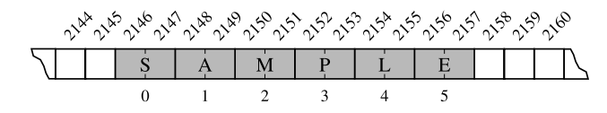
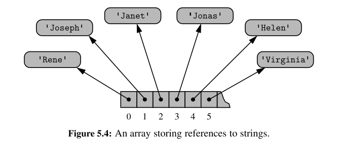
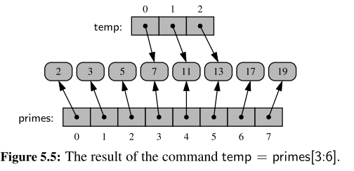
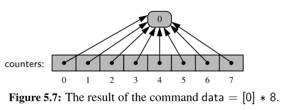
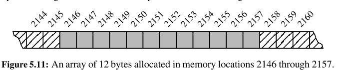

# Chapter 1.8 - Iterators

In python, the mechanism for iteration is based upon the following conventions
- An iterator is an object that manages an iterations through a series of values. If variable ``i`` identifies an iterator object then each call to the built-in function, ``next(i)``, produces a subsequent element from the underlying series
- An iterable is an object, obj, that produces an iterator via the syntax iter``(obj)``

An iterator can be produced via the syntax ``i = iter(data)``, and then each subsquent call to ``next(i)`` will return an element of that list
- The iterator does not store its own copy of the list of elements, instead maintains a current *index* into the original list.
- By these defintions, ``data = [1, 2, 3, 4]`` is an iterable, but not an iterator
- Python also supports functions and classes that produce an implicit iterable series of values, for example, ``range(10000)``
  - Does not return a list of values (returns a range object) that is iterable

### Generators
The most convienient technique for creating iterators in Python is through the use of **generators**. 
- Implemented with a syntax that is very similar to a function, buts executes a ***yield*** statement to indicate each element of the series

For example, a traditional functions to find factors of ``n`` would be as so:
```python
def factors(n):                  # traditional function that computes factors
    results = [ ]                # store factors in a new list
    for k in range(1,n+1):
        if n % k == 0:           # divides evenly, thus k is a factor
            results.append(k)    # add k to the list of factors
    return results               # return the entire list

```

In contrast, an implementation with a generator would be as so:
```python 
def factors(n):             # generator that computes factors
    for k in range(1,n+1):
        if n % k == 0:      # divides evenly, thus k is a factor
            yield k         # yield this factor as next result
```
- Keyword ***yield*** indicates to Python that we are defined a generator, rather than a traditional function
- Python continues running the statement until a yield statement indicates the next value
- Allows for ***lazy evaluation***, results are computed only if requested, and the entire memory need not reside in memory at one time
  - generator can effectively produce an infinite series of values

---

# Chapter 5 - Array Based Techniques
- Explore python's built-in sequence classes, namely ``list``, ``tuple`` and ``str`` classes
- Commonality: all supports indiexing to access an individual element of a sequence, using a syntax such as ``seq[k]``

### Public behaviours
- There are several important subtleties regarding the behaviours associated with these classes (such as what it means to make a copy of the sequence, or take a slice of a sequence)
- Establish an accurate mental model for eachh of these classes

### Implementation Details
- The efficiency of a program depends greatly on the efficiency of the components which it relies

### Asymptotic and Experimental Analyses
- We will rely on the formal ***asymptotic analysis*** notations established in Chapter 3.
- performs experimental analyses on the primary operations to provide empirical evidence that is consistent with the more theoretical asymptotic analyses.

## 5.2 Low level Arrays
Primary memory:
- A computer system will have a number of bytes in memory, and to keep track of what information is stored in what byte, the computer uses an abstraction known as a memory address
  - Associated with a unique number that serves as its address
- Computer hardware is designed so that any byte if the main memory can be efficiently accessed based upon it's memory address
  - Using our notation for asymptotic analysis, we say that any individual byte of memory can be stored and retrieved in O(1) time

A group of related variables can be stored one after another in a contiguous portion of a computer's memory
  - Denote such a representation as an array
- Example a text string is stored as an ordered sequence of individual charcaters
  - A six character string would be stored in 12 consecutive bytes of memory



We describe this as an array of six characters
- We refer to each location within an array as a ***cell***
- Use an integer index to describe its location
- Each cell of an array must use the same number of bytes
    - If one knows the memory address at which an array starts, the number of bytes per element and a desired index within an array, the appropriate memory address can be computed `` start + cellsize * index``
    - Calculating memory addresses can be handled automatically, and a programmer can envision a more typical high-level abstractyion of an array of characters

## Referential Arrays
Assume we want a medical information system to keep track of the patients currently assigned to beds in a certain hospital
- Hospital has 200 beds
- beds are numbered from 0 to 199

We could consider using an array-based structure to maintain the names of the patients currently assigned to those beds.
- The elements are strings, and the string naturally have different lengths
- Python could attempt to reserve enough space to hold the maximum string length, but that would be wasteful

Instead, Python represents a list or ruple instance using an internal storage mechanism as an array of object ***references***.



The fact that lists and tuples are referential structures is significant to the semantics of these classes.

A single list instance may include multiple references to the same object as elements of the list, and it is possible for a single object to be an element of two or more lists, as those lists simply store references back to that object.
- when you compute a slice of a list, the result is a new list instance, but that new list has references to the same elements that are in the original list



If, for example,
the command ``temp[2] = 15`` were executed from this configuration, that does not change the existing integer object; it changes the reference in cell 2 of the temp list to reference a different object

The same semantics is demonstrated when making a new list as a copy of an existing one.
- New list that is a ***shallow copy***, in that it references the same elements as in the first list
  - If the contents of the list were of a mutable type then issues may arise


Common practise to initialise an array of integers such as ``counters = [0] * 8``
- Produces a length of list 8, all eight cells of the list reference the same object



## Compact arrays in Python
In the introduction to this section, we emphasized that strings are represented using an array of characters (not an array of references). We will refer to this more direct representation as a compact array because the array is storing the bits that represent the primary data (characters, e.g.)

Advantages:
- Overall memory usage will be lower
- Each unicode caharacter typically requires two byters. If each character was stored independently, there would be signioficantly more bytes used.
- Primary data is stored consecutively in memory

## Dynamic arrays and amortisation
When creating a low-level array in a computer system, the precise size of that array must be explicitly declared in order for the system to properly allocate a consecutive piece of memory for its storage.



Because the system might dedicate neighboring memory locations to store other data, the capacity of an array cannot trivially be increased by expanding into subsequent cells.

Python’s list class presents a more interesting abstraction. Although a list has a particular length when constructed, the class allows us to add elements to the list, with no apparent limit on the overall capacity of the list.
-  To provide this abstraction, Python relies on an algorithmic sleight of hand known as a ***dynamic array.***

**Key principles:**
- A list instance maintains an underlying array that often has greater capacity than the current length of the list.
- If a user continues to append elements to a list, any reserved capacity will eventually be exhausted

At that point in time, the old array is no longer needed, so it is reclaimed by the system. Intuitively, this strategy is much like that of the hermit crab, which moves into a larger shell when it outgrows its previous one.

```python
import sys              # provides getsizeof function
data = [ ]
for k in range(n):      # NOTE: must fix choice of n
    a = len(data)       # number of elements
    b = sys.getsizeof(data) # actual size in bytes
    print( Length: {0:3d}; Size in bytes: {1:4d} .format(a, b))
    data.append(None) #      increase length by one
```
Output is as follows:
```
Length: 0; Size in bytes: 72
Length: 1; Size in bytes: 104
Length: 2; Size in bytes: 104
Length: 3; Size in bytes: 104
Length: 4; Size in bytes: 104
Length: 5; Size in bytes: 136
Length: 6; Size in bytes: 136
Length: 7; Size in bytes: 136
Length: 8; Size in bytes: 136
Length: 9; Size in bytes: 200
Length: 10; Size in bytes: 200
Length: 11; Size in bytes: 200
Length: 12; Size in bytes: 200
Length: 13; Size in bytes: 200
Length: 14; Size in bytes: 200
Length: 15; Size in bytes: 200
Length: 16; Size in bytes: 200
Length: 17; Size in bytes: 272
Length: 18; Size in bytes: 272
Length: 19; Size in bytes: 272
Length: 20; Size in bytes: 272
Length: 21; Size in bytes: 272
Length: 22; Size in bytes: 272
Length: 23; Size in bytes: 272
Length: 24; Size in bytes: 272
Length: 25; Size in bytes: 272
Length: 26; Size in bytes: 352
```

**Observations**
-  We see that an empty list instance already requires a certain number of bytes of memory
-  As soon as the first element is inserted into the list, we detect a change in the underlying size of the structure
-  Because a list is a referential structure, the result of ``getsizeof`` for a list instance only includes the size for representing its primary structure; it does not account for memory used by the objects that are elements of the list.


# Chapter 8
