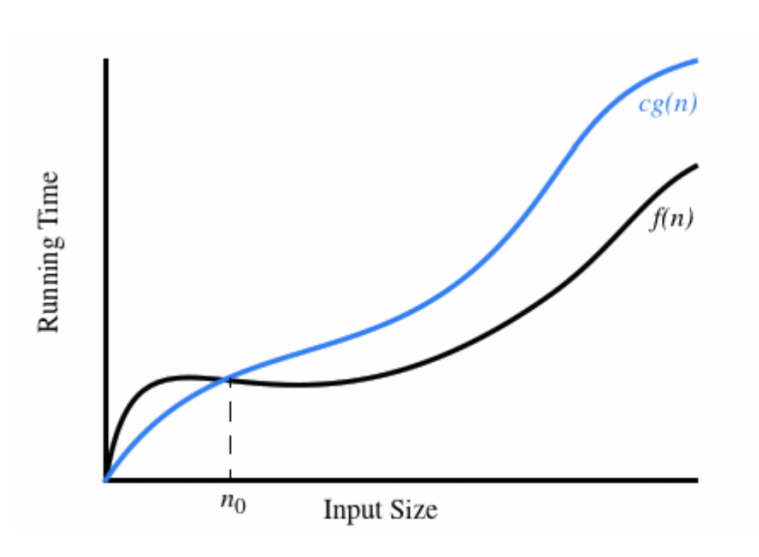
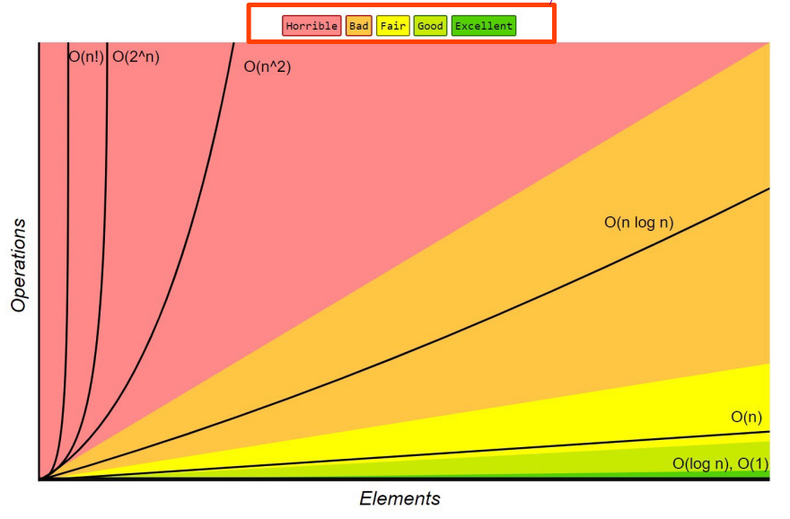

# Tutorial 1 - Slides

### Arrays
- Data structure storing a group of elements of the same type
- contiguous area of memory

|Action|Time|
|---|---
|Access Element|Constant|
|Increase array size|Linear (need to allocate new memory + copy over elements)
| Insert into middle of aray | Linear (usually new to allocate new memory, shift elements into insertion point)

### Algorithms
- Finite sequence of well-defined, computer implementable instructions
- Always unambiguous
- The user doesn't like to wait - we choose the fastest algorithms to solve our problems

Measure algorithms experimentally:
- One way to study the efficiency is to implement it and expierment with various inputs and record the time spent
- Plot results and complete statistical analysis
#### Issues with experimental analysis
- Difficult to compare unless tested on identical software and hardware
- May leave out certain inputs, which may be important and have different running times

### Beyond experimental analysis
Develop an approach to analysing algorithm efficiency
- Allow us to evaluate relative efficiency of two algorithms

### Important details to measure
- Runtime and memory
- Focussed on worst-case scenarios
  - Can also analyse best case and average case scenarios, those these are typically harder to do

### Theoretical Algorithm Analysis
1. Describe using pseudocode
2. Count primitive operations
3. Describe the function of f(n)
   - Number of inputs (n)
   - Maximum/worst case number of primitive operations
4. Perform asymptotic analysis

## Asymptotic Analysis
Determine Big O, $\Omega$, $\Theta$ bounds on runtime
- Big O notation describes the upper bound on the function
- Given functions $f(n)$ and $g(n)$ which map positive integers to positive real numbers, we say that:
$$f(n) \; is \; O(g(n))$$
If there exists constants $c$ and $n_{0}$ such that 
$$ f(n) \le c\cdot g(n) \; for \;all \; n > n_{0}$$

Function $f(n)$ grows *asymptotically* no faster than $g(n)$
- $O(g(n))$ defines an infinite set of functions
- They have to be asymptotically equal

## Big O
When we usually talk about asyptotic analysis, we use the following rules:
1. Drop lower order terms and constants
2. Make your bounds as tight as possible
3. Simplify as much as possible

### Important growth rates you need to know:
|Name| Notation
|---|---
|Constant| $1$
|Logarithmic | $\log n$
|Linear | $n$
|Log-linear | $n \log n$
|Quadratic | $n^{2}$
|Cubic | $n^{3}$
|Exponential | $c^{n}$
|Factorial  | $n!$

## Big $\Omega$
Is the lower bound

We say that $f(n) \in \Omega (g(n))$ if there exists a constant $c > 0$ and integer $n_{0}$ such that $f(n) \ge c \cdot g(n)$ for all $n_{0} > n$.

## Big #\Theta$
Is the tight bound.
- Big $\Theta$ exists iff Big O == Big $\Omega$
- Most simple functions (such as polynomials, exponentials, etc.) have big $\Theta$ bounds.
