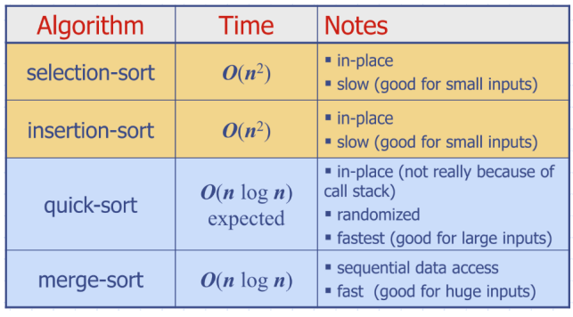

# Tutorial 2
### Adgenda 
- Recursion
- Binary Search

### Recursion


One recrusion call to deal with LHS, one to deal with RHS

Requires:
- Base case
- Recursive case

### Analysing recursive functions
1. Count the operations in a single recursive step
2. Express the algorithm as a mathematical recurrence
3. Compute a bound for the recurrence by expanding the recursive calls or drawing the recursion tree.
   - Will try with both methods

### Selection sort example:
```
if n > 1 then
    maxindex <- 0                   # O(1)
    for i <- 1 to n-1, do
        if A[i] > A[maxIndex] then  #o(4n)
            maxindex <- i 
    swap(A[maxIndex], A[n-1])       #O(1)
```
$$ 
T(n) = 
\begin{cases}
        O(1) & \text{if } n = 1\\
        O(1) + T(n-1)  & \text{if } n > 1
\end{cases}
$$
Use the fact that $1+2+3+...+(n-1)+n = n(n-1)/2$ to conclude $T(n)$ is (O(n^{2}))

### Binary Search Summary

- This is not a binary recursion type, because we will only execute one of the recursive calls.
$$ 
T(n) = 
\begin{cases}
        O(1) & \text{if } n = 0\\
        O(1) + T(n/2)  & \text{if } x > 0
\end{cases}
$$
- Run time: $O(\log n)$

## Sorting - Selection sort
- In place sorting - does not require any additional memory space
- Run time: $O(n^{2})$

How it works:
- Iterate over array from start ot end
- Swap the current element with the smallest element to our right

## Insertion sort
- Also in place sorting - does not require any additional memory space
- Also has run time of $O(n^{2})$

How it works:
- Iterate over array from start to end
- Compare that element with all elements to the left (previously seen/sorted)
- Insert that element in the correct location

```
procedure insertionSort(A: list of sortable items)
    for i = 1 to length(A) - 1 do
        currentElement = A[i]
        j = i - 1
        
        while j >= 0 and A[j] > currentElement do
            A[j + 1] = A[j]
            j = j - 1
        
        A[j + 1] = currentElement
    end for
end procedure
```
## Merge sort
- Run time: $O(n \log n)$
- Split by half each time in first step, no sorting in this process

## Quick sort
- randomly select a pivot
  - have all elements $\le$ on LHS, and $>$ on RHS
  - keep splitting with random pivot
  - sort and combine like in merge-sort

Run time:
- can have worst time of $O(n^{2})$ due to the worst case pivot
- Expected case: $O(n \log n)$
- Quick sort can be implemented in place




### Tutorial sheet
Questions 1, 2, 6.
#### Question 1 
1. $2^{10} = O(c)$
2. $2\log _{3} (\log _{3} n) = O(\log (\log n))$
3. $100 \log _{2} n$
4. $4n = O(n)$
5. $4n \log_{4}n + 2n = O(n)$
6. $2 ^{\log _{2} n} = n = O(n)$
7. $n^{2} + 10n = O(n^{2})$
8. $n^{2} \log _{2} (n) = n^{2} \log (n)$
9. $n^{3} = O(n^{3})$
10. $2^{n} = O(2^{n})$

#### Question 2:
- One primitive operations to print from 0 to 9
- Two primitive operations to print from 10 -to 99
- Three primitive operations to print from 100 to 999...
  - this is equivalent to $\log_{10} n$
- Run time: $O(n \log _{10} n)$

#### Question 3:
- grows in $O(\log n)$ time


#### Question 6
$$ 
T(n) = 
\begin{cases}
        1 & \text{if } n = 1\\
        3T(n/2) + 2  & \text{if } n > 1
\end{cases}
$$
- See solutions, uses geometric sequences and log rule $a^{\log _{b}c} = c^{\log_{b}a}$.
#### Question 9
- In the worst case, have to check all of the elements.
```
for x in range (A, length)
    a = A[x]
    b = B[x]
```
Similar process to Binary search. Have A, B, and x as input
```
for j in range (A, length)
    if BinarySearch(sortedB, A[j] - x)
        return true         #This is done in log n time
    return false
```
Run time: $n(\log n + \log n) = 2n(\log n) = O(n \log n)