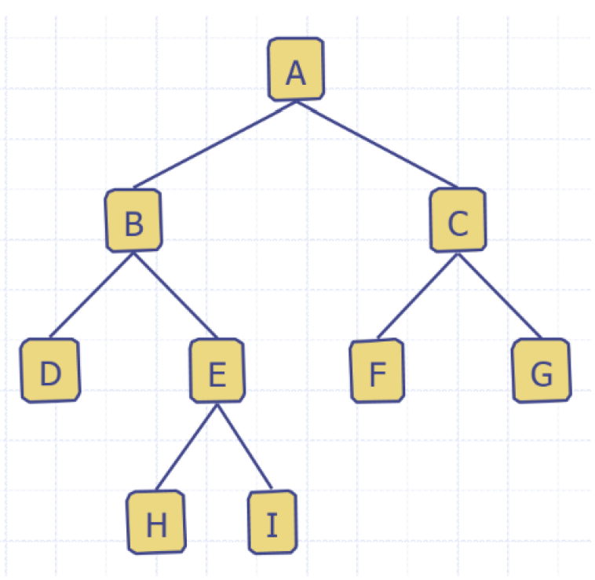
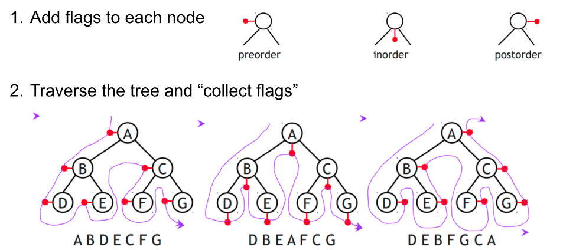
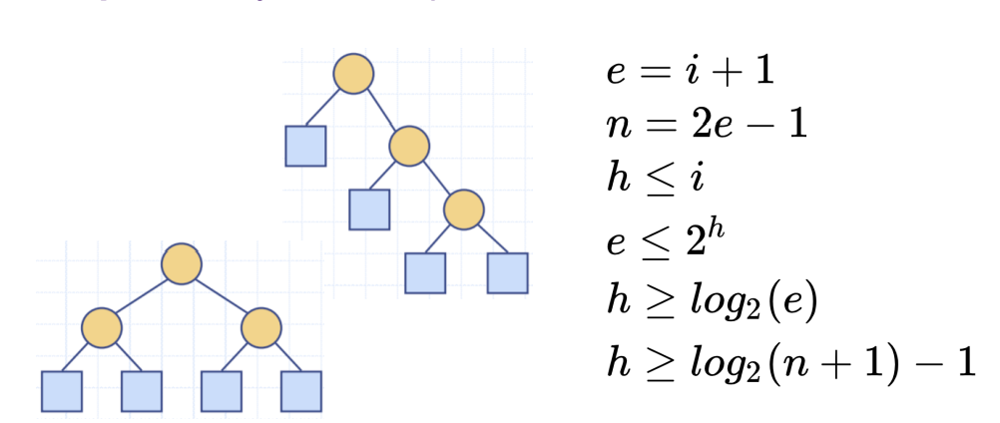

# Tutorial 5

- Stacks
- Queues
- Trees
  - Tree Basics
  - Tree Traversal
  - Binary Trees

### Stacks
- Last in first out (LIFO)
- ``pop()`` and ``push()`` are the main methods
- Use Arraylist for implementation

### Queues
- Array Implementation
- f: Index at the front of the queue
  - increment the from index to remove front index
- r: Index at the rear of queue
  - increment the rear index to add to end of list
- Index of an element (f + i) % len

### Trees
- Hierarchical Data structure
  - good representation is parent directory
- Consists of nodes with a parent-child relation
- Root: a node without a parent
- Internal node: a node with at least one child
- External node/leaf: node without children
- Ancestors of a node: always goes UP
- Descendants: child nodes: always goes DOWN

#### Level
- Root is level 0

#### Depth of Node/Tree
- Number of descendants from root
- E is depth 2

### Height of Node/Tree
- Number of ancestors from ***leaf***
- E is of height 1

#### Subtree
- Tree consisting of a node and its descendants
- E's subtree is [E: H, I]

### Tree ADT methods
|Method| Description
|---|---|
|``getElement()``|Returns element stored at this position
|``size()`` |Returns the numer of positions in the tree
|``isEmpty()``| Indicates if the tree is empty
|``iterator()``| Returns an iterators of all elements
|``positions()``| Returns iterable collection of all positions
|``root()``| Returns position of the tree's root
|``parent(p)``|Returns position of parent
|``children()``| Return's iterable collection of p's children

### Tree traversal
- In order
- Pre Order
  - Root, left-right
- Post Order
- left, right, root

### Binary Tree terminology
- Full level
  - Level $i$ contains $2^{i}$ nodes
- Complete tree
  - for height h
  - levels $0, 1, 2, ... h$ are full
  - Level $h$, all nodes are as far left as possible
- Proper/full Binary tree
  - Each level (besides leaf nodes) have two children

### Binary tree performance:
|**var**| **description**
|---|---
|$n$| number of nodes
|$e$ | number of external nodes
|$i$| number of internal nodes
|$h$| height 

Performance:

$h= o(\log n)$
(when at least two nodes)

### Proper Binary tree properties

