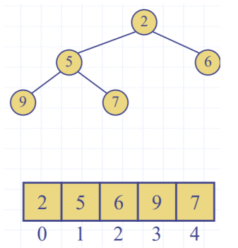

# Tutorial 6

### Priority Queues
- Queue but first one out is highest priority (lowest key value)
- Each entry:
  - Key: The priority, 0 is the highest priority, 1 is the next
  -  Value: The value of the element
- Uses auxiliary comparator to compare keys

### Array Implementation
For a sorted list:
- insertion takes $O(n)$, worst case we insert in the end
- RemoveMin is $O(1)$

For an unsorted list:
- insertion is $O(1)$
- removeMin is $o(n)$

### Heaps
- **Complete** binary tree
  - Note to student: consider heap height properties

**Heap Order**
- The Parent is of higher priority than the child
- ``key(v) >= key(parent(v))``

**Last node**
- Is the lastmost node of the lowest level

### Insert into a Heap
1. Insert at location z, the new last node
2. Restore heap order (up heap)
 - keep on swapping with parent until heap order is restored

### RemoveMin for a heap
- Swap root node with the last node
- remove the last node (which used to be the root node)
- Restore heap order (perform down heap operation)
  - swap with child nodes (either left or right) until heap order is maintained
  - peformed in $o(\log n)$ time

### Array Based Heap implementation
- n nodes in an array
- For rank $i$
  - Left child $2i + 2$
  - Right child: $2i + 2$
- Insert: at index n
- Remove: $n-1$

### Heap sort
- For $n$ times:
  1. Create a Max Heap
    -  Max Heap: Parent priority < Child priority
  2. Swap root (largest number/lowest priority) with last node
  3. Remove last node (the largest number)
  4. Down heap to restore Max Heap Order
Performance: $O(n \log n)$ i.e. performing the uphead for $n$ elements $\log n$ times

### Heap construction
- For n nodes in a heap (n times)
  1. Insert into a node
  2. Upheap $\log n$

Given two heaps A and B, 
1. add a node $k$ as the root
2. Downheap to restore heap order

- $O(n)$ run time
  