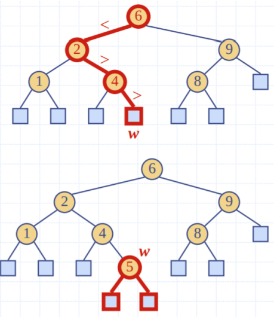

# Tutorial 7

### LinkedList SingleList based map
- Unsorted doubly linked list
- get and remove run in O(n) time
- insertion runs in $O(n)$ because of duplicates

### Sets, multimaps and values
- Set: unordered collection of elements, without duplicates
  - Like the keys of a map (but no associated values)
- Multiset: A set that has duplicates
  - (aka Bag)
  - Can have mutiple key and value pairs
- Multimap: A map with keys mapping to multiple values. 

### Hash tables
- Just the map will give $O(n)$ insertion time
- Key should be a number relating to the index 
- n elements in an array of size N
- Keys are integers from 0 to N
- Store the value at index k.

### Hash Codes
- When keys are not integers that can easily be indexed
- Convert key to index in array
- Example: use last 4 digits of Tax file number
  - Note: Our array is 10,000 elements long

Hash Codes
Common Hash Codes | Description
|---|---
Component Sum | For all characters c in string s, sum up all ascii values. Note: the, teh, eth, eht have the same component sum
Polynomial Accumulation | Create a polynomial with the string s  Note: Our index range is large
Cyclic Shift | Shift n bits from one side of bit pattern to the other side

### Compression functions
- Modulo the size of the array

#### Division
- $x \mod n$

#### Multiply, Add and Divide (MAD)
- $h_{2}(y) = ((ay + b) \mod p) \mod N$
- $N$: the size of the array
- p: prime number > N
- a and b are random integers in the range $[0,p-1]$

### Collision Handling

Common Collision Handling Methods |Description
---|---
Separate Chaining | Each cell in the table points to a linked list of entries that map there
Linear Probing | Places colliding items in next available cell. Each table cell is inspected by “Probing”. 
Quadratic Probing | Probe using a quadratic index, e.g. if 'b' is occupied, then move to $i^{2}$ next index. This will wrap around
Double Hashing | Use 2 hash codes. $h(1)$ is the original hash function, and $h(2)$ is the second hash function.

### Performance
Worst case: O(n)
- Many collisions
- Expected case:O(1)
    -  No collisions

## Binary search trees
- Binary tree
- Internal nodes satisfy following property:
  - Let u (left subtree), v (parent) and w (right subtree) 
  - key(u) < key(v) < key(w)
  - i.e. all the values on the left subtree must be smaller than the parent, all the values on the right subtree must be greater than the parent
- External nodes do not store items
  - Imagine these are null pointers

### Searching a BST
To find key k (e.g. 4): 
1. Trace from root node down the tree
2. Compare with node
  - If less then node, go to left subtree
  - if greater than node, go to right subtree
1. If you find the node: Return
  - If you hit the leaf node: key k is not in the tree.

### Insert into a BST
- Assume key k is not in BST
1. Trace down the tree (as you did before) until you find a leaf node
2. Insert key k into the tree at that leaf node
3. Expand the tree so the node is now an 
internal node.

### Delete from a BST
 - Assume key k (e.g. 58) is in the 
BST
1. Trace down to find key k
2. Remove node k and replace it 
with the next node, node v 
(inorder traversal)
3. Reconnect the tree: v’s subtrees.

### Performance
Finding, Inserting and Deleting:
- Worst case: O(n)
- Average case: O(log n)

