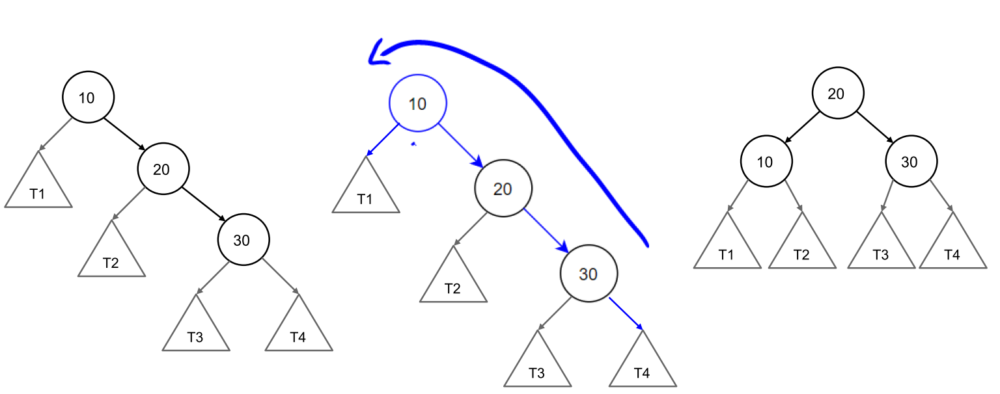
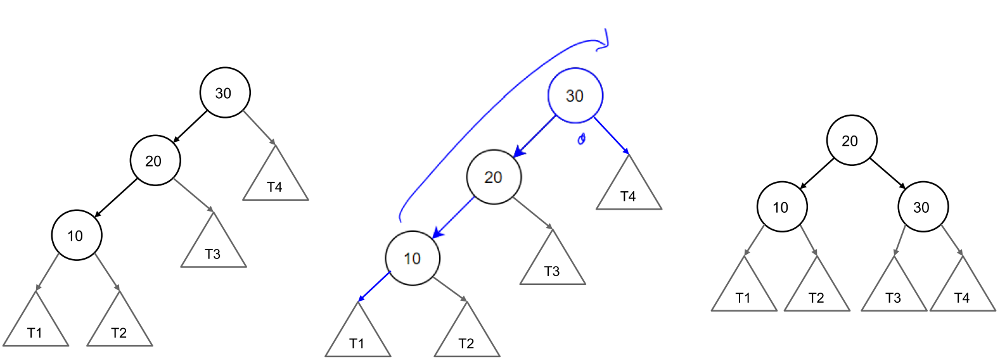
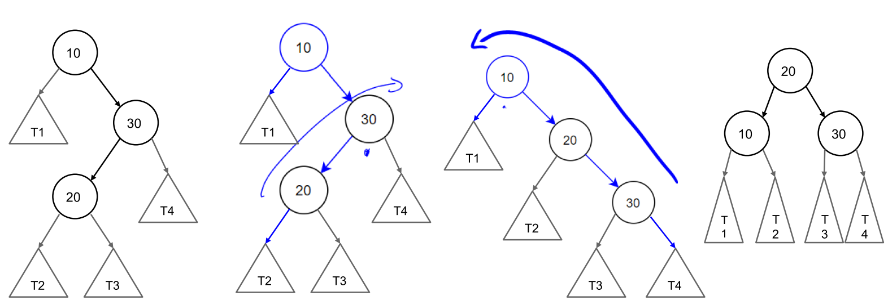
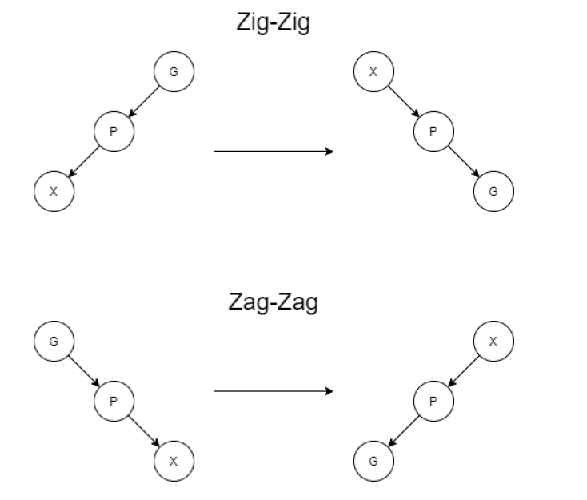
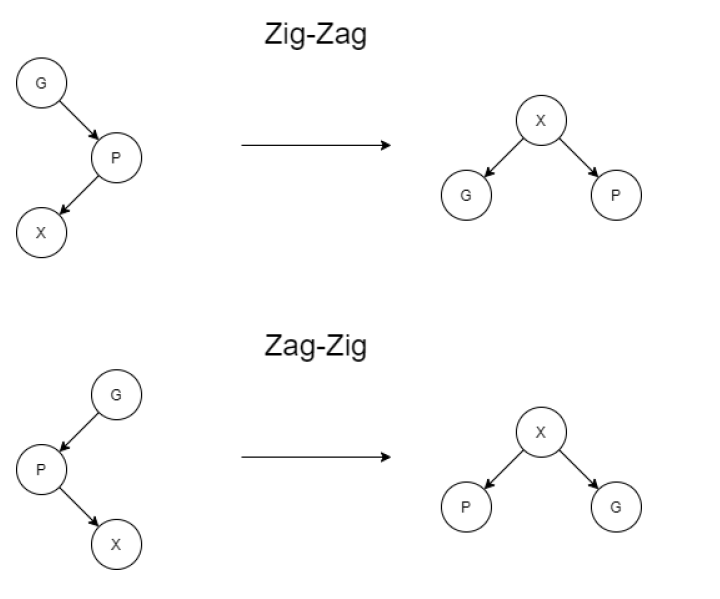

## AVL Trees

### Finding the imbalanced node
- Look at the height of the left and the right subtrees. If the height difference is more than 1 between both subtrees, then the node is imbalanced.

### Insert into an AVL tree
- Regular insert if no imbalance
- Tri-node restructuring if there is an imbalance

### Tri node restructuring
- Only four cases of tri-node restructuring:

Right-right rebalance:
- push the imbalanced node *down*

Left-left rebalance:

Right-left
- lift 20 up and drag 20 down to create a right-right imbalance

### Delete from an AVL tree
1. Remove from tree as if a Binary search tree
2. From the deleted node, move up to the first unbalanced node.
3. Tri-node Restructuring to restore height property

### Performance:
- Height: $O(\log n)$
- Space $O(n)$

Runtime 
- Single restructure: O(1) 
- Searching: O(log n) (IN BST, O(n))
- Insertion: O(log n) (IN BST, O(n))
- Removal: O(log n) (IN BST, O(n))

## Splay tree
- Nearly balanced binary search tree    
  - no rules on height
- faster access to most recently used keys
- all operations require a 'splay'

### Finding node
- same as a binary search tree
- 'Splay' the node up to the root
- Even if you don't find the node, still splay the whole tree
  - i.e. searched item becomes the new root

Zig-zag: rotate the tree to the left and swap the root with the right child
Zag-zig: rotate the tree to the right and swap the root with the left child

### Insert into the splay tree
1. INsert into the tree.
2. 'splay' the new inserted node to the root

### Remove from a Splay tree
1. Remove a node like a Binary Search Tree
2. “Splay” a up to the root
  - If you don't find the node: Splay the node that ended your search
  - If you do find the node: Splay the parent of the removed node

## 2-4 trees
- Balanced binary search trees
- Nodes can have:
  - 1 key, 2 children
  - 2 keys, 3 children
  - 3 keys, four children
