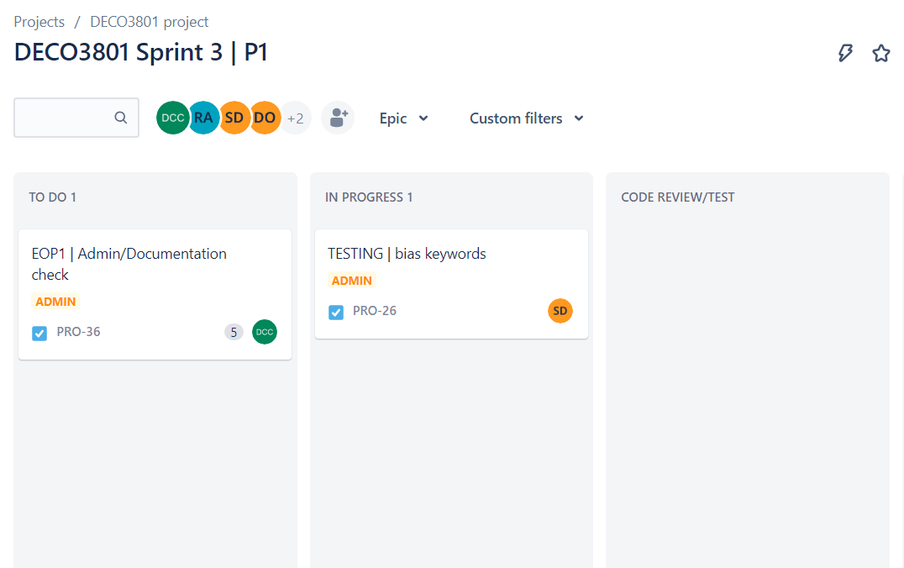
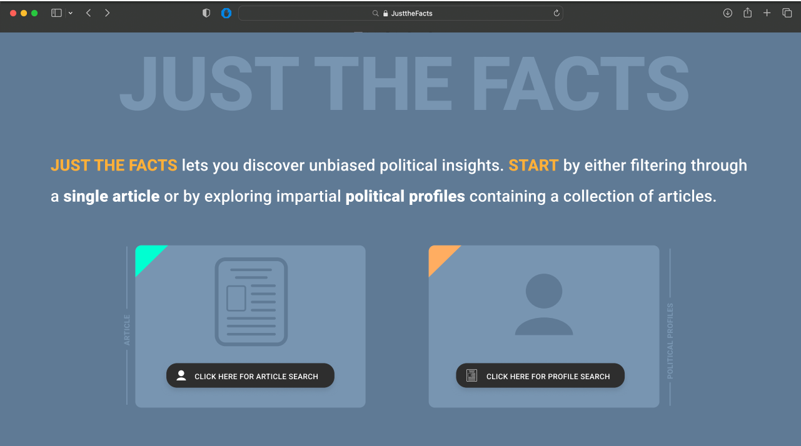

# Snapshot 1
The contents of this page outline the work I have completed on a weekly basis regarding the DECO3801 group project. It outlines my work, in addition to my feelings and concerns of the project over time. Each journal is written on a weekly basis. Please go to my website [danielCiccC.github.io](https://danielciccc.github.io/DECO3801/docs/main_DECO3801.html) for a styled and complete running list of my journals.

## Week 1 journal
- Not much to say at this stage. Our first class consisted of a few icebreaker sessions and introduction with the work to come. One of my friends has invited me to a work he is organising, and I have been introduced to my teammates for the semester.
- Next week we will officially form our teams

## Week 2 journal
- This week we didn't do much, besides put in for our team formations. We were told that we will be accepting our project briefs soon (sometime in the next couple days). As soon as that happens, will will read through the list and put in our preferences asap.

## Week 3 journal
- We put in our top preference for brief 38 - called 'New Curation', and received it too. This week, we began to have discussions about what the solution would look like, the technologies we would need to implement this and the business ops tools as we began to compile our statement of work.  
- 

We will be using jira to manage our tasks, and confluence any large documentation. It will be my responsibility to manage upcoming work and build jira's to manage to workflow of the developers. This is the [current jira workstation](https://deco3801.atlassian.net/jira/software/projects/PRO/boards/1)



### Statement of work
Fortunately, the technologies we needed to implement were quite straightforward. As the project brief asked for a Large Language Model (LLM) be implemented to remove bias from news articles. This made the backend relatively simple to choose - only python has strong support with existing LLM's, and Darren's strong aptitude with React/node.js can be used to build our user interface. 

Our hurdles immediately ahead of our are understanding what we need to develop as part of our statement of work, and putting pen to paper to write down all of our design elements for this project. We have had several discussions already about what elements and features we choose to incorporate into our design, and whether we want to introduce AR (augmented reality) into the design as well (as it was labelled a potential feature to include). So far, we have plans to deliver three phases in our build:
1.  Outline all the biased keywords in the text, and explain why they are biased. Build UI to support this feature
2.  Develop a bias score (which will be a propeitary mix of different subversion techniques) which will outline how biased the news article is based on a variety of subversion techniques
3.  use search engine optimisation and google search to find similar and other relevant articles, and compare them to the one inputted in. Use this to compare the scores of related articles. In addition to this, summarise the key facts from the variety of sources inputted in.


There has still been some debate as to whether we should incorporate AR into our build. I will have a meeting with Yash and Sean to discuss this further, as they are soon to complete more interviews and testing.

Yash has begun developing our statement of work on [google drive](https://docs.google.com/document/d/1eian7Lq7jjnbPXbMV-p0AtF2zAB1gc1qQfj7hMRu_H4/edit?fbclid=IwAR1AXTNjgif_rL-OmYZxvU48EAIJtS1PnRWtFo_v0XJYS5bOp4J2F2Y4TDI) and Sean has begun work on developing wireframes to outline our build, although I don't believe this will be ready in time for our statement of work. 

## Week 4 Journal
Almost immediately after submitting our Statement of work, I had another conversation with Yash and Sean about the phases of our build, and the insights they have drawn from interviews and surveys. Sean urged (and convinced us) to pivot our existing phases to instead aim to create a site that can summarise out key facts from the article in the initial phase of our build, instead of finding keywords in text. All in all, this would mean re-arranging the phases our build plus addiing some additional functionality earlier on the phases of our build. 

[Our wireframe plans to date](Wireframes1.pdf)


## Week 5 Journal
- Passed our statement of work on our first try (team was very relieved) but received a lot of feedback from our tutor regarding some details we have to further refine
- biggest detail by far was our target demographic. Currently our application is suited for all users that are interested in reading facts from an unbiased perspective, but our tutor had concerns that our audience was not specific enough, and that we needed to further explore our target demograph and make features related to a more specific audience.
- Completed phase I, as per the specifications of Sean's wireframes. I am super impressed with the skillset of the fellow developers in our team. Darren and Manav have taken ownership of the UI, and built it almost identically to Sean's wireframes, and Ron has been busy implementing all the API endpoints and developing webscraping functions to make the URL work.
- Focus on our milestone presentation, which is due next week. I have been given the responsibility to present all the technical implementation regarding the work we have done so far.

## Week 6 Journal
-  Spent most of the week organising the milestone presentation alongside Yash and Sean. 
-  Spent the leftover time I had updated the summary prompt to be as efficient and consistent as possible
-  Pivoted the project a second time, to be targeted towards political bias. Concerns regarding creditbility of facts, in which Yash discussed the use of a polling system or commenting system to discuss the credibility of the facts we present, alongside a disclaimer.
-  In this pivot, we would now also include a political search. I have concerns that this will grealt increase the complexity of the table structures, and the workload for the developers to build this within our given timeframe.

[Our most up to date wireframe, outlining poltiical figure websites](WIREFRAMES3.0.pdf)

#### An example image:


## Week 7 journal
- Sean has developed new wireframes that incorporate political figures, and accounts which maintain a running feed of news regarding their activities. 
- Working on connecting a database on AWS cloud to using that as a global database for our newscuration project. I also realised that I had not finished previous work creating a bias summary prompt for the frontend developers to begin implementing. I shall have to complete this before I begin building transaction tables and databases for backend.
- Pivoted a lot from out original project. From last week, we decided to narrow down our scope to specifically tailor our application to political bias. In this development, we have included the idea of a political figure homepage, where a user can see a feed of unbiased summaries of a political figure.
- While all our members are busy, I have concerns that we do not have a strong project structure of the phases of our new build, and the dependencies that will eventually develop as some people are waiting on implementation from others. The jira's desparately need to be updated to reflect the changes in scope. I will update this immediately after submitting this snapshot
  
#### Greatest contribution this week - Data management organisation
### (NEED TO ELBAORATE THIS FURTHER) 
- Needed to build a database management system that all the developers in the team could easily use
- I didn't want developers to have mismatched tables structures between their local envrionments, and I also wanted to avoid needing to duplicate in their individual environments. Ideally, we would have one master database system that all developers could alter, and propogate to all other users. Of course, some redundancies and versioning control will need to be in place, details related to that could be organised later.
- After some preliminary amongst peers and industry professionals, I opted to created an AWS account and build an RDS (Relational Database System) instance. With a cloud siolution such as this, all developers could remotely access the database, perform DDL operations and retrieve the most up-to-date versions of table structures used in our project.

- ss of the Newscuration AWS instance
- Created a ORM tool inpython, to handle insertion and querying of table elements, similar to like softwares sich as [java hibernate](https://hibernate.org/)


```python
'''
ID 
NameCode VARCHAR(255) NOT NULL UNIQUE,
InProduction BOOLEAN,
InsertedAt DATETIME,
InsertedBy VARCHAR(50)
'''
class Politician_PositionNameCodes(table):
  
  def __init__(self, nameCode=str, inProduction=bool):
    super().__init__()
    self.nameCode = nameCode
    self.inProd = inProduction
    self.name = Politician_PositionNameCodes.__name__
    

  def __str__(self):
    if self.id is None:
      return f'{self.name} Record has not been inserted into DB - ID is NONE'
    else:
      return f'{self.name}[{self.id}, {self.nameCode}, {self.inProd}]'
  
  '''
  This insert statement only takes one parameter; the name of the user inserting the record.
  '''
  def insertSQL(self, insertedBy) -> str:
    query = f"""
    INSERT INTO {self.name} (NameCode, InProduction, InsertedAt, InsertedBy)
    VALUES (
    '{self.nameCode}',
    {1 if self.inProd else 0}, 
    NOW(),
    '{insertedBy}'
    );
    """
    return query
  
  def getName(self):
    return self.name
```
- talk briefly about the transaction data client here also, neatly wraps around mysql output and prints to a log file and to terminal output.
- Very carefully handled errors in output, to catch bad insertions and queries into the database. 

```
[2023-10-04 11:24:14.489746] [Daniel Ciccotosto-Camp] [SUCCESS] [Established connection <pymysql.connections.Connection object at 0x000001483AF162D0>]
[2023-10-04 11:24:14.491739] [Daniel Ciccotosto-Camp] [SUCCESS] [Established cursor <pymysql.cursors.DictCursor object at 0x000001483ADE1110>]
[2023-10-04 11:24:14.950751] [Daniel Ciccotosto-Camp] [SUCCESS] [Established connection to database newscuration]
[2023-10-04 11:24:15.442174] [Daniel Ciccotosto-Camp] [SUCCESS] [Successfully attempted query: 
    SELECT *
    FROM Politician_PositionNameCodes
    WHERE 1=1
    ]
[{'ID': 1, 'NameCode': 'Prime Minister of Australia', 'InProduction': 0, 'InsertedAt': datetime.datetime(2023, 9, 28, 8, 2, 3), 'InsertedBy': 'Daniel Ciccotosto-Camp'}]
[2023-10-04 11:24:15.444174] [Daniel Ciccotosto-Camp] [SUCCESS] [Closing Connection <pymysql.connections.Connection object at 0x000001483AF162D0>]
[2023-10-04 11:24:15.445176] [Daniel Ciccotosto-Camp] [SUCCESS] [Closing cursor <pymysql.cursors.DictCursor object at 0x000001483ADE1110>]
```
## Week 8 Journal
- In addition to this build, I have developed a website to maintain my reflective journals. 
  - Explain briefly how the website was created - will aid in submissions and can easily draft, add images and update to a site.
- Spent a lot of the time organising the teams developmental jiras
- Explain why this business operations tool is effective in organising team goals and aids in the our developmental process
  - backlog is ripe with jiras to have development underway, with worded explanations about what has to be completed within each jira.


Each jira maintains three parts:
1. **Context**: what has been going on in the background? What has been developed up to this stage and what phase of work are we currently building?
2. **Requirements**: what has to be developed in this piece of work?
3. **Success Criteria**: what is an acceptable output/change that will see that this work has been developed?
4. **Images**: (for reference only)

The following three images are screenshotted from jira ``PRO-72: Phase 4 API routes.``


- Enables other features, such as the ability to engage in conversation and find dependencies and blockers for this task.
- At the moment, there are 27 issues in the jira backlog. Our meeting Sunday will enable us to chat about the upcoming work, and delegate tasks ready for us to complete over the following week.

## Week 9 Journal
Issues:
- Ron has developed a system to organise our table structures which is so complex that I stuggle to be able to understand it add functionality to improve it.
- Began to develop a new feature - ``PRO-78`` - most popular articles. I originally had begun work on this piece but after a code review from Ron was merged into main, the changes had spawned so many merge conflicts that I had to scrap the branch (and the work I had nearly completed) and after conversation with Ron, reassign it to him. This was particularly frustrating as I had spent some time developing this new feature and 

- At the same time, I also have regrets about the implementation of the model-template and data layer driven by AWS cloud.
  - A little more research could have found a system that already has integration and adopts a system like this.
  - https://www.geeksforgeeks.org/how-to-integrate-mysql-database-with-django/
  - Although the system already works, is simple to use and implement into a system, utilising a ready made system would mean that more time could be dedicated to implementing new systems

- Received feedback on our journals to date. My tutor raised that I should be more actionable in my responses. I have been doing things, and there have been problems, but I haven't been vocal in how I am attempting to improve our processes and solve active issues.

## Week 10 Journal
- Spent a large amount of time over the pause week to continue implementing associated jiras during our sprint
- Implemented caches and API endpoint routes to handle recents and saved Articles
- new table architecture to support the new wireframe design. Our idea has pivoted to comparing political candidates for an upcoming election. Endpoint routes


- The jira outlined in week 8 asked a front end developer to outline all the API endpoints they would require in the last phase of the build; because this exercise was completed early, I as a developer can easily modify existing table structures, deriver functions and backend management layer to faciliate the data in the exact form he specifies. Most jiras like this necessitate and endpoint to created in out ``API.py`` doc, with sufficient documentation. the follow code is an example of a politician, and all the related info that was needed to send to the page.

```python
'''
Returns:
    ID int,
    Fname : str,
    Lname : str,
    About : str,
    Age : int,
    Gender : str,
    CountryCode : str,
    InProduction : Boolean,
    InsertedAt : DATETIME,
    InsertedBy : str,
    ImageLink : str,
    Summary : str,
    Articles : [
        {ID : int
        URL : str,
        UpperBias : float,
        LowerBias : float,
        Summary TEXT,
        InProduction : bool,
        InsertedAt : DATETIME,
        InsertedBy : str
        Header : str,
        OriginalText : str,
        SummaryParagraph : str},
    ]
'''
@app.route('/GetPoliticianByID', methods=['POST'])
def politicianRequestByID():
    data = request.get_json()
    id = data.get('id')
    return sm.getPoliticianItem(id, None)
```

- conflict with with a teammate regarding the amount of work - priortising other studies at this particular point in time
