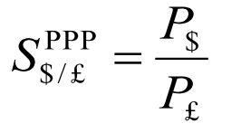
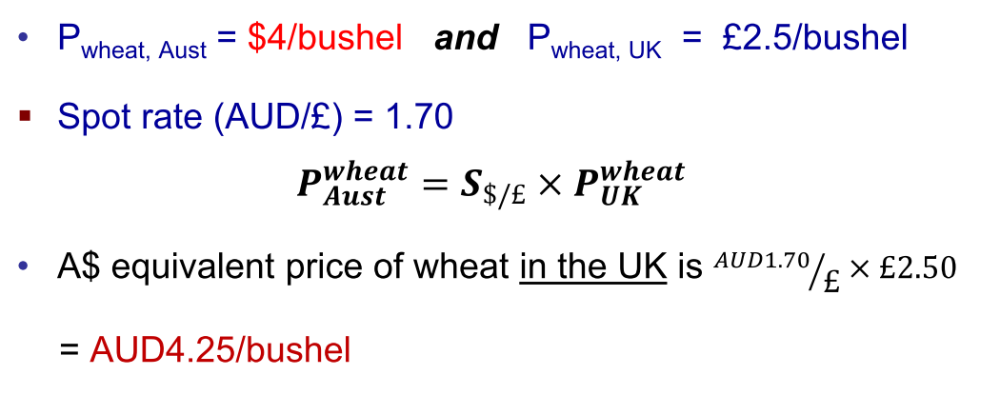
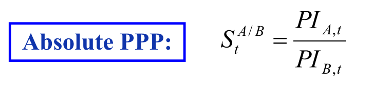
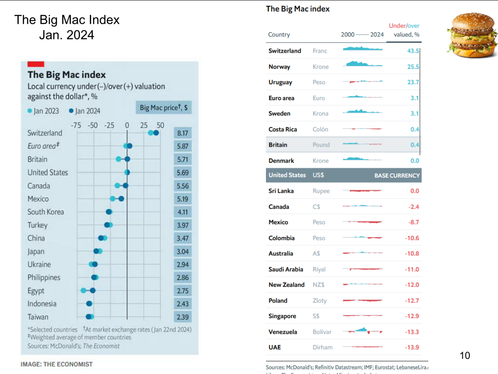
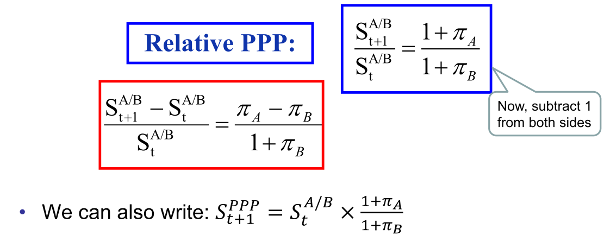
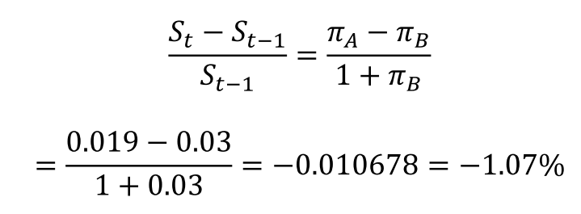

# Lecture 2

### International Montary System
- The international Monetary System is a set of rules that governs international payments
- Historical Overview of exchange rate mechanisms
    - Classical Gold Standard: 1875 – 1914
      - Fixed exchange rate system. Every single country would decide what the value of their currncy was worth compared to gold.
      - Worked for a long period of time - exchange rates were fairly stable
      - Not too much gold discovery, but around 1911 huge amoutns fo gold discovery and gold inflation became a problem
    - Bretton Woods System: 1945 – 1972
    - Floating Exchange Rate Regime: 1973 – Present
      - market flows determine the value of one currency to another
    - European Monetary Union: 1979 – Present
      - European currencies pegged their value against the deutsche currency
      - late 90's got rid of various European currencies
- The system, or regime, is classified as either a fixed, floating, or managed exchange rate regime
    - The rate at which the currency is fixed, or pegged, is frequently referred to as its par value
      - fixed against anochor currency
    - If the government doesn’t interfere in the valuation of its currency, the currency is classified as floating or flexible
        - market value will determine what a currency is compared to a floating currency

Fixed ER:
- every dollar from one currency has to be matched relative to a second currency
Adjustable peg
- change your currency relative to another currency but allow the opportunity to change the peg
Free floating system
- fully flexible

### Currency Board: Hong Kong
- Central bank of hong Kong stands to buy any Forex to maintain their price
- defend their par value

Since 1982, Hong Kong dollar has remained a very stable exchange rate

### Fixed exchange rate system

|£0.35/$ is referred to as the “par value” i.e., AUD is fixed relative to GBP (anchor currency) at £0.35/$. | Fig 2: The exchange rate is "undervalued” at the par value of £0.35/$. |
|---|---|
 |  |
| | |

- Calculating risk, use the standard devation of returns

### The floating Exchange rate (post 1973)
- Under the floating rate system, the exchange rate is determined entirely by forces of supply and demand
- The system that prevailed was not quite “freely floating”
- Central banks had the obligation to intervene to prevent “disorderly conditions”
  - A lot of rules in place, rules of capital movements
- Capital controls were abolished and access to the US capital market was allowed
- Monetary and macro-economic policies were independent to that of US 
    - Have independent monetary policies

| 5 year window | % window
|---|---|
|  | 

### Advantages of a Fixed ER
1. Reduce transaction costs and exchange rate risk which can
discourage trade and investment
2. Provide a credible nominal anchor for monetary policy (importing
credibility)
3. Transparency of the Regime

### Advantages of a Float
1. Ability to pursue an independent monetary policy
2. Ability to use monetary policy to respond to recessionary
effects on the economy

### Attributes of the "ideal currency
- Exchange rate stability
- Full financial integration (free flow of capital)
  - No capital or investment controls. Move money easily
- Monetary independence (of domestic policies)

### The impossible Trinity
A country must give up one of the three goals:
- Exchange rate stability
- Full financial integration (free flow of capital)
- Monetary independence (of domestic policies)

### The Balance of Payments (BOP)
- The BOP is a statistical record of the flow of all of the payments between the residents of a country and the rest of the world in a given year.
    - Multinational businesses use various BOP measures to gauge the growth and health of specific types of trade or financial transactions by country and regions of the world against the home country
    - Monetary and fiscal policy must take the BOP into account at the national level---the BOP gives indications of the demand and supply of a country’s currency.
  - statistical record of the inflows and outflows of cash from the country (where and what was it used for)
  - Used to gauge the health of the country
  - Government spending relative to its revenue, etc.

### Fundamentals of BOP Accounting
- Transactions are recorded on the basis of double entry bookkeeping – by definition it has to balance
    - Every “source” must have a “use”
- BOP is a statement of flows, thus like a cash flow statement, not a balance sheet.
- Every economic transaction recorded as a credit brings about an equal and offsetting debit entry

### Accounting principles

- Any transaction resulting in a payment to foreigners is entered in the BOP accounts as a debit and is given a negative sign.
- Any transaction resulting in a receipt from foreigners is entered as a credit and given a positive sign.
- To reiterate, every international transaction automatically enters the BOP twice, once as a credit and once as a debit
    - If you buy something from a foreigner, you have to pay for it, and the foreigner has to either spend or store your payment.
    - Examples of these paired transactions will be covered in the tutorial. 

### Current account

- It is record of a country’s trade in goods and services
and of unilateral transfers.
- It is divided into several sub-categories:
    - Merchandise Trade: physical goods like beef, cars etc.
    - Services: tourism, education, shipping and finance etc.
      - Any service provided by trips and tourism
    - Primary Income (“investment income”): interest income, dividends etc.
    - Secondary Income (“unilateral transfers”): Foreign aid, pensions to retired people abroad, wages repatriated etc.
- The sum of the sub-categories = CA balance
- 

CA = Exports (x) - Imports (M)

- Current Account Deficit: $M > X → CA < 0$
- Current Account Surplus: $M < X → CA > 0$

Current Account Balance = Change in Net Foreign
Wealth/Assets

Implication: A country with a CA deficit must be
increasing its net foreign debts by the amount of the
deficit 
- borrow from the rest of the world to be able to consume

### The Financial Account

- It includes all short- and long-term financial transactions pertaining to both international trade and flows associated with portfolio shifts (stocks, bonds etc.) 
  
KA = Capital Inflow (cr) – Capital outflow (dr)
- The two main categories:
  - Portfolio investment
  - Direct investment (takeover or acquiring a substantial portion of a foreign company, i.e., ˃ 10%)
- KA balance = Sum of portfolio investment and direct investment + 
  - Any returns on investment from international trades are accounted in the financial account

