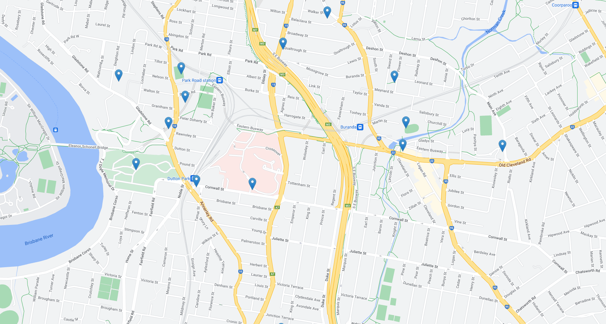

# Lecture 1

Introduction to some general real estate principles and the concept of Real Estate as an Asset Class

### Aims for FINM3406
- This course aims to provide students a detailed understanding of real estate finance and investment and the role of property as an asset class. 
- Students will learn how to critically evaluate the role that property plays as an investment vehicle and to analyse investment and financing opportunities. 
- The course will examine the differing roles that direct and indirect property investment has and the mechanisms for financing property transactions.

### Real Estate as an Asset Class
- What is real estate – bundle of rights theory
  - The way in which we treat property is the way in which we govern
- Conceptual frameworks for property ownership (socialist/communist/capitalist – liberal democratic ideology)
- Purpose of built form – historic, current and future and how this impacts investment decisions
- Real estate market characteristics
- Comparison with other asset classes

### Scale of Australian Real Estate Sector
- Residential Real estate $7.6 Trillon
- Australian Superannuation $2.6 Trillon
- Australian Listed Stocks $1.8 Trillon
- Commercial Real Estate $0.972 Trillon

### What is Real Estate?
- Tangible Asset (physical)
- When viewed as a tangible real estate includes:
    - Land (Cuius est solum, eius est uesque ad coelum et ad inferos)
      - Has to be real estate? Where does it start and stop?
      - Rivers? Beaches?
      - Historically a legal maximum and minimum
    - Improvements on the land (appurtenances)
      - merged with the land as a single asset
      - Title to the land includes all the assets on the land 
    - Does not include removable items (plant & equipment)
      - If it's fixed, then considered part of the building
- Can it be Intangible (nonphysical)?
    - Contractual rights (ie leases, mortgages, options etc) - NO
      - Lease forms creates property rights and contractual rights
    - Easements & Profit-a-prendre - YES
      - Property right - access easement (e.g.). Seems tangible but aren't always tangible
      - Profit-a-prendre - right to take from the property (harvest, e.g.)
- Property Rights vs Contractual Rights
  - Privity of Contract vs Rights against the world
    - I can only enforce my rights against the person I have a contract with
    - Rights against the world - trespassing on your occupied property
- Bundle of Rights Theory
  - Ownership (private right enforceable against strangers)
  - Possession (possession is 9/10 of the law)
  - Control (what is built and what takes place)
  - Enjoyment (can use as see fit)
  - Exclusion (no trespassing)
  - Disposal (sale, lease or by will) & Destruction
- These rights are not unconstrained
  - Government controls (ie Planning, Environment, Heritage and Property Laws, Compulsory acquisition)
    - If the government decides it wants to build infrastructure on your land they can do it
  - Common law (ie nuisance)
    - Can't light a fire on your land and create smoke the goes into neighbours
    - Cannot dam shared river/water over properties
  - Self imposed (Contracts – restrictive covenants, leases, mortgages, liens, caveats)

### Conceptual Frameworks for Ownership
- Capitalist perspective
  - Private ownership of property is an individual right 
    - Every individual has a right to privately own property
  - Liberal democratic society grundnorm (freedom and liberty)
    - grundnorm - foundational principle of liberal democracy
    - Property rights - communitarial obligation (heritage buildings, environmental protection etc.)
- Socialist perspective
  - State controls ownership and use of real estate
  - State allocates land based upon society needs
  - Private ownership limited – no right to buy or sell
- Communist perspective 
  - State owns all real estate. Private property is abolished
    - Determination of how it is used an allocated
  - State determines how real estate is used and allocated, with the goal of equal distribution of resources and wealth
  - Hybrid models exist

### Purpose of built form – Why do we need property?
- Enclosure/delimitation of space
- Climate barrier/modifier
  - barrier or modifier of climate
  - Manufactuiring medicine, need modified climate
- Protection and privacy

Buildings create environmental conditions indoors which are more stable 
and predictable than those outdoors. In so doing they enable activities to 
take place that otherwise would not.

A building like a company, should help us to do more things and to make 
things more abundantly better

### Purpose of built form – What do we need/use property for?
- Shelter
- Security
- Business base
- Corporate Statement
- Architectural and/or historical/cultural
- Investment
- Infrastructure
- Relationship with people and technology

### Characteristics of Real Estate Markets
- Heterogeneous Products
  - Real Property is unique
    - Might be nearly identical in nearly every aspect, never the same
- Immobile Products
    - Real estate exists in a defined spatial context
    - Buildings can be relocated but land is immovable
- Localised Market
  - Markets differ from region to region
- Segmented Market
  - Segmentation can be based on use, size/scale and location
    - further drill down - layers that perform differently. 
- Private negotiations with high transaction costs
  - Time consuming, costly and complex
  - Private negotiations between pruchaser and seller
  - In real estate in Australia, we are charged stamp duty - charge by the government to 'stamp' your enforce your contract
    - Based upon the value of your contract

### Ownership Objective

#### Corporate Property
- Business Base
- Corporate Statement
- Enabler of Business
- Infrastructure Facility

#### Investment Property
- Return On Investment
- Diversification by
  - Location
  - Size
  - Sector
- Direct and Indirect
  - AREITS
  - Syndicates

### Property sectors
- Residential
 - Houses, apartments, affordable housing, retirement
- Industrial
  - Warehouses, factories, specialist plant (ie abattoirs, refineries, mills etc)
- Commercial
  - CBD vs fringe vs various grade of accommodation
- Retail
  - Regional, sub-regional, neighbourhood shopping centres, bulky goods
- Leisure
  - Hotel, resorts, theme parks
- Agricultural
  - Farming, mining
- Infrastructure
  - Roads, tunnels, airports, seaports, bridges

### Scope of Real Property
- Public/Private
- Owner occupied/investment
- Multi purpose/single use
- Large scale/small scale 

Public
- Infrastructure
  - Roads, rail, ports, dams
- Services
  - Health, defence, law, education, recreation
Private
- Corporate Real Estate
- Investment Property

### Why are decisions about property generally more complex and time consuming compared to decisions about other asset classes?
(Question has always been formed in the final exam) - would need to compare and contrast other asset classes
- Size – large capital requirements
  - If you are buying or selling a piece of real estate, they tend to cost more than buying an ounce of gold e.g.
  - Larger capital requirements than most asset classes
- Regulatory environment – high degree of regulatory control and compliance
  - massive degree of regulatory control
  - Health and Safety
  - Toxic materials
- Uniqueness
- Time line – long time from inception to use/monetisation
  - contracts, signing etc. Potentially no return for a very long time
- Property is a wasting asset – depreciation and obsolescence
  - Built form depreciates and becomes obsolete
- Limited liquidity
- Quality of management impacts value
  - Improve the value by being smart, with renovations

Equity in real estate - the equity compoenent is the amount you own in the property, excluding the debt component
