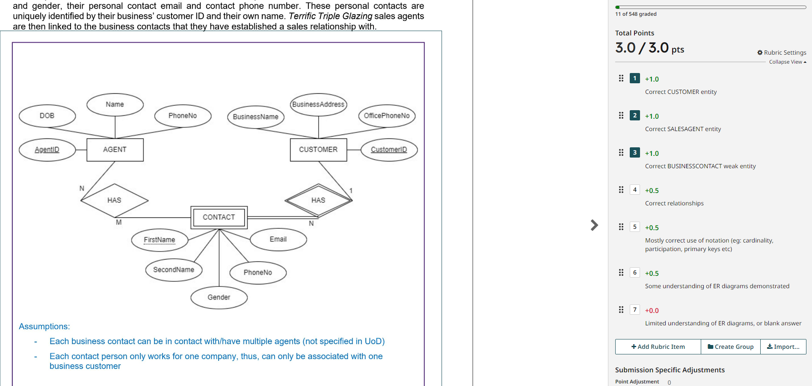
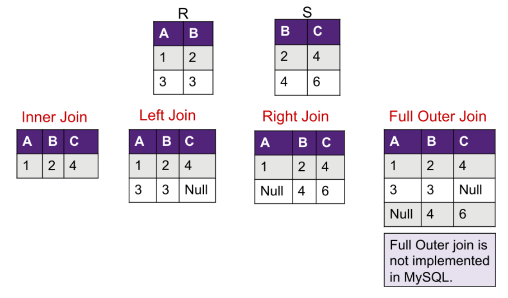

# Tutorial week 4, 2.2: Mapping

**Please download *File 2.2. Mapping - Worksheet.pdf* from module 2 for todays lesson.**

Syntax pointers:

**For a relation**
- Entity, followed by attributes
  - first attribute should be primary key
  - primary key must be underlined
- foreign key references should follow immediately after the relation

> #### Example
> Customer [<u> ID </u>, Name, Address, email, phone, receiptID]
>
> Customer.receiptID references Receipt.ID


### A.1



>
>
>
>


### B.2


>
>
>
>


### C.1



>
>
>
>


### Section D: Analysis and Application


**D.1 Which of the following statement(s) is correct based on the ER diagram?**
- A) All Parts stored in the system will have a BatchNo.
- B) A Part may be a ManufacturedPart or a PurchasedPart or neither.
- C) If a Part is already a ManufacturedPart then it cannot be a PurchasedPart.
- D) A Part must be a ManufacturedPart or a PurchasedPart or both


**D.2 Consider the following addition to the ER diagram: What would be the correct relational mapping for METALPART?**


```
A) METALPART[partNo]
METALPART.partNo references Part.partNo

B) METALPART[partNo, batchNo, manufactureDate, drawingNo]
METALPART.partNo references MANUFACTUREDPART.partNo

C) METALPART[partNo]
METALPART.partNo references MANUFACTUREDPART.partNo
```