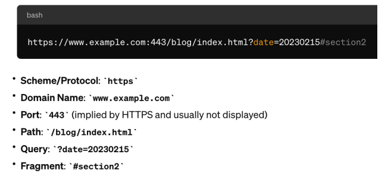
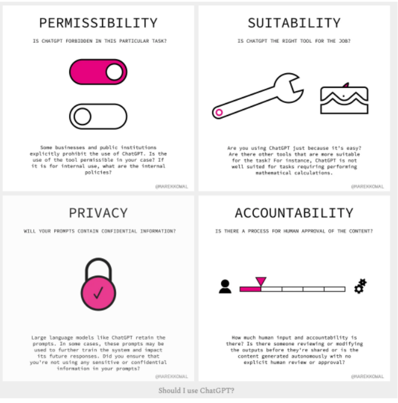

# Lecture 1

What will we learn:
- Foundational web technologies HTML and CSS
- Server-side web development using PHP and the CodeIgniter MVC Framework
- Designing databases for Web applications (including for searching)
- Designing web UI’s using CSS and HTML Forms
- Incorporating GenAI into Web applications 
- Deploying Web Applications (via Nginx Web server and AWS)

### Domain name service
- Function: DNS acts like the internet's phonebook. It translates human-friendly domain names (like www.example.com) into IP addresses (like 192.0.2.1) that computers use to identify each other on the network.
- Process: When you type a website address in your browser, a DNS query is performed. This query travels through a network of DNS servers to find the IP address associated with the domain name.
- Hierarchy: The DNS system is hierarchical, consisting of different levels of DNS servers, including root, top-level domain (TLD), and authoritative name servers, ensuring efficient and distributed resolution of domain names to IP addresses.
- To access a website, your browser first uses DNS to resolve the site's domain name to an IP address. 
- Then, it uses HTTP to send a request to the server at that IP address to fetch and display the web page.

Easier to link to different information

### The HyperText Transfer Protocol (HTTP/S)

- **Function:** HTTP is the protocol used for transferring web pages on the internet. It defines how messages are formatted and transmitted, and how web servers and browsers should respond to various commands.
- **Communication**: HTTP operates as a request-response protocol between a client (the web browser) and a server. The client sends an HTTP request to the server, and the server responds with an HTTP response, delivering web content.
- **Stateless Protocol:** HTTP is stateless, meaning it doesn't retain information between request-response sessions. This simplicity allows for faster communication but necessitates additional protocols (like cookies) for managing state information.
- **HTTPS:** HTTPS is the secure version of HTTP, the protocol over which data is sent between your browser and the website that you are connected to. It means all communications between your browser and the website are encrypted.

### Example URL

### Model View Controller – Architectural Pattern

- Model (ExampleModel.php): 
Handles database operations.
- View (example_view.php): 
Contains the HTML and JavaScript that will be sent to the 
browser.
- Controller (ExampleController.php): 
Fetches data from the Model and passes it to the View.